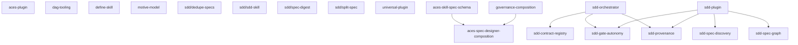
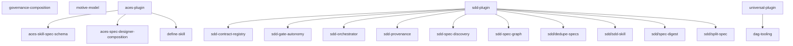

# Spec DAG

The dependency graph across all specs in `artifacts/specs/`. Each node is a spec folder (the slug is its root-relative path); each edge `A --> B` means **A blocks B** (B declares `blocked-by: [A]`).

This is a **derived view** generated by the `render-spec-graph` skill — `blocked-by` and `subtasks` in each `spec.md` are the source of truth. Do not hand-edit; regenerate when edges change. Execution order is the topological sort of this graph; there is no authored `priority`.

## Composition

Containment from `subtasks`: each edge `A --> B` means **project A owns feature B**. Distinct from the dependency graph above; a feature has exactly one parent.

## Nodes

| Spec | type | blocked-by | status |
|---|---|---|---|
| `aces-plugin` | project | — | draft |
| `aces-skill-spec-schema` | feature | — | draft |
| `aces-spec-designer-composition` | feature | `governance-composition`, `aces-skill-spec-schema` | draft |
| `dag-tooling` | feature | — | draft |
| `define-skill` | feature | — | draft |
| `governance-composition` | project | — | draft |
| `motive-model` | project | — | draft |
| `sdd-contract-registry` | feature | `sdd-orchestrator` | draft |
| `sdd-gate-autonomy` | feature | `sdd-orchestrator`, `sdd-plugin` | approved |
| `sdd-orchestrator` | feature | — | approved |
| `sdd-plugin` | project | — | draft |
| `sdd-provenance` | feature | `sdd-orchestrator`, `sdd-plugin` | draft |
| `sdd-spec-discovery` | feature | `sdd-plugin` | implemented |
| `sdd-spec-graph` | feature | `sdd-plugin` | draft |
| `sdd/dedupe-specs` | feature | — | draft |
| `sdd/sdd-skill` | feature | — | implemented |
| `sdd/spec-digest` | feature | — | draft |
| `sdd/split-spec` | feature | — | draft |
| `universal-plugin` | project | — | draft |
