# Spec DAG

The dependency graph across all specs in `artifacts/specs/`. Each node is a spec folder (the slug is its root-relative path); each edge `A --> B` means **A blocks B** (B declares `blocked-by: [A]`).

This is a **derived view** generated by the `render-spec-graph` skill — `blocked-by` and `subtasks` in each `spec.md` are the source of truth. Do not hand-edit; regenerate when edges change. Execution order is the topological sort of this graph; there is no authored `priority`.

```mermaid
graph TD
  aced-plugin
  dag-tooling
  define-skill
  motive-model
  sdd-escape-hatch
  sdd-orchestrator
  sdd/dedupe-specs
  sdd/sdd-skill
  sdd/spec-digest
  sdd/split-spec
  universal-plugin
  aced-skill-spec-schema --> aced-spec-designer-composition
  governance-composition --> aced-spec-designer-composition
  sdd-gate-autonomy --> sdd-state-legality
  sdd-gate-autonomy --> sdd-stop-provenance
  sdd-operator --> sdd-contract-registry
  sdd-operator --> sdd-doctrine-loop
  sdd-operator --> sdd-gate-autonomy
  sdd-operator --> sdd-inject-channel
  sdd-operator --> sdd-mission-loop
  sdd-operator --> sdd-operator-deliver
  sdd-operator --> sdd-operator-dispatch
  sdd-operator --> sdd-operator-explore
  sdd-operator --> sdd-operator-freeze
  sdd-operator --> sdd-operator-resolution
  sdd-operator --> sdd-operator-segment
  sdd-operator --> sdd-provenance
  sdd-operator --> sdd-stop-provenance
  sdd-operator-dispatch --> sdd-operator-deliver
  sdd-operator-dispatch --> sdd-operator-explore
  sdd-operator-dispatch --> sdd-operator-freeze
  sdd-operator-freeze --> sdd-operator-deliver
  sdd-operator-resolution --> sdd-operator-dispatch
  sdd-plugin --> sdd-doctrine-loop
  sdd-plugin --> sdd-gate-autonomy
  sdd-plugin --> sdd-inject-channel
  sdd-plugin --> sdd-mission-loop
  sdd-plugin --> sdd-provenance
  sdd-plugin --> sdd-spec-discovery
  sdd-plugin --> sdd-spec-graph
  sdd-plugin --> sdd-stop-provenance
  sdd-provenance --> sdd-campaign-loop
  sdd-provenance --> sdd-doctrine-loop
  sdd-provenance --> sdd-forge-loop
  sdd-spec-discovery --> sdd-formation-loop
  sdd-spec-graph --> sdd-formation-loop
  sdd-state-legality --> sdd-campaign-loop
```

## Composition

Containment from `subtasks`: each edge `A --> B` means **project A owns feature B**. Distinct from the dependency graph above; a feature has exactly one parent.

```mermaid
graph TD
  motive-model
  aced-plugin --> aced-skill-spec-schema
  aced-plugin --> aced-spec-designer-composition
  aced-plugin --> define-skill
  sdd-operator --> sdd-operator-deliver
  sdd-operator --> sdd-operator-dispatch
  sdd-operator --> sdd-operator-explore
  sdd-operator --> sdd-operator-freeze
  sdd-operator --> sdd-operator-resolution
  sdd-operator --> sdd-operator-segment
  sdd-plugin --> sdd-campaign-loop
  sdd-plugin --> sdd-contract-registry
  sdd-plugin --> sdd-doctrine-loop
  sdd-plugin --> sdd-escape-hatch
  sdd-plugin --> sdd-forge-loop
  sdd-plugin --> sdd-formation-loop
  sdd-plugin --> sdd-gate-autonomy
  sdd-plugin --> sdd-inject-channel
  sdd-plugin --> sdd-mission-loop
  sdd-plugin --> sdd-operator
  sdd-plugin --> sdd-provenance
  sdd-plugin --> sdd-spec-discovery
  sdd-plugin --> sdd-spec-graph
  sdd-plugin --> sdd-state-legality
  sdd-plugin --> sdd-stop-provenance
  sdd-plugin --> sdd/dedupe-specs
  sdd-plugin --> sdd/sdd-skill
  sdd-plugin --> sdd/spec-digest
  sdd-plugin --> sdd/split-spec
  universal-plugin --> dag-tooling
  universal-plugin --> governance-composition
```

## Nodes

| Spec | type | blocked-by | status |
|---|---|---|---|
| `aced-plugin` | project | — | draft |
| `aced-skill-spec-schema` | feature | — | draft |
| `aced-spec-designer-composition` | feature | `governance-composition`, `aced-skill-spec-schema` | deprecated |
| `dag-tooling` | feature | — | draft |
| `define-skill` | feature | — | draft |
| `governance-composition` | feature | — | draft |
| `motive-model` | project | — | draft |
| `sdd-campaign-loop` | feature | `sdd-provenance`, `sdd-state-legality` | draft |
| `sdd-contract-registry` | feature | `sdd-operator` | draft |
| `sdd-doctrine-loop` | feature | `sdd-operator`, `sdd-provenance`, `sdd-plugin` | approved |
| `sdd-escape-hatch` | feature | — | draft |
| `sdd-forge-loop` | feature | `sdd-provenance` | draft |
| `sdd-formation-loop` | feature | `sdd-spec-graph`, `sdd-spec-discovery` | draft |
| `sdd-gate-autonomy` | feature | `sdd-operator`, `sdd-plugin` | implemented |
| `sdd-inject-channel` | feature | `sdd-operator`, `sdd-plugin` | draft |
| `sdd-mission-loop` | feature | `sdd-operator`, `sdd-plugin` | implemented |
| `sdd-operator` | feature | — | draft |
| `sdd-operator-deliver` | feature | `sdd-operator`, `sdd-operator-dispatch`, `sdd-operator-freeze` | draft |
| `sdd-operator-dispatch` | feature | `sdd-operator`, `sdd-operator-resolution` | draft |
| `sdd-operator-explore` | feature | `sdd-operator`, `sdd-operator-dispatch` | draft |
| `sdd-operator-freeze` | feature | `sdd-operator`, `sdd-operator-dispatch` | draft |
| `sdd-operator-resolution` | feature | `sdd-operator` | draft |
| `sdd-operator-segment` | feature | `sdd-operator` | draft |
| `sdd-orchestrator` | feature | — | deprecated |
| `sdd-plugin` | project | — | draft |
| `sdd-provenance` | feature | `sdd-operator`, `sdd-plugin` | approved |
| `sdd-spec-discovery` | feature | `sdd-plugin` | implemented |
| `sdd-spec-graph` | feature | `sdd-plugin` | draft |
| `sdd-state-legality` | feature | `sdd-gate-autonomy` | implemented |
| `sdd-stop-provenance` | feature | `sdd-gate-autonomy`, `sdd-operator`, `sdd-plugin` | implemented |
| `sdd/dedupe-specs` | feature | — | draft |
| `sdd/sdd-skill` | feature | — | implemented |
| `sdd/spec-digest` | feature | — | draft |
| `sdd/split-spec` | feature | — | draft |
| `universal-plugin` | project | — | draft |
