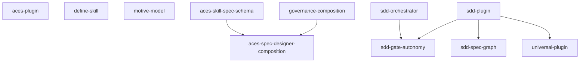

# Spec DAG

The dependency graph across all specs in `artifacts/specs/`. Each node is a spec folder (the slug is its ID); each edge `A --> B` means **A blocks B** (B declares `blocked-by: [A]`).

This is a **derived view** generated by the `render-spec-graph` skill — `blocked-by` in each `spec.md` is the source of truth. Do not hand-edit; regenerate when edges change. Execution order is the topological sort of this graph; there is no authored `priority`.

## Nodes

| Spec | blocked-by | status |
|---|---|---|
| `aces-plugin` | — | draft |
| `aces-skill-spec-schema` | — | draft |
| `aces-spec-designer-composition` | `governance-composition`, `aces-skill-spec-schema` | draft |
| `define-skill` | — | draft |
| `governance-composition` | — | draft |
| `motive-model` | — | draft |
| `sdd-gate-autonomy` | `sdd-orchestrator`, `sdd-plugin` | approved |
| `sdd-orchestrator` | — | draft |
| `sdd-plugin` | — | draft |
| `sdd-spec-graph` | `sdd-plugin` | draft |
| `universal-plugin` | `sdd-plugin` | draft |
