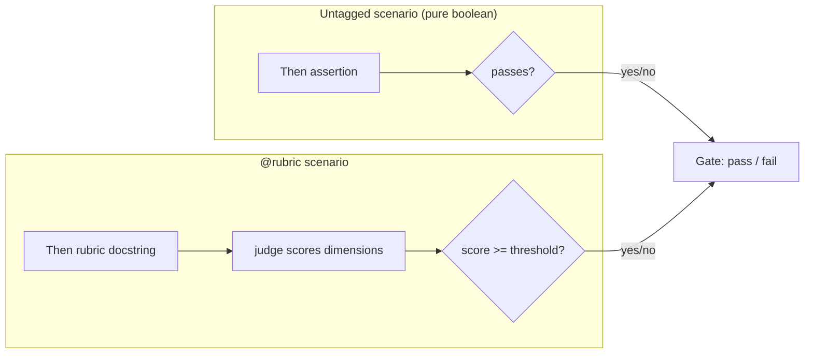

# Rubric-style Gherkin scenarios (judged by-hand)

## What

Admit a **rubric form** scenario alongside pure-boolean Gherkin in every SDD `.feature`. A rubric scenario embeds scoring criteria (named dimensions, per-dimension max, and a threshold) directly in the scenario and collapses the scored result to a single boolean — preserving the one-pass/fail-per-scenario contract at the gate. `spec-governance`'s format bar gains a tagged-rubric carve-out; `sdd-spec-judge` gains a rubric validation branch.

Pure-boolean scenarios are **unchanged**. Rubric form is purely additive.

## Why

A gradient judgment cannot be faithfully encoded in a single boolean: "spec.md frozen firmest" is too coarse to express "editable when the change is reversible AND preserves alignment AND is non-breaking." A plain boolean rule is also un-self-modifiable — you cannot safely edit a frozen thing. A rubric rule is self-modifiable: a safe edit self-clears. Rubric Gherkin lets SDD carry gradient rules and safely modify its own contracts without losing the boolean gate invariant that the rest of the pipeline depends on.

## Key decisions

| # | Decision | Rationale |
|---|----------|-----------|
| 1 | **Rubric scenario syntax** — `@rubric` tag + docstring or table for dimensions/threshold + collapsing `Then` | Tag makes the rubric branch mechanically distinguishable without breaking Gherkin validity |
| 2 | **Judge bar gains a rubric branch** — structural check (dimensions + threshold present) AND by-hand scoring | Structure check is automatic; scoring is irreducibly human judgment |
| 3 | **ACED is not a prerequisite** — rubric Gherkin is self-contained, judged by-hand | ACED is the regression harness when automation is worth the cost; not required to use rubric form |
| 4 | **Prohibition relaxed** — "no rubric in the `.feature`" becomes "no rubric in an untagged scenario" | The carve-out is the whole point; the tag is the guard |

## Rubric scenario syntax

A rubric scenario is valid Gherkin. The convention:

1. **Tag** the scenario `@rubric`.
2. **Embed the rubric** in a `Then` step as a docstring (`"""..."""`) — named dimensions, each with a `max:` value, plus exactly one `threshold:` line.
3. **Close** with a boolean-collapsing `Then`: `Then the rubric score is at least the threshold`.

```gherkin
@rubric
Scenario: <name>
  Given ...
  When  ...
  Then the judge evaluates the scenario against the rubric
    """
    dimensions:
      - name: correctness
        max: 3
      - name: completeness
        max: 2
    threshold: 4
    """
  And the rubric score is at least the threshold
```

The final `Then` yields exactly **one boolean** — the gate sees a pass/fail, not a score.

## How the two paths reach one boolean



Both paths deliver a single boolean to the gate. The rubric is internal evaluation detail — the gate contract is unchanged.

## Affected governance sections

Three surfaces change as a result of this spec.

### 1. `spec-governance` — "The `.feature` format bar"

The bullet currently reads:
> **No rubric in the `.feature`.** Threshold, score, and rubric are the impl-judge's private evaluation detail — never written into a scenario.

It is rewritten to:
> **No rubric in an untagged scenario.** Rubric form is legal only inside a `@rubric`-tagged scenario (see *Rubric scenarios* below). An untagged scenario's every `Then` remains a plain boolean assertion.

A new sub-section **Rubric scenarios (`@rubric`)** is added immediately below, specifying the syntax from Key decision #1.

### 2. `sdd-spec-judge` — "Valid boolean Gherkin" bar (reference implementation)

The domain's resolved spec-judge gains a rubric branch. The structural check is **universal** — every resolved judge enforces it identically. Scoring capability is **per-resolved-judge**: the default `sdd-spec-judge` does baseline by-hand scoring; a plugin can supply a more capable resolved judge (e.g. `aced-spec-validator` for ACED domains).

| Scenario type | Resolved judge validates |
|---|---|
| Untagged | Every `Then` is a boolean assertion — no scores, probabilities, or rubric lingo |
| `@rubric`-tagged | **Structure (universal):** rubric block present with named dimensions + per-dimension `max` + exactly one `threshold`; collapsing `Then` present. **Scoring (per-resolved-judge):** reads rubric, scores each dimension, applies threshold, emits pass/fail |

The resolved judge does **not** reject scoring lingo inside a `@rubric` scenario — that is the sanctioned form.

### 3. `spec-governance` — "Scenario ordering (step-down)"

Unchanged. A `@rubric` scenario sorts into its lifecycle stage like any other scenario.

## Use Cases

| Trigger | Inputs | Outcome |
|---------|--------|---------|
| Spec-producer writes a gradient-judgment scenario | A scenario with named scoring dimensions and a collapse threshold | A valid `@rubric`-tagged scenario in the `.feature`, boolean-collapsing `Then` present |
| Spec-producer writes a plain behavioral scenario | An observable, deterministic assertion | An untagged scenario with every `Then` a boolean assertion; no rubric lingo |
| The domain's resolved spec-judge (default `sdd-spec-judge`) validates a `@rubric` scenario | A `.feature` with one or more `@rubric`-tagged scenarios | Structure check passes (dimensions + threshold + collapsing `Then` present); judge scores by-hand and emits pass/fail |
| The domain's resolved spec-judge (default `sdd-spec-judge`) rejects a malformed `@rubric` scenario | A `@rubric` scenario missing a `threshold` or named dimensions | Judge emits a structural failure — scenario is rejected before scoring begins |

## Artifacts

| Artifact | Path |
|----------|------|
| Spec | `artifacts/specs/rubric-gherkin/spec.md` |
| Feature | `artifacts/specs/rubric-gherkin/rubric-gherkin.feature` |
