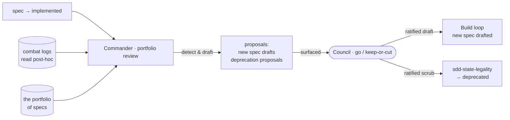

# SDD Campaign Loop — growing and pruning the product

> Descriptive name: the **Product loop**. Metaphor name: the **Campaign loop**.

---

## What

An **outer loop** of the SDD model — the cross-mission loop that **grows and prunes the product**: it decides which features the product should *have*. Fleet role: the **Commander**. Actor: the **Director**. Its delegate watches missions reach a terminal state and reasons across the whole portfolio: *"We shipped feature A; B is the natural next; and with B, feature C is now redundant — deprecate it."* In the metaphor: which **theaters** to open and which to close.

It operates at **portfolio altitude**, across many specs — distinct from the Director's per-spec act at the gate. Its outputs are **proposals** that feed the Build loop: it **drafts new feature specs** and **triggers deprecations**, never auto-applying either. The human **Council** holds the keep-or-cut / go decision.

---

## Why

A spec ships, and nothing asks *what should the product be now*. Today SDD reasons one spec at a time — the gate decides whether **this** spec ships, but no loop reads across the portfolio to decide what to build next or what has become dead weight. The Campaign loop is that missing portfolio-altitude reasoning: a shipped feature suggests its successor, and a successor can make a predecessor redundant.

---

## Design decisions

### The Commander operates at portfolio altitude, not per-gate

The Campaign loop fires across **many specs and missions**, asking *"what should the product BE?"* — never *"should THIS spec ship?"*. That second question is the **per-spec gate**, and it stays exactly where it is. The Commander does not act at the gate and does not run per-spec; it reads the whole portfolio and reasons about the product as a whole.

### Outputs feed the Build loop — as proposals the Council ratifies

The loop produces two output kinds, both **proposals**, never auto-applied:

- **A new feature spec draft** — a shipped feature suggests a next feature, so the Commander drafts a new spec proposal.
- **A deprecation proposal (a scrub)** — a new/shipped feature makes an existing one redundant, so the Commander proposes deprecating it.

Both are surfaced to the **Council**. Spawning a draft spec is a proposal a human ratifies before it enters the Build loop; triggering a deprecation is a scrub the Council decides.

### It reads combat logs post-hoc — the contract input

The Commander reads **persisted artifacts post-hoc** — completed missions' **combat logs** plus the portfolio of specs — never live subagent context. This is parallel to the Scanner: it always fires *after* missions end, so post-hoc file reading is the right model. (Dependency: `sdd-provenance` owns the combat-log contract.)

### It triggers deprecation but never writes the transition

The Commander **triggers** a deprecation — it surfaces the scrub proposal — but it **never writes** the `→ deprecated` status itself. That transition is owned by `sdd-state-legality` (a `blocked-by` dependency). This loop only proposes; the state machine performs the write once the Council ratifies.

### Detect-and-draft by the delegate; keep-or-cut / go by the Council

The same split as the Doctrine loop: the delegate **detects and drafts** cheaply (spec proposals, deprecation proposals, reprioritizations); the human **Council** holds the **go / keep-or-cut**. No draft becomes a real spec and no feature is deprecated without the Council's ruling.

### Distinct from the other two outer loops

Three outer loops, three concerns — the Campaign loop owns only the product:

| Loop | Role | Grows / keeps |
|---|---|---|
| **Campaign** (Product) | Commander | grows and prunes the **product** — *what to build* |
| **Doctrine** (Process) | Scanner | grows the **process** — how we operate |
| **Formation** (Structure) | Warden | keeps the **corpus organized** — a coherent spec graph |

Doctrine grows the *process*, not the product. Formation keeps the spec corpus *organized* (dedupe / split / coherent graph), not deciding *what* to build. The Campaign loop decides **what the product should be** — and nothing else.

---

## Use Cases

| Use case | Trigger | Inputs | Outcome |
|---|---|---|---|
| **Shipped feature suggests a successor** | a spec ships (`→ implemented`) | the finished spec + the portfolio + combat logs | a new feature spec **draft** surfaced for ratification |
| **A feature subsumes another → redundant** | a feature ships that subsumes another | the portfolio + the redundant spec | a **deprecation proposal** (scrub) surfaced to the Council |
| **Portfolio review → reprioritize** | a human-held portfolio review event | the whole portfolio of specs + their combat logs | a **reprioritization** (and possibly new drafts / deprecation proposals) |
| **A feature no longer earns its keep** | a feature's value no longer justifies its maintenance | the feature + portfolio signal | a **deprecation proposal** (scrub) surfaced to the Council |

---

## Command surface / API

| Concern | Behavior |
|---|---|
| Trigger | a spec ships (`→ implemented`), a feature subsumes another, a portfolio review, a feature no longer earning its keep — **never per-gate / per-spec** |
| Input | completed missions' **combat logs** + the portfolio of specs, read **post-hoc** (never live context) |
| Output | **new spec drafts** + **deprecation proposals** + **reprioritizations** — all proposals |
| Decision | the Council holds **go / keep-or-cut**; no draft becomes a spec and no feature is deprecated unratified |
| Effect | ratified drafts enter the **Build loop**; ratified scrubs **trigger** `→ deprecated` (written by `sdd-state-legality`) |

---

## Related

- `artifacts/specs/motive-model/spec.md` — the loop model; this is one of the three **outer** loops
- `artifacts/specs/sdd-doctrine-loop/spec.md` — sibling outer loop (Process), for contrast
- `artifacts/specs/sdd-provenance/spec.md` — the combat logs this loop reads
- `artifacts/specs/sdd-state-legality/spec.md` — owns the `→ deprecated` transition this loop triggers
- `artifacts/specs/sdd-mission-loop/spec.md` — the inner Build loop its outputs feed

---

## Artifacts

| Label | Path |
|---|---|
| Spec | `artifacts/specs/sdd-campaign-loop/spec.md` |
| Scenarios | `artifacts/specs/sdd-campaign-loop/sdd-campaign-loop.feature` |
