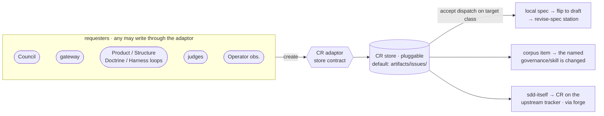
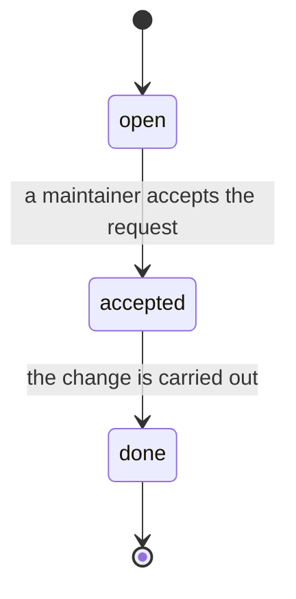

# SDD Change Request — the async "change needed" flag for any target

**Change request (CR)** (descriptive) — a first-class, pluggably-stored "change needed" object that any actor may fire at any target, including targets that have no local spec to attach a flag to.

---

## What

A **change request** is a first-class object — `target`, `requested-by`, `what`, `why`, `status` — that records *"this thing should change"* and lives in a **separate, pluggable store**, distinct from the per-spec combat log. It is the general form of the async **re-open** flag: a cheap, fire-and-walk-away signal that some named thing in the SDD world needs work, raised by anyone (the Council, the gateway, any loop, a judge, an Operator) and routed on accept to wherever that thing actually lives.

A CR targets one of **three classes**: a **local spec** in this repo, a **corpus item** (a governance, skill, or convention in the shared corpus), or **sdd-itself** (the harness — the upstream framework in another repo). The first can carry its "change needed" flag in its own `spec.md` frontmatter; the other two **have no local spec to attach to**. That absence is the load-bearing reason a CR needs its own store: a re-open list in one spec's frontmatter cannot represent *"this governance is wrong"* or *"the SDD harness should change,"* because there is no local frontmatter that owns those targets. The store is **pluggable** — loops write **through an adaptor**, never to a backend directly; the default backend is local markdown files under `artifacts/issues/`, and remote adaptors (GitHub, Asana, JIRA) implement the **same contract**.



**What the CR store is NOT:** it is **not the combat log** (which is per-spec frontmatter, local to one mission), **not provenance** (it may *cite* a correction but does not record who-did-what), and **not a lifecycle status** (a CR's `status` tracks the request, never the target spec's `draft → approved → implemented`).

---

## Why

Today the only "change needed" signal SDD has is **re-open** — an auditor flips a spec to `draft` by appending a `reopened:` entry to that spec's frontmatter (see `sdd-provenance`). That works only because the target *is a local spec with frontmatter*. The moment the thing that should change is a shared governance or the SDD harness itself, there is no local frontmatter to write the flag into, and the signal has nowhere to live.

- **Two of three target classes have no local spec.** A Doctrine recommendation to revise a corpus governance, or a Harness-loop finding that SDD-itself should change, cannot be recorded as a frontmatter re-open — there is no `spec.md` in this repo that owns a shared governance or the upstream framework. The signal is lost, or smuggled into an unrelated spec.
- **The combat log is the wrong home.** The combat log is **per-spec and local to one mission**; a cross-corpus or upstream change request does not belong to any one mission's log, and parking it there conflates provenance (what happened) with intent (what should change next).
- **Every actor needs the same cheap flag.** The Council, the gateway, the four loops, judges, and Operator observations all surface "this should change" — but without a common object they each invent an ad-hoc channel. One first-class CR, written through one adaptor, gives every requester the same fire-and-walk-away primitive.

---

## Design decisions

### A CR is a first-class object in a separate, pluggable store — not the combat log

The CR is its **own object** in its **own store**, deliberately separated from the per-spec combat log. The separation is justified by the **three target classes** and the fact that two of them have no local spec:

| Target class | Where the target lives | Can a per-spec flag represent it? |
|---|---|---|
| **local spec** | a `spec.md` in this repo | yes — its own frontmatter (this is re-open) |
| **corpus item** | a shared governance / skill / convention | **no** — no local `spec.md` owns it |
| **sdd-itself** | the upstream SDD harness, another repo | **no** — not in this repo at all |

Because two of the three classes have **no local frontmatter to attach to**, a per-spec mechanism cannot carry them. The CR store is the home that *all three* classes share. **The CR store is not the combat log** — the combat log is per-spec, local to one mission; the CR store is corpus-wide and outlives any single mission.

### The store adaptor governance is Architect-owned — loops write through it, never to a backend

The store is reached through an **adaptor** whose contract is **Architect-owned**. The adaptor defines the **backend contract** — the operations and fields every backend must expose — so that the **default backend (local markdown files under `artifacts/issues/`)** and every **remote adaptor** are interchangeable:

| Backend | Adaptor |
|---|---|
| local markdown (`artifacts/issues/`) | the **default** adaptor |
| GitHub issues | via the `create-issue` skill |
| Asana | via `cyber-asana` |
| JIRA | a JIRA adaptor implementing the same contract |
| PR↔task linking | via `link-pr-to-task` |

**Loops write through the adaptor, never directly to a backend.** This keeps the requesters backend-agnostic: a Doctrine recommendation files a CR the same way whether the store is local markdown or a remote tracker.

**This spec specifies the adaptor contract — it does not write the governance file.** The adaptor governance itself is a later, Architect-owned implementation artifact. Here we fix only *what the contract must expose* (the operations and fields in **Command surface**); authoring the governance is out of scope.

### The CR schema — `target`, `requested-by`, `what`, `why`, `status` with legal transitions

A CR carries five fields. `why` **may optionally cite a combat-log correction** as evidence, but **the CR store is not provenance** — the citation is a loose pointer, not a copy of the mission record.

`status` moves through exactly three states with **no skips** and a single **terminal** state:



**Legal transitions:** `open → accepted → done`. **No skips** (`open → done` is illegal). **Terminal = `done`** (nothing leaves `done`).

### Accept dispatch routes on the target class

Acceptance is where the CR's target class becomes action. On `accepted`, dispatch routes by class:

| Target class | `accepted` routes to |
|---|---|
| **local spec** | the targeted `spec.md` is **flipped to `draft`**, then routed to the **`revise-spec`** station — re-open as a special case (see below) |
| **corpus item** | the **governance / skill named by the target** is the thing changed — the named corpus artifact, not any spec |
| **sdd-itself** | a CR is filed on a **remote tracker on the upstream SDD repo**, via the adaptor — the **forge** mechanism (this spec's `blocked-by`) |

### Every actor is a requester — a CR is a write any of them may make

A CR may be created by **any** of these, all writing **through the adaptor**:

- the **Council** (human keep-or-cut authority),
- the **gateway** (the spec-management entry point),
- the **Product, Structure, Doctrine, and Harness loops** (Doctrine recommendations against corpus items; Structure dedupe/split findings),
- **judges** (a spec-judge or impl-judge surfacing a needed change), and
- **Operator observations** (an Operator flagging something out of band).

No requester is privileged; the CR object is the shared primitive they all use. **Requester identity does not earn its own scenario.** The Council and the gateway file CRs through the very same generic adaptor write already asserted by *"a requester writes through the adaptor and never to a backend directly"* — a per-requester scenario for either would be redundant. The per-requester scenarios that do exist (Doctrine, Structure, Harness, Operator, judge) earn their place because each exercises a distinct **target class** or distinct framing, not because the requester's identity needs a test of its own.


### The CR generalizes the async re-open flag

**Re-open is the local-spec special case of the CR.** Re-open — flipping a local spec to `draft`, persisted today as the `reopened:` list in that spec's frontmatter (see `sdd-provenance`) — works only because the target is a local spec with frontmatter. The CR is the **general async "change needed" flag** for targets **without** a local spec (corpus items and sdd-itself).

Both follow the **auditor model**: a cheap, async, **fire-and-walk-away** flag — *"this needs to change"* dropped and left for someone to pick up — **not** a heavy positional ratification. The auditor sets the flag and moves on; acceptance and the actual change happen later, by whoever owns the target.

### Altitude discipline — what the CR store is NOT (negative invariants)

The CR store is bounded by three negative invariants:

- **The CR store is NOT the combat log.** The combat log is per-spec frontmatter, local to one mission; the CR store is corpus-wide and outlives any mission.
- **The CR store is NOT provenance.** A CR may *cite* a combat-log correction in its `why`, but it does not record who-produced-or-judged-what; provenance stays in the combat log.
- **The CR store is NOT a lifecycle status.** A CR's `status` (`open → accepted → done`) tracks the *request*, never the target spec's lifecycle (`draft → approved → implemented`). Accepting a CR may *flip* a local spec to `draft`, but the CR's own status is a separate axis.

---

## Use Cases

A **use case** is an entry-point — a trigger, its inputs, and its outcome. Each maps to one-or-more boolean scenarios in the `.feature` (happy path plus negative mirror where a constraint is load-bearing).

| Use case | Trigger | Inputs | Outcome |
|---|---|---|---|
| **Doctrine files a corpus CR** | the Doctrine loop recommends revising a governance | a `corpus-item` target, `requested-by`, `what`, `why` | an `open` CR exists in the store, targeting the named corpus item |
| **Structure files a corpus CR** | a Structure dedupe/split finding | a `corpus-item` target + finding | an `open` CR targeting the corpus item to restructure |
| **Harness CR on sdd-itself** | a Harness-loop finding that SDD itself should change | an `sdd-itself` target, `what`, `why` | an `open` CR whose target class is `sdd-itself` |
| **Operator observation becomes a CR** | an Operator flags something out of band | the observation as `what`/`why` | an `open` CR created through the adaptor |
| **Judge raises a CR** | a judge surfaces a needed change | the judge's finding | an `open` CR through the adaptor |
| **Cite a correction in `why`** | a requester references a combat-log correction | the correction reference | a CR whose `why` cites it, without copying the mission record |
| **Write through the adaptor** | any requester files any CR | the CR fields | the CR is written via the adaptor, not a backend directly |
| **Accept a local-spec CR** | a maintainer accepts a `local-spec` CR | the `open` CR + target spec | the target spec flips to `draft` and routes to `revise-spec` |
| **Accept a corpus CR** | a maintainer accepts a `corpus-item` CR | the `open` CR + named corpus item | the named governance/skill is the thing changed |
| **Accept an sdd-itself CR** | a maintainer accepts an `sdd-itself` CR | the `open` CR | a CR is filed on the upstream tracker via the adaptor |
| **Complete a CR** | the accepted change is carried out | the `accepted` CR | the CR transitions to `done` |
| **Illegal skip (negative)** | a transition tries `open → done` | an `open` CR | the transition is rejected; the CR stays `open` |
| **Terminal is final (negative)** | a transition leaves `done` | a `done` CR | the transition is rejected; the CR stays `done` |
| **Not the combat log (negative)** | a CR is created | a corpus/sdd-itself CR | no mission combat log is written for it |
| **Not provenance (negative)** | a CR is created | any CR | no producer or judge provenance is recorded on the CR |
| **Status ≠ lifecycle (negative)** | a local-spec CR reaches `done` | the `done` CR + its target spec | the target spec's own lifecycle status is independent of the CR status |

---

## Command surface

**CR schema**

| Field | Values | Meaning |
|---|---|---|
| `target` | one of: a local spec \| a corpus item \| `sdd-itself` | what should change — its class drives accept dispatch |
| `requested-by` | the Council \| gateway \| a loop \| a judge \| an Operator | who raised the request |
| `what` | free text | the change being asked for |
| `why` | free text; **may optionally cite** a combat-log correction | the motivation; a citation is a loose pointer, never a copy |
| `status` | `open` \| `accepted` \| `done` | the request's own state — not the target's lifecycle |

```yaml
# a corpus-targeted change request in the default store
target:
  class: corpus-item
  ref: combat-log-governance
requested-by: doctrine-loop
what: split the cause enum's "coverage-gap" into spec-gap and test-gap
why: recurring across missions; cites combat-log correction (loose pointer, not a copy)
status: open
```

**Adaptor contract** — the store backend must expose:

| Operation | Behavior |
|---|---|
| `create` | write a new CR (`status: open`) through the adaptor |
| `read` | fetch one CR by reference |
| `list` | enumerate CRs, filterable by `target` class and `status` |
| `transition` | advance `status` along a legal edge only |

**Legal transitions:** `open → accepted → done` — no skips, `done` is terminal.

**Accept dispatch**

| Target class | Route on `accepted` |
|---|---|
| local spec | flip the target spec to `draft` → `revise-spec` station |
| corpus item | the named governance/skill is changed |
| `sdd-itself` | file a CR on the upstream tracker via the adaptor (forge) |

**Out of scope / negative invariants:**

- The CR store is **not the combat log**, **not provenance**, and **not a lifecycle status**.
- This spec **specifies** the adaptor contract; it does **not** author the adaptor governance file (a later Architect-owned artifact).
- A `transition` may never **skip** (`open → done`) or **leave the terminal** (`done → *`).

---

## Related

- `artifacts/specs/sdd-forge-loop/spec.md` — the upstream-tracker mechanism the `sdd-itself` target class routes through on accept; this spec's only `blocked-by` (the harness target class cannot route without forge's upstream egress path)
- `artifacts/specs/sdd-provenance/spec.md` — owns the `reopened:` frontmatter list (the local-spec re-open the CR generalizes) and the combat-log correction a `why` may loosely cite; a **related** citation seam, not a dependency
- `artifacts/specs/sdd-doctrine-loop/spec.md` — a requester: Doctrine recommendations become corpus-item CRs
- `artifacts/specs/sdd-formation-loop/spec.md` — a requester: Structure dedupe/split findings become corpus-item CRs
- `sdd:revise-spec` (SDD plugin skill) — the station a local-spec CR routes to on accept after the spec is flipped to `draft`

---

## Artifacts

| Label | Path |
|---|---|
| Spec | `artifacts/specs/sdd-change-request/spec.md` |
| Scenarios | `artifacts/specs/sdd-change-request/sdd-change-request.feature` |
