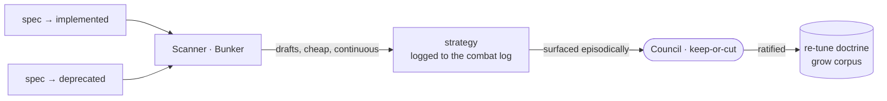

# SDD Doctrine Loop — the Strategist outer loop

---

## What

The **outer loop** of the SDD model — the one the framework does not yet have. It is owned by the **Strategist** actor and run by its delegate, the **Scanner in the Bunker**: a fleet-level agent that watches every spec reach a terminal state, drafts **strategy** (forward recommendations to revise governances, conventions, and skills), and surfaces it to the human **Council**, who hold the keep-or-cut. Ratified, that strategy re-tunes the **doctrine** and grows the **corpus**. It fires at **lifecycle granularity, not per-gate**.

---

## Why

Today SDD learns nothing across products. The orchestrator records a producer only on conflict; the corpus (skills, governances, conventions) is revised only by hand, ad hoc. The motive-model names this as the **Strategist** gap (the outer loop, "Strategist and the loop"):

- **Lessons don't compound.** A pattern solved three times, a correction repeated across missions, a now-false convention — nothing distills these into doctrine so the next mission starts warmer.
- **The trigger must be lifecycle-grained.** Firing the outer loop every gate is *premature codification* (motive-model:312) — it encodes transient noise. The real triggers are a spec that **ships** (`→ implemented`) or is **killed** (`→ deprecated`), a milestone retro, or a recurring pattern.
- **Detection and decision must split** (motive-model:314): the delegate *watches continuously and drafts* (cheap); the human *keeps or cuts* (accountable, high-blast-radius).

---

## Design decisions

### The Scanner is fleet-level, not inside the orchestrator

The Scanner sits **above any single spec** — in the Bunker — because doctrine serves every spec (and every tool), not one mission. It is **not** a step inside the Operator/orchestrator: that flow is per-segment, and a per-segment outer loop is exactly the premature codification the model forbids.

### It watches terminal transitions, it does not write them

The Scanner observes the transitions written elsewhere — `→ implemented` (by `validate-spec` at the impl gate) and `→ deprecated` (by the deprecation path). It never writes lifecycle status; it reacts to it.

### Detection and drafting by the delegate; keep-or-cut by the human

The Scanner drafts **strategy** cheaply and continuously and records it to the **combat log** (the provenance record from `sdd-provenance`: `produced-by` + `approved-by`). It **accumulates** strategy and surfaces it **episodically** — at a retro, on demand, or when a threshold piles up — never synchronously blocking a mission. **No strategy enters the corpus without the Council's ratification.**

### Strategy → doctrine → corpus

Three distinct things, by time-direction:

- **Strategy** — the Scanner's *forward* output: a recommendation ("codify this pattern, prune that convention"). Situational, drafted every cycle, transient until ratified.
- **Doctrine** — the *principles* layer: codified operating rules ("how we operate"). Ratified strategy re-tunes it.
- **Corpus** — the *full durable body* every other delegate reads from: skills, governances, conventions, templates, plugins. Doctrine is its principles slice; ratified strategy grows it.

Provenance/registry resolution stays live and authoritative for *who acts next*; the corpus is the *accumulated knowledge*, not the resolver.

### The gateway surfaces pending strategy

The `sdd` gateway — where humans re-enter SDD — **surfaces** "N pending strategy" as an entry point. The Scanner detects and drafts; the gateway is how the Council is brought to the keep-or-cut.

### It prunes drift

Beyond codifying what works, the Scanner detects **drift / staleness** — a now-false convention, a contradiction between governances — and drafts a prune. This is the double-loop *revision* mode, the Strategist's distinctive act.

---

## Command surface / API

| Concern | Behavior |
|---|---|
| Trigger | `→ implemented`, `→ deprecated`, milestone retro, recurring pattern — **never per-gate** |
| Output | **strategy** (forward recommendations) recorded to the combat log; surfaced via the gateway |
| Decision | the Council holds keep-or-cut; no strategy enters the corpus unratified |
| Effect | ratified strategy re-tunes the **doctrine** and grows the **corpus** (skills, governances, conventions, templates) |

---

## Related

- `artifacts/specs/motive-model/spec.md` — "Strategist and the loop"; the three loops; this spec is the **outer** one
- `artifacts/specs/sdd-provenance/spec.md` — the combat log (`produced-by` + `approved-by`) strategy is recorded to
- `artifacts/specs/sdd-orchestrator/spec.md` — the middle-loop Operator the Scanner sits above, not inside
- `artifacts/specs/sdd-mission-loop/spec.md` — the middle loop, for contrast

---

## Artifacts

| Label | Path |
|---|---|
| Spec | `artifacts/specs/sdd-doctrine-loop/spec.md` |
| Scenarios | `artifacts/specs/sdd-doctrine-loop/sdd-doctrine-loop.feature` |
