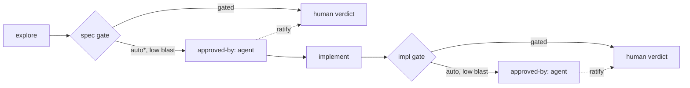

# Gate Autonomy & Accountability

---

## What

A model for **how far an agent may advance a spec without the human**, how that advance is **recorded**, and how the human **catches up** — without ever letting the spec land in a contradictory state.

It adds four cooperating pieces:

1. **The leash** — how far the agent may self-assert before a human gate (`gated` | `auto-to-spec` | `auto`), **derived** from a per-gate risk assessment and capped by an optional human ceiling.
2. **Gate attribution** — `approved-by` records *who* passed each gate; agent-attributed gates are provisional, awaiting human ratification.
3. **An enforced state machine** — `validate-spec` rejects any illegal `(status, aligned, markers, .feature)` tuple, so states like `draft + aligned:true`-meaning-implemented can't be committed.
4. **The gate report** — a **decidable**, regenerated-on-demand checklist (verdict per face + leash derivation + open markers as questions + a decision menu) so the human can approve / change / reject fast.



---

## Why

A spec was just driven from blank to "implemented" in one autonomous run with no recorded human verdict, and left in `status: draft + aligned: true` — a state the workflow-cursor table does not define. Three gaps surfaced:

- **No declared autonomy boundary.** The agent assumed `auto`; the human never set a leash. Approval, where it existed, was diffuse in conversation, not a discrete act.
- **`aligned` was misread, not undefined.** It is already resolved — sdd-orchestrator scopes it by layer (contract layer at the spec gate, impl layer at the impl gate). The agent read `draft + aligned:true` as *implemented* when, layer-scoped, it only means *contract synced, ready for the spec gate*. The gap is that **nothing enforces** the legal states, so a misread lands uncaught.
- **No representation of "advanced by agent alone."** There was no way to mark the spec as provisionally advanced and owed a human review — so it silently looked done.

The motive model already gives the principle: the human (Conductor) holds **motive and accountability**; a delegate may be handed the **act**, never the accountability. Autonomous completion is delegating the act ahead of reconciling accountability. These four pieces make that gap **explicit, legal, and visible**.

---

## Design decisions

### The leash is derived per gate, not just declared

The three leash values are not a free choice — they **fall out of a risk assessment** the agent runs on each gate. The human may cap the result, but the default behavior is the agent reasoning about how far it can safely go and **showing its work**.

**The leash values map to "the furthest gate the agent may self-assert":**

| Level | Self-asserts | Stops at |
|---|---|---|
| `gated` | nothing | the **spec gate** |
| `auto-to-spec` | the spec gate | the **impl gate** |
| `auto` | both gates | nothing (both provisional) |

**A gate is self-assertable only when all four risk dimensions read *safe*:**

| Dimension | Safe → self-assert | Risky → stop and ask |
|---|---|---|
| **Reversibility** | cheap revert, no external effect | irreversible / published / external side effect |
| **Blast radius** | local to this spec | frozen contract, installed/public surface, another spec, prod, security |
| **Decision novelty** | trivial / defaulted, or already ratified by the human | new contestable choices the human has not seen |
| **Confidence** | clear pass on the judge bar | marginal verdict, unresolved markers |

**Deriving the value** is then mechanical — the leash is the furthest gate reachable where every gate up to it reads safe:

- spec gate risky → `gated`
- spec gate safe, impl gate risky → `auto-to-spec`
- both safe → `auto`

This is exactly the reasoning from the incident post-mortem: *autonomous-to-the-end is OK when the work is reversible, low-blast, the decisions are already ratified, and the verdict is confident.* Each dimension is one of those conditions; the gate they gate is the leash.

**Why an aggressive derived leash is still safe.** A self-asserted gate is **provisional** (`approved-by: agent`) and lands in the review queue. So the leash only chooses **stop-and-ask-now** (synchronous) versus **self-assert-and-continue, leaving a review marker** (asynchronous). It never makes a decision *final* — the human still ratifies the trail. That is what lets the agent lean autonomous without stealing accountability.

**The human sets a ceiling; the agent may only go lower.** In the kickoff prompt the Conductor may cap the derived leash ("stop at the spec gate regardless"). Effective leash = `min(ceiling, derived)`. The agent may always stop earlier than both the ceiling and its own derivation; it may never go further. Absent any cap, the derivation stands. The leash is **per run / sitting** (session-local, like the iteration cap), not persisted — no project-wide config.

**The reasoning has a home: the gate report.** Every gate report carries a **Leash derivation** block — the four-dimension assessment for each gate, the derived value, the effective value after any ceiling, and the one-line reasoning per dimension. This is the auditable place the agent explains *why it stopped where it did*; on ratification it is captured in the approval record (commit / PR). (See *The gate report* below.)

### Accountability stays human: `approved-by`

Each gate transition records its approver in a frontmatter map keyed by gate:

```yaml
approved-by:
  spec: agent          # provisional — awaiting human ratification
  impl: homa           # ratified by the human
```

- `agent` = **provisionally** past that gate; the act is done, accountability is **not yet reconciled**.
- a human name = ratified.
- The set of specs with any `agent` value **is the human's review queue** — no separate backlog file.

Ratifying flips the value from `agent` to the human's name. This is the motive model made concrete: the act is delegable, the accountability is not — `approved-by` tracks exactly the reconciliation gap.

<!-- open: confirm frontmatter shape — `approved-by` map keyed by gate (this proposal) vs. two flat fields `spec-approved-by` / `impl-approved-by`? -->

### State integrity: the cursor table becomes an enforced FSM

The sdd-orchestrator **workflow-cursor table** already enumerates the legal `(status, aligned, markers, .feature)` rows. This spec **lifts it to normative**: `validate-spec` rejects any tuple that is not a legal row. An illegal state is a validation failure → red → commit discipline already forbids committing it. The contradiction becomes uncommittable rather than relying on discipline.

### `aligned` is already layer-scoped — this spec only enforces it

`aligned` is **not** redefined here. sdd-orchestrator already scopes it by layer: at the spec gate `aligned: true` means the contract layer (`spec.md ↔ .feature`) is in sync; at the impl gate it means the impl layer conforms to the frozen `.feature`. Under that definition `draft + aligned:true` legally means "contract synced, ready for the spec gate" — **not** implemented.

The incident's real error was therefore not the field's meaning but **committing an implementation against an unapproved, unfrozen `.feature` while reading `aligned` as "done."** The FSM enforcement above is the fix: it makes the legal `(status, aligned, markers, .feature)` rows the only committable states, so a misread cannot land.

### The gate report: a ratification checklist

When the agent reaches a gate under any autonomy level, it emits a **gate report** — the same two-axis verdict a judge produces, made reviewable and **decidable**. Its sections:

- **Verdict per backward face**: Framer (scope — still worth shipping?), Builder (contract/impl complete & testable against the bar?), Architect (fit — conventions, no dup/conflict).
- **Leash derivation** (the reasoning home): the four-dimension assessment (reversibility, blast radius, decision novelty, confidence) for each gate, the **derived** leash, the **effective** leash after any human ceiling, and a one-line reason per dimension. This is *why the agent stopped where it did*, made auditable.
- **Open markers as questions** — each blocking marker phrased as a question **with the agent's proposed answer**, so "approve" can mean "accept my proposals" and the human only engages where they disagree.
- **Contestable defaults**: the decisions a human might have made differently, listed explicitly with a jump link (`file:line` / marker) to each decision point.
- **Diff since last report** — on a re-review (after a "change"), only what moved, so re-review is incremental, not a full re-read.
- **Decision menu** — the gate's three actions, each with its concrete consequence and the agent's **recommendation**.
- `STATUS`, and when a gate was self-asserted, the flag **"agent-asserted — ratify or kick back."**

**The live report is a derived view; the agent's self-assertion is durable.** As a *current-state view* the report is regenerated on demand (like the cursor and `graph.md`) — no parallel journal. But when the agent **self-asserts** a gate, the leash derivation that justified it is a **historical fact, not recomputable later**, and it is the accountability record this spec exists for — so it is preserved, split by layer:

- **Attribution — who** (`approved-by { spec, impl }`) lives in `spec.md` frontmatter: a small pointer, layer-scoped *exactly like `aligned`*.
- **Derivation — why** rides the **self-assertion commit body**, which is automatically layer-appropriate. The spec-gate derivation is in the commit that wrote `spec.md` / `.feature`; the **impl-gate derivation is in the commit that wrote the implementation**, *not* `spec.md`. Putting impl-gate reasoning in `spec.md` would reconflate the contract and impl layers; only the `approved-by.impl` pointer belongs there. Git is the dated, attributed journal we already have.

The review queue is the specs with any `approved-by: agent`; opening one surfaces the self-assertion commit(s) (the recorded reasoning) and/or a freshly regenerated current-state report.

**Example** — this spec, reported at its own spec gate:

```
GATE REPORT — sdd-gate-autonomy @ spec gate
STATUS: ready for spec gate · agent-asserted — ratify or kick back

Verdict
  Framer  (scope)    PASS — real incident, contained, worth shipping
  Builder (contract) PASS — 18 scenarios cover leash / attribution / FSM / report / gate-actions
  Architect (fit)    PASS — extends orchestrator + sdd-plugin; reuses aligned as-is

Leash derivation
  gate        reversibility  blast       novelty  confidence   read
  spec gate   safe           cross-spec  novel    1 marker     RISKY
  impl gate   — not reached —
  derived: gated   ceiling: none   effective: gated
  reasons
    reversibility  docs only, revert is cheap                       → safe
    blast radius   edits sdd-orchestrator + sdd-plugin (other specs) → risky
    novelty        new gate model, human has not ratified            → risky
    confidence     one open marker unresolved                        → risky

Open markers as questions (block Draft → Approved)
  Q1 approved-by shape: gate-keyed map, or two flat fields?
     proposed → gate-keyed map { spec, impl }   (spec.md:94)

Contestable defaults
  - new spec instead of editing sdd-orchestrator inline   (spec.md:7)
  - leash held in the prompt / main thread, not frontmatter (spec.md:79)
  - no human ceiling set — derivation stands

Diff since last report
  + leash now derived from a 4-dimension risk assessment
  + gate report gains decision menu + markers-as-questions
  - removed the aligned open marker (already resolved upstream)

Decision menu
  approve → accept Q1 proposal, set approved-by.spec, freeze .feature   [recommended]
  change  → tell me a different Q1 answer or edit a contestable default; stays Draft
  reject  → drop the spec / back to Draft (scope kill)
```

One risky dimension is enough to make a gate non-self-assertable, so the spec gate reads RISKY and the derived leash is `gated` — the agent stops here and asks, which is exactly the correct behavior for this change.

### Both gates take the same three actions — with different meaning

`approve` / `change` / `reject` are the verbs at **both** gates, so the human's decision surface is uniform. What each verb *does* differs by gate, because the gates judge different objects:

| Action | Spec gate (judges the contract) | Impl gate (judges the code vs frozen contract) |
|---|---|---|
| **approve** | → Approved; **freeze** the `.feature`; set `approved-by.spec` | → Implemented; set `approved-by.impl` |
| **change** | revise the **contract** (`spec.md` / `.feature`); stays Draft | fix the **code** against the frozen `.feature`; contract **stays frozen** |
| **reject** | scope-kill — drop or return to Draft | redo the implementation — **or** the **Framer-revert**: building proved the contract wrong, so **unfreeze** and return to Draft |

Two asymmetries matter:

- At the spec gate **change edits the contract**; at the impl gate **change edits the code** (the frozen contract is off-limits — that is the whole point of freezing).
- The impl gate is the **only** place a frozen `.feature` can reopen, via the Framer-revert. It is rare and deliberate: a scenario that passed every check but turns out fatal sends the whole spec back to Draft (per *Freeze is a strength* in sdd-orchestrator).

### Skill-domain implementation is ACES-delegated

Where implementing this spec modifies SDD **skills** (e.g., `validate-spec`) or writes any skill/agent, that work is **agent-configuration domain** and belongs to the ACES production chain (spec-producer → plan-producer → impl-producer → impl-judge), per the orchestrator model. This is **documented delegation**: until the orchestrator-model ACES agents exist, the work is executed inline, but the owning roles are ACES's.

---

## Command surface / API

**Frontmatter additions** (defined in `sdd-plugin`):

| Field | Values | Meaning |
|---|---|---|
| `approved-by` | map `{ spec, impl }` → `agent` \| `<human>` | who passed each gate; `agent` = provisional |

**Leash** — declared in the prompt to the create-spec / validate-spec skills (default `gated`); held in the main thread, not persisted.

**`validate-spec` new checks:**
- the `(status, aligned, markers, .feature)` tuple is a legal cursor-table row;
- `approved-by` values are well-formed; an `agent` value surfaces the spec in the review queue;
- `aligned` is enforced as layer-scoped (per sdd-orchestrator), not re-decided here.

**Gate report** — structured output of the orchestrator at a gate (see uniform delegate output in sdd-orchestrator); not a CLI.

**Gherkin scenarios:** [sdd-gate-autonomy.feature](./sdd-gate-autonomy.feature)

---

## Related

- `artifacts/specs/sdd-orchestrator/spec.md` — the gate model, layer-scoped `aligned`, and the workflow-cursor table this enforces
- `artifacts/specs/sdd-plugin/spec.md` — frontmatter/status definitions the `approved-by` field extends
- `artifacts/specs/motive-model/spec.md` — Conductor holds accountability; the act is delegable, accountability is not

---

## Artifacts

| Label | Path |
|---|---|
| Spec | `artifacts/specs/sdd-gate-autonomy/spec.md` |
| Scenarios | `artifacts/specs/sdd-gate-autonomy/sdd-gate-autonomy.feature` |
