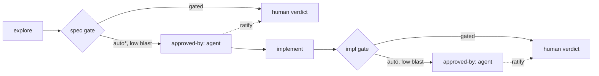

# Gate Autonomy & Accountability

---

## What

A model for **how far an agent may advance a spec without the human**, how that advance is **recorded**, and how the human **catches up** — without ever letting the spec land in a contradictory state.

It adds four cooperating pieces:

1. **The leash** — an autonomy *ceiling* the Conductor sets per run (`gated` | `auto-to-spec` | `auto`).
2. **Gate attribution** — `approved-by` records *who* passed each gate; agent-attributed gates are provisional, awaiting human ratification.
3. **An enforced state machine** — `validate-spec` rejects any illegal `(status, aligned, markers, .feature)` tuple, so states like `draft + aligned:true`-meaning-implemented can't be committed.
4. **The gate report** — on reaching a gate under autonomy the agent emits a structured checklist (verdict per backward face + the contestable defaults it chose) so the human can ratify fast.



---

## Why

A spec was just driven from blank to "implemented" in one autonomous run with no recorded human verdict, and left in `status: draft + aligned: true` — a state the workflow-cursor table does not define. Three gaps surfaced:

- **No declared autonomy boundary.** The agent assumed `auto`; the human never set a leash. Approval, where it existed, was diffuse in conversation, not a discrete act.
- **`aligned` is overloaded.** It conflates "contract layer in sync" with "implementation in sync," so the same `aligned: true` can mean *ready for the spec gate* or *implemented*. Nothing catches the contradiction.
- **No representation of "advanced by agent alone."** There was no way to mark the spec as provisionally advanced and owed a human review — so it silently looked done.

The motive model already gives the principle: the human (Conductor) holds **motive and accountability**; a delegate may be handed the **act**, never the accountability. Autonomous completion is delegating the act ahead of reconciling accountability. These four pieces make that gap **explicit, legal, and visible**.

---

## Design decisions

### The leash is a ceiling, not a floor

The Conductor declares an autonomy level per run; it is **transient and procedural**, so the skill (main thread) holds it — like the reviewer set and the iteration cap — never spec frontmatter.

| Level | Agent may | Default |
|---|---|---|
| `gated` | run one autonomous segment, then stop at **every** gate for the human verdict | ✅ |
| `auto-to-spec` | explore and self-assert the **spec gate**, stop before implementing | |
| `auto` | run through the **impl gate** too | |

It is a **ceiling**: even under `auto`, the agent **downgrades to a stop** when it detects high blast radius — a change to a frozen contract, a public/installed surface, a cross-spec ripple, or anything irreversible or security-sensitive. The agent may always stop earlier than the leash; it may never go further. Absent a declared level, the default is `gated` — the agent asks.

### Accountability stays human: `approved-by`

Each gate transition records its approver in a frontmatter map keyed by gate:

```yaml
approved-by:
  spec: agent          # provisional — awaiting human ratification
  impl: homa           # ratified by the human
```

- `agent` = **provisionally** past that gate; the act is done, accountability is **not yet reconciled**.
- a human name = ratified.
- The set of specs with any `agent` value **is the human's review queue** — no separate backlog file.

Ratifying flips the value from `agent` to the human's name. This is the motive model made concrete: the act is delegable, the accountability is not — `approved-by` tracks exactly the reconciliation gap.

<!-- open: confirm frontmatter shape — `approved-by` map keyed by gate (this proposal) vs. two flat fields `spec-approved-by` / `impl-approved-by`? -->

### State integrity: the cursor table becomes an enforced FSM

The sdd-orchestrator **workflow-cursor table** already enumerates the legal `(status, aligned, markers, .feature)` rows. This spec **lifts it to normative**: `validate-spec` rejects any tuple that is not a legal row. An illegal state is a validation failure → red → commit discipline already forbids committing it. The contradiction becomes uncommittable rather than relying on discipline.

### Resolve the `aligned` overload

The incident proved `aligned` is ambiguous. Resolution (recommended): **`aligned` is gate-relative** — it always means "the artifacts for the **current** gate are in sync."

- at `draft`, current gate = spec gate → `aligned: true` means `spec.md ↔ .feature` are in sync (**ready for the spec gate**, *not* implemented).
- at `approved`, current gate = impl gate → `aligned: true` means the implementation conforms to the frozen `.feature`.

Under this reading the prior incident's real error was **not** the `draft + aligned:true` tuple (which legally means "ready for the spec gate") but **committing an implementation against an unapproved, unfrozen `.feature`** and treating `aligned` as "done."

<!-- open: pick the resolution — gate-relative `aligned` (this proposal, one field) vs. split into `contract-aligned` / `impl-aligned` (two fields, explicit, no overloading). Needs the human verdict at the gate. -->

### The gate report: a ratification checklist

When the agent reaches a gate under any autonomy level, it emits a **gate report** — the same two-axis verdict a judge produces, made reviewable:

- **per backward face**: Framer (scope — still worth shipping?), Builder (contract/impl complete & testable against the bar?), Architect (fit — conventions, no dup/conflict).
- **the contestable defaults it chose** (the decisions a human might have made differently), listed explicitly.
- `STATUS` and, when self-asserted, the flag **"agent-asserted — ratify or kick back."**

The human runs the checklist and either ratifies (sets `approved-by`) or returns it with changes. This standardizes the ad-hoc gate summary into a fixed artifact.

### Skill-domain implementation is ACES-delegated

Where implementing this spec modifies SDD **skills** (e.g., `validate-spec`) or writes any skill/agent, that work is **agent-configuration domain** and belongs to the ACES production chain (spec-producer → plan-producer → impl-producer → impl-judge), per the orchestrator model. This is **documented delegation**: until the orchestrator-model ACES agents exist, the work is executed inline, but the owning roles are ACES's.

---

## Command surface / API

**Frontmatter additions** (defined in `sdd-plugin`):

| Field | Values | Meaning |
|---|---|---|
| `approved-by` | map `{ spec, impl }` → `agent` \| `<human>` | who passed each gate; `agent` = provisional |

**Leash** — declared in the prompt to the create-spec / validate-spec skills (default `gated`); held in the main thread, not persisted.

**`validate-spec` new checks:**
- the `(status, aligned, markers, .feature)` tuple is a legal cursor-table row;
- `approved-by` values are well-formed; an `agent` value surfaces the spec in the review queue;
- `aligned` is interpreted gate-relative (pending the open decision).

**Gate report** — structured output of the orchestrator at a gate (see uniform delegate output in sdd-orchestrator); not a CLI.

**Gherkin scenarios:** [sdd-gate-autonomy.feature](./sdd-gate-autonomy.feature)

---

## Related

- `artifacts/specs/sdd-orchestrator/spec.md` — the gate model, layer-scoped `aligned`, and the workflow-cursor table this enforces
- `artifacts/specs/sdd-plugin/spec.md` — frontmatter/status definitions the `approved-by` field extends
- `artifacts/specs/motive-model/spec.md` — Conductor holds accountability; the act is delegable, accountability is not

---

## Artifacts

| Label | Path |
|---|---|
| Spec | `artifacts/specs/sdd-gate-autonomy/spec.md` |
| Scenarios | `artifacts/specs/sdd-gate-autonomy/sdd-gate-autonomy.feature` |
