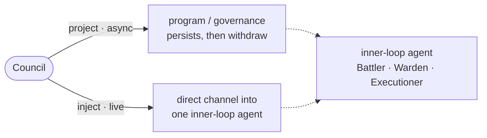

# SDD Inject Channel — zoom into a single inner-loop agent

---

## What

A capability for the human **Council** to **zoom from the orchestration level down into a single inner-loop agent** — to communicate with it or fine-tune it directly. It defines two distinct moves toward an agent — **project** and **inject** — and the **dual-mode / invokable-agent** mechanism that enables them.

---

## Why

SDD delegation is one-way and coarse: the gateway routes to the Operator, which dispatches producers and judges autonomously. The human cannot address an individual inner-loop agent — to ask it something, to watch it work, or to adjust how it behaves in the moment. Two different needs are tangled together and must be separated:

- **Tuning how an agent behaves**, durably — today done only by editing a governance out of band.
- **Reaching one agent live**, to converse or pilot through it — not possible at all.

---

## Use Cases

Three entry-points, all through the `sdd` gateway. Each names the trigger, what it receives, and what it produces. Project and inject are the two moves; the third is the shared refusal path that guards both.

| Trigger | Inputs | Outcome |
|---|---|---|
| **Council projects into an agent** — wants to durably tune how an inner-loop agent behaves | a named inner-loop agent + a program (a governance) | the agent's program is imprinted; every future autonomous run applies it; the Council withdraws |
| **Council injects into an agent** — wants to reach one agent live, to converse or pilot through it | a named inner-loop agent | a live channel opens to that one agent; the channel closes on withdraw |
| **Project or inject is refused** — the input is invalid or the target is not injectable | an invalid program, or a name matching no inner-loop agent / a non-injectable agent, or an entry that bypasses the gateway | the move is refused; nothing is changed and no channel opens |

Each use case is verified by one-or-more scenarios in the `.feature`: the happy path, the refusal mirrors (invalid program, non-injectable target, unknown name, non-gateway entry), and the contract-preservation cases under a live channel.

---

## Design decisions

### Two moves: project and inject

| Move | Nature | Effect |
|---|---|---|
| **Project** | asynchronous, persistent | imprint a **program** (a governance — the agent's operating directives) and withdraw; the tuning persists on every future run |
| **Inject** | live, transient | jack into one inner-loop agent in real time to converse or pilot *through* it; the channel closes when you withdraw |

Projecting is *calibrating the worker*; injecting is *being present in it*. They must never be conflated — one changes future behavior, the other operates the present.

### The dual-mode mechanism

An injectable agent is **dual-mode**: it can be (a) dispatched autonomously by the Operator as today, **and** (b) invoked directly — as a subagent or loaded in-context as a persona — for a live human channel. The injectable set is the **inner-loop agents**: the producers and judges (in fleet terms the Battler, Warden, Executioner).

### The gateway is the entry to the channel

The Council enters inject from the `sdd` gateway: select a named inner-loop agent, open the channel. The gateway is the single door to both projection and injection.

### Inject respects existing contracts

A live channel does **not** bypass the loop's ownership and governance rules. A judge injected live still cannot write artifacts it does not own (e.g. a frozen `.feature`); a producer injected live still answers to its program. Inject changes *who you are talking to*, never *what they are allowed to do*.

---

## Command surface / API

| Concern | Behavior |
|---|---|
| Project | edits the target agent's **program** (governance); persistent; async |
| Inject | opens a live channel to **one** named inner-loop agent; transient |
| Injectable agents | the inner-loop producers and judges (dual-mode) |
| Entry point | the `sdd` gateway |
| Invariant | inject respects ownership and governance contracts |

---

## Related

- `artifacts/specs/sdd-mission-loop/spec.md` — the Operator that dispatches these agents autonomously; inject is the human's direct path to one of them
- `artifacts/specs/sdd-orchestrator/spec.md` — the production chain whose inner-loop agents are injectable
- `artifacts/specs/motive-model/spec.md` — the actor/delegate model; project vs inject is the human–agent interface ("delegate fidelity")

---

## Artifacts

| Label | Path |
|---|---|
| Spec | `artifacts/specs/sdd-inject-channel/spec.md` |
| Scenarios | `artifacts/specs/sdd-inject-channel/sdd-inject-channel.feature` |
