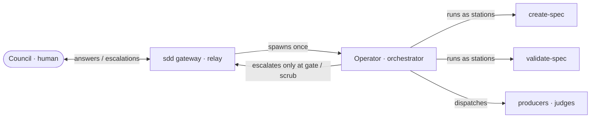

# SDD Mission Loop — the Operator owns the middle loop

---

## What

The **middle loop** — one spec's journey from `draft` to `approved` to `implemented`, across many tasks — is owned by a single coordinator: the **Operator** (the role filled today by `sdd-orchestrator`). The `sdd` gateway is a **thin relay**; `create-spec` and `validate-spec` are **stations the Operator runs**, never spawned as agent types. The Operator escalates to the human **Council** only at **gates** and **scrub** (kill).

---

## Why

The `sdd` gateway skill is internally contradictory about delegation, and the contradiction produces real failures:

- Its *Delegate Downstream Work* section says "spawn a subagent… Do not load `create-spec`, `validate-spec`, or `render-spec-graph` into the current session," and maps each workflow action to a **"Subagent skill"** column naming those skills.
- But those are **skills, not agent types** — an agent that reads the table literally attempts `subagent_type: validate-spec`, which fails with *"Agent type not found."*
- Meanwhile `validate-spec` "owns the gate decision… on the human verdict writes `status` and `approved-by`," and `create-spec` "owns the user loop." Both need a user channel — i.e. in-session — contradicting "spawn a subagent / don't load in-session." The gateway itself states (downstream) that "user questions belong to this skill's intake or the downstream skill."

The result is that a router either fails outright, or bypasses the gate skill entirely and hand-writes the `status`/`approved-by` the gate was meant to own.

---

## Design decisions

### The Operator owns the mission loop

The coordinator (`sdd-orchestrator`, the **Operator**) owns the per-spec middle loop. It drives the production chain across segments and is the single agent the gateway spawns. The downstream skills (`create-spec`, `validate-spec`, `render-spec-graph`) are **stations the Operator runs**, not separately-spawned user-facing skills.

### The gateway is a thin relay

The `sdd` gateway holds **no production logic**. It routes by status, hands the resolved work to the Operator, carries the Council's answers down and the Operator's escalations up. The user channel lives at the **relay ↔ Operator** boundary: the Operator (which has no user channel) returns `STATUS: needs-input`; the relay asks the Council and resumes the Operator with the answers.

### Never spawn the judge directly

The relay **must never** spawn a gate or judge skill as a `subagent_type`. The only thing it spawns is the Operator. The Operator runs the gate station and escalates to the Council **only at gates and scrub**.

### Write-ownership is preserved

This spec changes *who is invoked how*, not *who writes what*. The gate station still owns `status` and the human ratification of `approved-by`; the Operator still owns `aligned` and agent self-assertions. The fix is a delegation-mechanism correction, not an ownership change.

---

## Command surface / API

**Spawn vs invoke:**

| Thing | Mechanism |
|---|---|
| Operator (`sdd-orchestrator`) | **spawned** as a subagent, once per segment |
| `create-spec` / `validate-spec` / `render-spec-graph` | **run as stations** by the Operator / relay — never `subagent_type` |
| User questions | returned by the Operator as `STATUS: needs-input`; asked by the **relay** |
| Escalation to Council | only at **gates** (go/no-go) and **scrub** (kill) |

---

## Related

- `artifacts/specs/sdd-orchestrator/spec.md` — the Operator (orchestrator) and the production-chain model this clarifies
- `artifacts/specs/sdd/sdd-skill/spec.md` — the gateway skill whose delegation section this corrects (Revised at impl)
- `artifacts/specs/sdd-inject-channel/spec.md` — the live channel into a single inner-loop agent, a sibling capability
- `artifacts/specs/motive-model/spec.md` — the three-loop model; this spec owns the **middle** loop

---

## Artifacts

| Label | Path |
|---|---|
| Spec | `artifacts/specs/sdd-mission-loop/spec.md` |
| Scenarios | `artifacts/specs/sdd-mission-loop/sdd-mission-loop.feature` |
