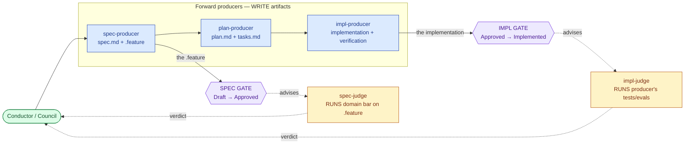

# SDD Operator & the Plugin-Delegate Model

> **Project spec.** This is the human-readable overview of the **Operator** (`sdd-operator`) — the lead delegate of the SDD Build loop. The normative scenarios live in six **feature children** (see *The decomposition*); this spec holds the narrative, the production-chain model, the fleet-metaphor framing, and the model invariants a person reads first.
>
> Decomposed from the former SDD build-loop monolith (one ~290-line spec, 65 scenarios) under the spec-granularity heuristic: re-judge cost scales with spec size, so the behaviors were cut along their seams. The agent file is now named `sdd-operator`; the rename of `sdd-orchestrator.md` → `sdd-operator.md` and the `subagent_type` references is complete.

---

## What

SDD owns the spec-driven workflow and runs the loop. The **Operator** is its lead delegate: it runs one autonomous **segment**, resolves which units to commit from the registry, dispatches the production chain, and synthesizes the result (sets `aligned`). Domain plugins (ACES for agent configurations, Quill for documentation) augment the loop by supplying **delegates** for the roles SDD does not hard-code.

The architecture has four moving parts:

1. **The Operator** (`sdd-operator`) — the line officer of an engagement. It resolves plugin delegates from the registry's domain coverage, dispatches each act, and synthesizes results. It does discovery and dispatch itself; there is no separate dispatcher agent. It has **no user channel** — it escalates through the relay only at a gate or a scrub.
2. **The production chain — five co-delivered artifacts, three forward producers, two judges.** The Operator dispatches whichever producers are declared and gathers the judges at the two gates.
3. **Default delegates** — `sdd-scenario-writer` (spec-producer), `sdd-planner` (plan-producer), `sdd-spec-judge` (spec-judge), `sdd-implementer` (impl-judge), and the generic Builder (impl-producer, no agent) — the built-in fallbacks, invoked only when no plugin fills the role.
4. **Plugin delegates** — each its own agent definition (own model/effort/context). A full domain plugin fills every producer and judge; thin domains let roles degenerate.

Dispatch is uniform and per-role: the Operator resolves each role to a plugin agent or the SDD default, and invokes it through one identical I/O surface.

---

## The production chain

Every act on the chain is one of **five roles**. The dividing line is simple: **producers write artifacts; judges run a bar and advise** (a judge never writes `spec.md` or the `.feature`). The Operator resolves each role to a plugin agent or the SDD default and dispatches it; the **human (Conductor / Council)** holds motive and makes every gate verdict.

| Role | Verb | Produces / runs | Writes to | SDD default |
|---|---|---|---|---|
| **spec-producer** | writes the contract | intent prose + boolean Gherkin | `spec.md` body, `.feature` | `sdd-scenario-writer` |
| **spec-judge** | judges the contract | runs the domain bar against the `.feature` | nothing — advises | `sdd-spec-judge` / `validate-spec` |
| **plan-producer** | plans the solution | the solution + its DAG breakdown | `plan.md`, `tasks.md` | `sdd-planner` |
| **impl-producer** | builds artifact + verification | the implementation **and** its tests/evals (one per frozen scenario) | code/docs/config **+** tests/evals | the generic Builder (no agent) |
| **impl-judge** | runs the verification | runs the producer's tests/evals + an orthogonal structural/scope read | nothing — advises | `sdd-implementer` |

Naming is **producer / judge** with one constraint: **`producer ≠ judge`**. A role is either **filled** (a plugin agent acts) or it **degenerates** to the SDD default; the `spec-producer` is always filled. Plan and tasks get **no judge of their own** — the five artifacts co-deliver, and the implementation's test result validates them transitively. Only two objects are gated: the `.feature` (spec gate) and the implementation (impl gate).

The forward producers run in two **phases** (the `MODE` parameter): **`explore`** (against the *draft* `.feature`) and **`deliver`** (against the *frozen* `.feature`). The distinction is **contract-not-yet-frozen vs building-against-the-frozen-contract** — *not* throwaway-vs-kept. Explore output can carry forward (co-delivery); a good spike cleans into the real implementation at the freeze.

---

## The fleet metaphor

SDD carries a running metaphor that surfaces in the prompts. The human is **fleet command** (the **Conductor** / **Council**): they hold motive and accountability, and theirs are the only hands on ratification and the kill switch. The **Operator** is the line officer of one **engagement** (a spec): it runs one autonomous **segment**, projects the production-chain roles, injects its stations, and reports up the **relay** — the only line to command.

| Fleet term | Real concept |
|---|---|
| **Engagement** | a spec — one committed objective |
| **Sealed orders** | the **frozen** `.feature` — the contract cannot change mid-engagement; changing it needs a ratified re-open (a freeze-break) |
| **The gate** | a backward-face verdict to advance status; command ratifies, a delegate may self-assert only within its **leash** |
| **Scrub** | a kill decision (`deprecated`) |
| **The leash** | how far the Operator may act alone before signaling command — derived per gate from reversibility, blast radius, novelty, confidence |

**Project vs inject** — the Operator **projects** the production-chain roles (spawned subagents, clean context) and **injects** its stations (`create-spec`, `validate-spec`, `revise-spec`, `split-spec`, `render-spec-graph` — skills it runs in-session). Trying to *project* a station as a subagent is the classic misfire and fails outright.

---

## The decomposition — six feature children

This project's behavior is cut along its seams, each child a coherent ~one-behavior scope (well under the granularity ceiling). The Explore/Deliver split is **symmetric**: each phase both *produces and judges* and ends at its gate.

| Child | Owns | Scenarios |
|---|---|---|
| [`sdd-operator-resolution`](../sdd-operator-resolution/spec.md) | How the Operator decides **who** to commit — the resolved lockfile, role/governance resolution, fallback/degeneracy/hard-fail, two-plugin disambiguation | 9 |
| [`sdd-operator-dispatch`](../sdd-operator-dispatch/spec.md) | The production chain — **who does what**, the five-role uniform I/O, the write boundary, governance loads, the model invariants | 16 |
| [`sdd-operator-explore`](../sdd-operator-explore/spec.md) | **Explore phase** — produce *and* judge the contract; shape & probe the draft; the spec-judge/format/ordering/enrichment bar; spec-layer `aligned`; the spec gate | 15 |
| [`sdd-operator-deliver`](../sdd-operator-deliver/spec.md) | **Deliver phase** — build *and* judge against the frozen contract; rubric-as-detail; impl-layer `aligned`; the impl gate | 7 |
| [`sdd-operator-freeze`](../sdd-operator-freeze/spec.md) | Freeze — the strength gradient, co-delivery, Approved ≠ Implemented, plan-ripple essence/expression, the `tasks.md` DAG, the `.feature` pivot | 6 |
| [`sdd-operator-segment`](../sdd-operator-segment/spec.md) | The segment — suspend/resume, batching, the iteration cap, cursor derivation, markers vs questions, OBSERVATIONS routing | 12 |

Total: **65 scenarios** — every scenario from the former monolith lands in exactly one child (no orphans, no duplicates).

---

## Model invariants

These hold across every child and are the reading a plugin author needs first:

- **`producer ≠ judge`** — the hand that writes an artifact never signs off on it. Grader-independence comes from the **frozen `.feature`** anchoring the verification plus a **separate runner**, not from the agent-split alone.
- **Resolution lands on a real producer — or fails closed.** Every required role resolves to a plugin agent or an SDD default; if neither, the Operator hard-fails with a blocker and **records nothing** (no inline sentinel). This joins the fail-closed structural-error class in `combat-log-governance` / `sdd-provenance`.
- **`aligned` is layer-scoped.** Spec gate → the contract layer (`spec.md` ↔ `.feature`); impl gate → the impl layer (code conforms to the frozen `.feature`). Checking impl at the spec gate is forbidden — it would collapse Approved into Implemented.
- **The five artifacts co-deliver** — produced together in Explore, never in sequential gated phases. There is **no plan gate**. Freeze is a *strength gradient*, not an absolute lock.
- **The `.feature` pivots** — the object judged at the spec gate becomes the bar at the impl gate. That is what makes Approved a prerequisite for Implemented without making them equal.
- **The Operator runs one segment, statelessly.** No user channel; it escalates to the relay only at a gate or scrub; it reconstructs position by reading artifacts.

---

## Related

- `artifacts/specs/sdd-plugin/spec.md` — the SDD practice this orchestrates
- `artifacts/specs/motive-model/spec.md` — Conductor (actor) vs Operator/operator (delegate pattern)
- `artifacts/adr/0013-governance-skills.md` — governance skills replace `governance show`
- `apps/website/src/content/docs/sdd/overview.md`, `control-flow.md`, `metaphor.md` — the authoritative vocabulary

---

## Artifacts

| Label | Path |
|---|---|
| Project spec | `artifacts/specs/sdd-operator/spec.md` |
| Feature children | `artifacts/specs/sdd-operator-{resolution,dispatch,explore,deliver,freeze,segment}/` |

> The former `artifacts/specs/sdd-orchestrator/` is deprecated by this decomposition (its scenarios moved into the children). See its `spec.md` for the deprecation record.
