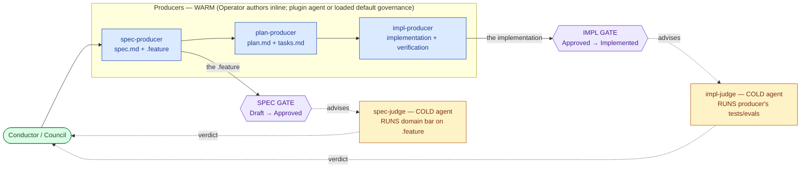

# SDD Operator & the Plugin-Delegate Model

> **Composition spec.** This is the human-readable overview of the **Operator** (`sdd-operator`) — the lead delegate of the SDD Build loop. The normative scenarios live in six **feature children** (see *The decomposition*); this spec holds the narrative, the production-chain model, the fleet-metaphor framing, and the model invariants a person reads first.
>
> Decomposed from the former SDD build-loop monolith (one ~290-line spec, 65 scenarios) under the spec-granularity heuristic: re-judge cost scales with spec size, so the behaviors were cut along their seams. The agent file is now named `sdd-operator`; the rename of `sdd-orchestrator.md` → `sdd-operator.md` and the `subagent_type` references is complete.

---

## What

SDD owns the spec-driven workflow and runs the loop. The **Operator** is its lead delegate: it runs one autonomous **segment**, resolves which units to commit from the registry, dispatches the production chain, and synthesizes the result (sets `aligned`). Domain plugins (ACES for agent configurations, Quill for documentation) augment the loop by supplying **delegates** for the roles SDD does not hard-code.

The architecture has five moving parts:

1. **The Operator** (`sdd-operator`) — the line officer of a mission. It resolves plugin delegates from the registry's domain coverage, dispatches each act, and synthesizes results. It does discovery and dispatch itself; there is no separate dispatcher agent. It has **no user channel** — it escalates through the relay only at a gate or a scrub.
2. **The production chain — five co-delivered artifacts, three producer roles, two judge roles.** The Operator runs whichever producers are declared and gathers the judges at the two gates. The two role *kinds* run in different contexts: **producers run in the Operator's own warm context** (the Operator authors them inline); **judges run as spawned cold agents** (a separate context the `producer ≠ judge` invariant requires).
3. **Default producers are loadable governance skills, not spawned agents** — `spec-producer`, `plan-producer`, and `impl-producer` each have an SDD-default **governance skill** the Operator **loads in-session and runs in its own warm context**, authoring the artifact inline. There is no default *producer agent* to spawn. (The producer governances reference the existing actor bars — director-/builder-/architect-/spec-governance — as their criteria.)
4. **Default judges are spawned cold agents** — `sdd-spec-judge` (spec-judge) and `sdd-implementer` (impl-judge) are re-spawned in a fresh context every time. This is the one carve-out from the "load it inline" rule: a grader must not share the author's context, so judge roles are always projected as cold agents, never loaded as governances.
5. **Plugin delegates** — a plugin that covers the domain supplies its own spawned agent (own model, effort, context) for each role it fills, producer or judge alike. A full domain plugin fills all five roles; a thin one fills only some and leaves the rest to the SDD default.

**Uniform resolution, one carve-out (the symmetry).** For *any* role the Operator asks one question — does a plugin cover this domain? If **yes**, it **spawns** that plugin's delegate agent. If **no**, it falls back to the SDD default. The fallback differs only by kind: a **producer** default is a **governance the Operator loads and runs inline (warm)**; a **judge** default is a **cold agent the Operator spawns**. Tagline: **"conductor writes, cold judges grade."**

Dispatch is uniform and per-role: the Operator resolves each role to a plugin agent (spawn), an SDD-default producer governance (load inline), or an SDD-default judge agent (spawn cold), and drives it through one identical I/O surface.

---

## Use Cases

The Operator has **no user channel** — it is always spawned by a relay (the `sdd` gateway, or the `create-spec` / `validate-spec` station that invoked it) and reports back up that relay. Each distinct way it is invoked:

| Trigger | Inputs | Outcome |
|---|---|---|
| **New spec, explore segment** — `create-spec` spawns the Operator to build a contract for a new or backfilled domain | `DOMAIN`, `DOMAIN_PATH`, `USER_INPUT` (What/Why/command surface), `ITERATION_CAP`; registry (`universal-plugin.json`) | One autonomous segment: resolves the chain, runs the spec-producer (warm) ⇄ spec-judge (cold) loop to convergence, sets contract-layer `aligned`, **stops at the spec gate** with a go/no-go report (or self-asserts within leash) |
| **Resume after relay-collected answers** — a station re-spawns the Operator to continue a suspended segment | `USER_ANSWERS` for prior `QUESTIONS`, plus the same `DOMAIN` inputs; cursor re-derived from the artifacts (stateless) | Folds answers into the producer call, resolves open markers, advances to the next checkpoint or gate |
| **Gate review** — `validate-spec` spawns the Operator to assess a spec at a gate | `DOMAIN`, `DOMAIN_PATH`, target gate (spec or impl); the spec's current artifacts + frontmatter | Read-only review (no producer dispatched): emits the gate report (verdict per face, leash derivation, decision menu); fails closed on a structural/ambiguity blocker |
| **Deliver segment** — the Operator builds against a frozen `.feature` (Approved spec) | `DOMAIN` inputs; the frozen `.feature`, `plan.md`/`tasks.md`; `MODE: deliver` derived | Runs plan-producer + impl-producer (warm) and the impl-judge (cold) per sub-domain; sets impl-layer `aligned` on a clean pass; **stops at the impl gate** with a go/no-go report (or self-asserts within leash) |

> This is a **composition parent** (owns no `.feature`); its normative scenarios live in the six children. The use cases above describe how the Operator *as a subject* is entered — the children's `.feature` files carry the boolean assertions that verify each.

---

## The production chain

Every act on the chain is one of **five roles**. The dividing line is simple: **producers write artifacts; judges run a bar and advise** (a judge never writes `spec.md` or the `.feature`). That line also fixes *where each role runs*: **the Operator authors every producer in its own warm context** — from a plugin agent it spawns, or from an SDD-default governance it loads inline — while **judges always run in a spawned cold context**. The **human (Conductor / Council)** holds motive and makes every gate verdict.

| Role | Verb | Produces / runs | Writes to | How the SDD default runs |
|---|---|---|---|---|
| **spec-producer** | writes the contract | intent prose + boolean Gherkin | `spec.md` body, `.feature` | Operator loads the spec-producer governance, authors inline (warm) |
| **spec-judge** | judges the contract | runs the domain bar against the `.feature` | nothing — advises | `sdd-spec-judge` — spawned cold agent |
| **plan-producer** | plans the solution | the solution + its DAG breakdown | `plan.md`, `tasks.md` | Operator loads the plan-producer governance, authors inline (warm) |
| **impl-producer** | builds artifact + verification | the implementation **and** its tests/evals (one per frozen scenario) | code/docs/config **+** tests/evals | Operator loads the impl-producer governance, builds inline (warm) |
| **impl-judge** | runs the verification | runs the producer's tests/evals + an orthogonal structural/scope read | nothing — advises | `sdd-implementer` — spawned cold agent |

Naming is **producer / judge** with one constraint: **`producer ≠ judge`**. A role is either **filled by a plugin** (a spawned plugin agent acts) or it **falls back to the SDD default** — a **loadable governance the Operator runs inline** for a producer, a **cold agent the Operator spawns** for a judge; the `spec-producer` is always filled. When the Operator runs a producer from its SDD default, the provenance value `produced-by.<producer-role>` is **`sdd:sdd-operator`** — the Operator ran the work inline (this replaces the retired fabricated `sdd:builder` and the old "generic Builder / null degeneracy" framing). A producer slot value is therefore either a plugin delegate agent name (spawned) or `sdd:sdd-operator` (Operator loaded the default governance and authored inline). Plan and tasks get **no judge of their own** — the five artifacts co-deliver, and the implementation's test result validates them transitively. Only two objects are gated: the `.feature` (spec gate) and the implementation (impl gate).

The producers run in two **phases** (the `MODE` parameter): **`explore`** (against the *draft* `.feature`) and **`deliver`** (against the *frozen* `.feature`). The distinction is **contract-not-yet-frozen vs building-against-the-frozen-contract** — *not* throwaway-vs-kept. Explore output can carry forward (co-delivery); a good spike cleans into the real implementation at the freeze.

---

## The fleet metaphor

SDD carries a running metaphor that surfaces in the prompts. The human is **fleet command** (the **Conductor** / **Council**): they hold motive and accountability, and theirs are the only hands on ratification and the kill switch. The **Operator** is the line officer of one **mission** (one spec's full lifecycle): it runs one autonomous **segment**, dispatches the production chain (projecting judges and plugin delegates as cold subagents, injecting the SDD-default producers it authors inline), injects its stations, and reports up the **relay** — the only line to command.

| Fleet term | Real concept |
|---|---|
| **Engagement** | a spec — one committed objective |
| **Sealed orders** | the **frozen** `.feature` — the contract cannot change mid-mission; changing it needs a ratified re-open (a freeze-break) |
| **The gate** | a backward-face verdict to advance status; command ratifies, a delegate may self-assert only within its **leash** |
| **Scrub** | a kill decision (`deprecated`) |
| **The leash** | how far the Operator may act alone before signaling command — derived per gate from reversibility, blast radius, novelty, confidence |

**Project vs inject** — the Operator **projects** an act into a spawned subagent with clean context, or **injects** it by loading and running it in-session. **Judge roles are always projected** (cold context — `producer ≠ judge`); **plugin delegate roles are projected** (each its own agent). The Operator **injects** its stations (`create-spec`, `validate-spec`, `revise-spec`, `split-spec`, `render-spec-graph` — skills it runs in-session) **and** the SDD-default producers (the spec-/plan-/impl-producer governances it loads and authors inline). Trying to *project* a station as a subagent — or to *project* an SDD-default producer governance as one — is the classic misfire and fails outright.

---

## The decomposition — six feature children

This project's behavior is cut along its seams, each child a coherent ~one-behavior scope (well under the granularity ceiling). The Explore/Deliver split is **symmetric**: each phase both *produces and judges* and ends at its gate.

| Child | Owns | Scenarios |
|---|---|---|
| [`sdd-operator-resolution`](../sdd-operator-resolution/spec.md) | How the Operator decides **who** to commit — the resolved lockfile, role/governance resolution, producer-inline vs named-spawn, hard-fail, two-plugin disambiguation | 8 |
| [`sdd-operator-dispatch`](../sdd-operator-dispatch/spec.md) | The production chain — **who does what**, the five-role uniform I/O, the write boundary, governance loads, the model invariants | 16 |
| [`sdd-operator-explore`](../sdd-operator-explore/spec.md) | **Explore phase** — produce *and* judge the contract; shape & probe the draft; the spec-judge/format/ordering/enrichment bar; spec-layer `aligned`; the spec gate | 20 |
| [`sdd-operator-deliver`](../sdd-operator-deliver/spec.md) | **Deliver phase** — build *and* judge against the frozen contract; rubric-as-detail; impl-layer `aligned`; the impl gate | 11 |
| [`sdd-operator-freeze`](../sdd-operator-freeze/spec.md) | Freeze — the strength gradient, co-delivery, Approved ≠ Implemented, plan-ripple essence/expression, the `tasks.md` DAG, the `.feature` pivot | 6 |
| [`sdd-operator-segment`](../sdd-operator-segment/spec.md) | The segment — suspend/resume, batching, the iteration cap, cursor derivation, markers vs questions, OBSERVATIONS routing | 12 |

Total: **73 scenarios** across the six children — grown from the monolith's 65 by the producer-fold revisions (escape-valve, error-case, and split scenarios added during the governance-skill model rollout).

---

## Model invariants

These hold across every child and are the reading a plugin author needs first:

- **`producer ≠ judge`, enforced by context.** The hand that writes an artifact never signs off on it. **Producers run in the Operator's warm context** (it authors them — from a plugin agent or a loaded SDD-default governance); **judges always run in a spawned cold context** the author cannot reach. Grader-independence comes from this context separation plus the **frozen `.feature`** anchoring the verification and a **separate runner** — which is why a judge default can never be a loaded-inline governance, only a cold agent. Tagline: **conductor writes, cold judges grade.**
- **Uniform resolution, one carve-out.** Every role asks one question — does a plugin cover the domain? Plugin → spawn its agent. No plugin → SDD default: a **producer** default is a **governance loaded and run inline (warm)**, a **judge** default is a **cold agent spawned**. The producer-vs-judge kind is the *only* thing that changes the fallback shape.
- **Resolution lands on a real producer — or fails closed.** Every required role resolves to a plugin agent or an SDD default; if neither, the Operator hard-fails with a blocker and **records nothing** (no inline sentinel). When the Operator runs a producer from its SDD default, `produced-by.<producer-role>` records **`sdd:sdd-operator`** (it ran the work inline) — there is no fabricated producer-agent value. This joins the fail-closed structural-error class in `combat-log-governance` / `sdd-provenance`.
- **`aligned` is layer-scoped.** Spec gate → the contract layer (`spec.md` ↔ `.feature`); impl gate → the impl layer (code conforms to the frozen `.feature`). Checking impl at the spec gate is forbidden — it would collapse Approved into Implemented.
- **The five artifacts co-deliver** — produced together in Explore, never in sequential gated phases. There is **no plan gate**. Freeze is a *strength gradient*, not an absolute lock.
- **The `.feature` pivots** — the object judged at the spec gate becomes the bar at the impl gate. That is what makes Approved a prerequisite for Implemented without making them equal.
- **The Operator runs one segment, statelessly.** No user channel; it escalates to the relay only at a gate or scrub; it reconstructs position by reading artifacts.

---

## Related

- `artifacts/specs/sdd-plugin/spec.md` — the SDD practice this orchestrates
- `artifacts/specs/motive-model/spec.md` — Conductor (actor) vs Operator/operator (delegate pattern)
- `artifacts/adr/0013-governance-skills.md` — governance skills replace `governance show`; the model the SDD-default producers now follow (loaded inline, not spawned). The producer knowledge relocates as governances: `sdd-scenario-writer` → a spec-producer governance, `sdd-planner` → a plan-producer governance, plus a new impl-producer governance (what `sdd:builder` was groping for); judge agents are untouched
- `apps/website/src/content/docs/sdd/overview.md`, `control-flow.md`, `metaphor.md` — the authoritative vocabulary

---

## Artifacts

| Label | Path |
|---|---|
| Project spec | `artifacts/specs/sdd-operator/spec.md` |
| Feature children | `artifacts/specs/sdd-operator-{resolution,dispatch,explore,deliver,freeze,segment}/` |

> The former `artifacts/specs/sdd-orchestrator/` is deprecated by this decomposition (its scenarios moved into the children). See its `spec.md` for the deprecation record.
