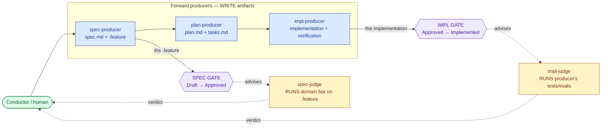
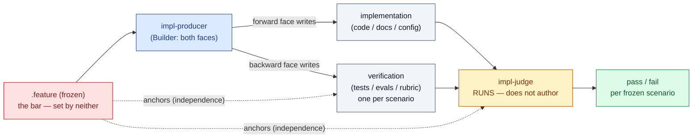

> **DEPRECATED — decomposed into [`sdd-operator`](../sdd-operator/spec.md) + six feature children.**
> This monolith's 65 scenarios moved into `sdd-operator-{resolution,dispatch,explore,deliver,freeze,segment}`.
> The content below is retained for history only; the normative spec is now the `sdd-operator` project spec and its children.
> The relay must set `status: deprecated` (status is skill-owned; the Operator cannot write it).

# SDD Orchestrator & the Plugin-Delegate Model

---

## What

SDD owns the spec-driven workflow and runs the loop. Domain plugins (ACES for agent configurations, Quill for documentation) augment that loop by supplying **delegates** for the roles SDD does not hard-code — the producers along the chain and the judges at the gates (the production chain below).

The architecture has four moving parts:

1. **`sdd-orchestrator`** (renamed from `sdd-author`) — the lead delegate. It runs the loop, resolves plugin delegates from the registry's domain coverage, dispatches each act, and synthesizes results (sets `aligned`). It does discovery and dispatch itself; there is no separate dispatcher agent.
2. **The production chain — five co-delivered artifacts, three forward producers, two judges.** The orchestrator dispatches whichever producers are declared and gathers the judges at the two gates:

   | Artifact | Producer (forward) | Judged |
   |---|---|---|
   | `spec.md` (intent) | human + orchestrator | — |
   | `.feature` (contract) | **spec-producer** | **spec-judge** — spec gate |
   | `plan.md` (solution) | **plan-producer** ("planner") | — (transitive) |
   | `tasks.md` (breakdown) | **plan-producer** | — (transitive) |
   | implementation | **impl-producer** (product + test split hidden) | **impl-judge** — impl gate |

   Plan and tasks get **no judge of their own**: the five artifacts co-deliver, and the implementation's **test result** validates them transitively. The forward producers run in two **modes** — `explore` (throwaway, against the draft) and `implement` (kept, against the frozen `.feature`).
3. **Default delegates** — `sdd-scenario-writer` (spec-producer), `sdd-planner` (plan-producer), `sdd-implementer` (impl-judge) — the built-in fallbacks, invoked only when no plugin fills the role. The default impl-producer is the generic Builder (no agent).
4. **Plugin delegates** — each its own agent definition (own model/effort/context). A full domain plugin fills every producer and judge; thin domains let roles degenerate (see *The production chain* under Design decisions).

Dispatch is uniform and per-role: the orchestrator resolves each role to a plugin agent or the SDD default, and invokes it through one identical I/O surface.

---

## Why

The existing design split each act into a dispatcher agent plus a contract governance plus an advisory agent. Three problems:

- **The dispatcher layer is dead weight.** A plugin knows how heavy its own work is, so it must own its delegation surface — an agent definition that picks its own model and effort. Routing through a generic dispatcher agent adds an indirection that owns nothing.
- **The write side was asymmetric to the verify side.** Verification already delegated the *act* to a plugin implementer; scenario-writing kept the act in SDD and let plugins only *advise* with data. The two sides should be the same shape.
- **Governances stop being a CLI call.** Once the interface is "an agent the orchestrator invokes," the contract folds into the orchestrator's documented I/O plus the default delegates as reference implementations. Reference content (the format bar, conventions) moves to a **governance skill** loaded by the harness — not `governance show` — removing a NodeJS runtime call from the loop (ADR-0013).

---

## Design decisions

### The five roles at a glance — verb, artifact, who fills it

Every act on the chain is one of **five roles**. The dividing line is simple: **producers write artifacts; judges run a bar and advise** (a judge never writes `spec.md` or the `.feature`). The orchestrator resolves each role to a plugin agent or the SDD default and dispatches it; the **human (Conductor)** holds motive and makes every gate verdict.

| Role | Verb — what it does | Produces / runs | Writes to | Default filler | Plugin examples |
|---|---|---|---|---|---|
| **spec-producer** | **writes the contract** | produces the intent prose + boolean Gherkin | `spec.md` body, `.feature` | `sdd-scenario-writer` | `aces-scenario-writer`, `quill-writer` |
| **spec-judge** | **judges the contract** | runs the domain bar against the `.feature` (testability, coverage, criteria) | nothing — advises | static format gate (`validate-spec`) | `aces-spec-validator`, Quill static criteria |
| **plan-producer** | **plans the solution** | produces the solution + its DAG breakdown | `plan.md`, `tasks.md` | `sdd-planner` | `aces-planner`, Quill default |
| **impl-producer** | **builds the artifact + its verification** | produces the implementation **and** its tests/evals (one per frozen scenario) | code / docs / config **+** tests / evals / rubric | the generic Builder (no agent) | `define-agent` / `improve`, `quill-doc-writer` |
| **impl-judge** | **runs the verification** | runs the producer's tests/evals + an orthogonal structural/scope read; reports pass/fail | nothing — advises | `sdd-implementer` | `aces-implementer`, `quill-implementer` |

Naming is **producer / judge** with one constraint: **`producer ≠ judge`**. Concrete agents keep readable names — only the five role keys are fixed vocabulary. A role is either **filled** (a plugin agent acts) or it **degenerates** to the SDD default; the `spec-producer` is always filled. The full filler matrix per plugin is in *The backward face is productive* below; the normative I/O contract is in *Vocabulary & wiring*.

**The production chain — producers write left-to-right, two gates judge the two ends:**



**The impl-producer co-produces; the impl-judge runs (never authors):** the corrected backbone of the model.



Independence does **not** come from the producer/judge agent-split (same actor, same bar). It comes from the **frozen `.feature`** anchoring the verification plus a **separate runner** — the producer cannot declare its own pass. (Detail: *Grader-independence comes from the bar or an orthogonal axis*.)

### Format authority is validation, not a write monopoly

SDD owning the `.feature` format means SDD owns the **validation gate** — any `.feature`, whoever wrote it, must pass `validate-spec` (valid Gherkin, boolean scenarios, lifecycle rules). It does **not** mean SDD writes the file. Once format authority is located in validation, the act of writing can safely be delegated, because SDD still polices the output.

### The interface is the act, not data

The plug-in point is a **behavior** — "produce the `.feature` for this domain", "plan the solution", "build the artifact" — not a data hand-off. SDD never classifies a domain as simple or complex: a role is either filled by a plugin agent (it acts) or it isn't (it degenerates). The **spec-producer** is always filled — by a plugin agent or the `sdd-scenario-writer` default; the other roles fill or degenerate per domain.

Criteria do not survive as a separate plug-in path. They are the **bar** — codified by the judges (spec-judge, impl-judge). SDD's own bar is the universal format gate (valid Gherkin, boolean scenarios, lifecycle), enforced by `validate-spec` and keeping `producer ≠ judge`. A domain's bar adds its own criteria (e.g., every agent scenario carries trigger context).

### The production chain: five artifacts, three producers, two judges

The plug-in surface is not a 2×2 of one spec object and one impl object. The forward chain has **distinct acts that need distinct skills**, so each is its own delegate the orchestrator sequences:

| Artifact | Producer | The skill it needs | Judged by |
|---|---|---|---|
| `spec.md` (intent) | human + orchestrator (Director-fwd) | scope, motive | — |
| `.feature` (contract) | **spec-producer** | behavioral criteria | **spec-judge** (spec gate) |
| `plan.md` (solution) | **plan-producer** | domain knowledge + brainstorm + research | — (transitive) |
| `tasks.md` (breakdown, a DAG) | **plan-producer** | decompose → executable units; dependencies, parallelism, scenario traceability | — (transitive) |
| implementation | **impl-producer** | heavy domain knowledge; **product + test split hidden** | **impl-judge** (impl gate) |

Naming is **producer / judge** (the motive model's forward verb is *produce*; its named constraint is **`producer ≠ judge`** — the four-eyes echo). Concrete agents keep readable names (`aces-scenario-writer` *is* the spec-producer); only role keys are fixed vocabulary.

**Plan and tasks get no judge.** The five artifacts **co-deliver**; the implementation's **test result** validates plan and tasks transitively — if the build passes, the plan was good enough. Only two objects are gated: the `.feature` (spec gate) and the implementation (impl gate).

**One planner, for now.** `plan.md` and `tasks.md` are one `plan-producer` agent today. *Hypothesis (to revisit): split into `plan-producer` (research) and `task-producer` (scheduling) if the two skills diverge enough to want separate model/effort.* The planner **runs in explore** (co-delivery — the plan is produced and spiked alongside the spec, not after a gate).

**`tasks.md` is a DAG, not a flat todo.** Each task is an executable unit with an ID, dependency edges (enabling parallel "waves"), traceability to the `.feature` scenario it serves, and target file paths; priority/order is **emergent** from the graph, not authored. It is the **live** end of the chain — regenerated as the plan changes, status-tracked during implementation, never hard-frozen.

**What stays hidden below the orchestration line: product vs test.** Whether the impl-producer uses one agent or separates the product-code writer from the test-code writer is **plugin implementation detail** — needed for, say, security logic, pointless for Quill. The orchestrator never learns it. But that intra-producer split is **not** the four-eyes guarantee — those tests are the Builder grading its own lens (see below).

### Grader-independence comes from the bar or an orthogonal axis — not the agent-split

`producer ≠ judge` as an *agent* separation is only anti-tampering hygiene — it stops the crude cheat (editing a test to go green). It does **not** give independent perspective, because for the **Builder** the impl-producer and impl-judge are two faces of **one actor** loading the **same** testability bar. If the builder misreads the spec, its implementation *and* its tests embed the same misread; same-lens tests pass against the wrong understanding. Real independence comes from two other places:

- **An independent bar (Builder).** The functional check is independent only because it is **anchored to the frozen `.feature`** — a bar the builder did not set. The impl-producer **writes** the scenario→evaluation mapping (one eval per scenario, never free-authored from its own sense of done) and the impl-judge **runs** it; both are bound to the frozen `.feature`, so authoring and execution split across two agents without either escaping the anchor.
- **An orthogonal axis (Director, Architect).** Their backward faces judge a property the builder was not optimizing — scope (still worth shipping?), structure (cyclomatic complexity, dup/conflict) — so they catch the builder's blind spot even from the same hand.

Inside the one impl-judge the three parts of the test result have **different** independence sources: functional → anchored to `.feature`; structural and scope → orthogonal. Only the functional part shares the builder's lens, and that is exactly the part the frozen `.feature` makes independent.

### Producers run in two modes: `explore` and `implement`

The forward producers (`plan-producer`, `impl-producer`) take a **mode**, so exploration can *attempt the build* to discover what the spec missed:

- **`explore`** — against the **draft** `.feature`. Output is **scaffolding — discard or promote** (plan/tasks/spike): generate-to-discard, but a good spike can be cleaned into the real implementation at the freeze. The act's goal is discovery: it returns gaps as content-gaps + `OBSERVATIONS`, which the orchestrator routes back into the spec row (markers in `spec.md`, re-invoke spec-producer). The **impl-judge (ship-quality gate) does not run** — forcing final quality on a spike would kill the speed exploration exists for. But discoveries are **not** absorbed unjudged: a discovery becomes a *proposed* `.feature` change and must survive the **spec-judge** (is it a well-formed, testable contract change?) and the **human at the spec gate** (is the missing behavior actually wanted?). The line: explore is held to the **spec-judge bar** (legit contract change), not the impl-judge bar (ship quality). A promoted spike meets the impl-judge later, at the impl gate.
- **`implement`** — against the **frozen** `.feature`. Output is kept; the impl-judge verifies it.

This is why the exploratory loop is **more than the spec row**: it is the spec row *plus* throwaway `explore`-mode runs whose discoveries feed back. The two loops differ by draft-vs-frozen, throwaway-vs-kept, and feedback-up-vs-down — not by which artifact.

### The backward face is productive — but the producer writes the verification, the judge runs it

A backward face does not just read the artifact — it **produces the verification** (the Builder-backward face *writes the tests*; for ACES, *writes the evals*) and **codifies the bar**. The correction: this productive backward face is carried by the **impl-producer**, not the judge. The impl-producer embodies **both faces of the Builder** — the forward face writes the implementation, the backward face writes its verification — so it co-produces **two artifacts** (implementation + test/eval), both derived from the frozen `.feature`. The **impl-judge reads that backward-face artifact and runs it** — it executes the producer's tests/evals and reports the result; it does not author them.

The backward face yields two things:

- **Durable: a governance skill** (ADR-0013) — the bar in loadable form, **keyed by actor, not by SDD**: `director` (scope/kill), `builder` (testability/coverage), `architect` (structural-fit — cyclomatic complexity, dup/conflict). Each is **registry-resolvable** (a plugin may bind its own; SDD ships the defaults) — the same resolution pattern as role→agent. The impl-producer **loads** the builder governance it embodies both to self-align *and to write the verification*; the impl-judge **loads** it to run that verification.
- **Per-run: the test result** — the producer's verification *executed by the judge* against this artifact. "Test result" is loose: the Builder's functional tests/evals (written by the impl-producer, run by the impl-judge) *plus* the judge's own orthogonal reading — Architect's structural check, Director's scope check — combined into one verdict.

**Producer → actor-governance load matrix:** spec-producer → `director` (it writes the intent) + `builder` (it writes the testable `.feature`); plan-producer → `architect`; impl-producer → `builder` + `architect`. (This is where `scope` is loaded — by the spec-producer, as the Director governance.)

This collapses the gate's three backward actors into **three actor governances + a thin judge**, not three runtime judge agents — the efficiency the actors-as-agents model would lose. How many judge agents actually fire is the plugin's call.

**A full domain plugin fills every producer; thin domains let roles degenerate:**

| Role | ACES (agent config) | Quill (documentation) | Plain code (no plugin) |
|---|---|---|---|
| spec-producer | `aces-scenario-writer` | `quill-writer` | `sdd-scenario-writer` (default) |
| plan-producer | `aces-planner` | `quill-planner` or default | `sdd-planner` (default) |
| spec-judge | `aces-spec-validator` | static doc criteria | format gate (`validate-spec`) |
| impl-producer | `define-agent` / `improve` (writes the config **and its evals** — the "written tests") | **`quill-doc-writer`** (missing — to add) | the generic Builder (writes product **and tests**) |
| impl-judge | `aces-implementer` (**runs** the evals over N runs → boolean) | `quill-implementer` | `sdd-implementer` (default) |

**ACES evals are produced by the impl-producer; the impl-judge runs them.** Evals are "written tests" — the Builder's backward-face artifact — so the impl-producer (`define-agent`/`improve`) writes the scenario→rubric map alongside the agent config, both derived from the frozen `.feature`. `aces-implementer` (impl-judge) **runs** that map over N runs and collapses score-vs-threshold to a boolean per scenario; it does not author it. Independence comes not from an authoring split but from the verification being anchored to the frozen `.feature` and executed by a **separate runner** — the producer cannot declare its own pass. Common degeneracies: **spec-judge** → static criteria; **impl-producer** → the generic Builder for ordinary code.

### Default delegates are agent definitions, not skills

`sdd-scenario-writer` and `sdd-implementer` are agent definitions so dispatch is uniform — the orchestrator invokes default and plugin delegates through one identical I/O surface, and each default can set its own model/effort like any plugin delegate.

### The rubric is a validation-detail — written by the impl-producer, run by the impl-judge

A scenario's outcome is **boolean**: the spec says the agent *does* X, not *does X some of the time*. For a non-deterministic subject, the boolean is reached through a rubric + judge + threshold over N runs — `score >= threshold` collapses the grade back to pass/fail. The rubric is the Builder's backward-face artifact: the **impl-producer writes** it (one per frozen scenario, keyed by name, never embedded in the `.feature`); the **impl-judge runs** it. This mirrors implementation-detail: the scenario hides *how it is built* (code) and equally hides *how it is judged* (rubric) — both produced together, both kept out of the contract. The three impl-judges are one interface, three verification methods (each runs the producer's verification):

| impl-judge | Scenario passes when | Subject |
|---|---|---|
| `sdd-implementer` (default) | a passing test exists | deterministic code |
| `quill-implementer` | static doc inspection holds | deterministic doc |
| `aces-implementer` | judge-score ≥ threshold over N runs | non-deterministic agent |

### `aligned` is layer-scoped to the gate

`aligned` conflates two sync relationships that belong to two different gates, so it is **scoped by layer** (the Artifacts table already tags each artifact's layer):

- **Spec gate** — `aligned: true` means the **contract layer** is in sync (`spec.md` ↔ `.feature`). Impl-layer is *not* required; a spec can be Approved with no code.
- **Impl gate** — `aligned: true` means the **impl layer** conforms to the frozen `.feature`.

This is why checking impl at the spec gate is forbidden — it would collapse Approved into Implemented. The two gates judge two ends of the chain, giving two natural unit-of-work boundaries — two commits.

### Freeze is a strength, not a lock — co-delivery, not phase gates

The motive model's **co-delivery** is non-negotiable: the five artifacts are produced *together* in exploration, never in sequential gated phases. So we **reject a plan-gate** (and any per-artifact gate). A plan-gate is waterfall — which every surveyed SDD system except lean is built on (see `research/sdd-freeze-boundary/`); it breaks co-delivery.

"Freeze" is therefore a **commitment strength, never absolute**. Any artifact can be scrapped if a deal-breaker emerges — even the contract: one scenario that passes every check but turns out fatal sends the whole spec back to Draft (the Director revert). Strength **descends along the chain**:

`spec.md` / `.feature` (firmest) → `plan.md` (firm) → `tasks.md` (live) → implementation spike (softest)

The **two gates set the strength at the two ends**, they do not split the chain into phases: the **spec gate** firms the contract end (and co-commits plan/tasks at lower strength); the **impl gate** firms the implementation end. So Approval co-freezes all five at *descending* strength — the "how" is committed without a separate plan gate, and the soft middle stays adaptable (the lean "last responsible moment", not the waterfall trap).

**The chain co-evolves; it is not one-way.** A `plan` change usually ripples back to the `.feature` — a different solution is *tested differently* — while the behavioral **essence** the scenarios guarantee stays intact. So `.feature` scenarios carry a stable **essence** (the intent) and a solution-shaped **expression** (how it is checked); the essence anchors the chain, the expression follows the plan. Derivation `spec → .feature → plan → tasks` is the default *flow*, not a one-way lock. The impl-judge always derives its functional checks from the **current expression**; the **essence** is the invariant that must survive when a plan-ripple rewrites that expression.

### The orchestrator is a delegate; the Conductor is the human

Per the motive model, the **Conductor is the actor** (the human holding motive and accountability) and the **orchestrator is the delegate pattern** it wields; collapsing them folds an actor into a delegate. `sdd-author` is that orchestrating delegate, so it is renamed `sdd-orchestrator`, not `sdd-conductor`. The human running SDD is the Conductor.

### Governances split: contracts fold in, references become governance skills

Two kinds of governance, two fates (ADR-0013):

- **Contract / interface** governances (the I/O between SDD and plugins) fold into the orchestrator + delegate definitions.
- **Reference / criteria** governances (SDD principles, the universal `.feature` format bar, the scenario-ordering convention) become a **governance skill** — `sdd:spec-governance`, marked `user-invocable: false` with an `Internal skill:` description prefix, body = pure reference. It is loaded the harness-native way (Skill) by SDD's own agents (default spec-producer, validate-spec) **and** by plugin spec-producers (aces, quill), which assume `sdd-plugin` exists. No `governance show` (NodeJS), and **not** `AGENTS.md` — that is project-global and would tax non-SDD work; the governance skill loads only for SDD work.

Repo-wide governance retirement (`packages/cyber-skills/governances/`, the `define-governance` skill) is a separate, larger decision and out of scope here.

### Scenario ordering: a workflow step-down, in the governance skill

`.feature` scenarios are ordered to trace the workflow top-to-bottom (step-down): each lifecycle stage in sequence, happy path first then its branches/errors, grouped with a section comment per stage. A human reads top-to-bottom and can see every stage is covered — completeness becomes auditable. This is a universal SDD format rule, so it lives in `sdd:spec-governance` (loaded by every spec-producer) and is enforced by `validate-spec`; it is not a per-domain criterion.

### Spec enrichment and human-readability, in the governance skill

`sdd:spec-governance` also requires the spec-producer to **actively enrich `spec.md` for human consumption** — not emit a wall of prose. Where a diagram carries the idea better than words (architecture, sequence, state, data flow, decision tree), the producer **draws it** (Mermaid or equivalent fenced diagrams). The spec must be **formatted for humans**: clear heading hierarchy, tables for structured comparisons, short paragraphs, and callouts — the `spec.md` is a document a person reviews at the gate, so its legibility is part of the bar. (The `.feature` stays plain boolean Gherkin; enrichment is for `spec.md`.)

### Discovery: the project registry is a resolved lockfile

The orchestrator must **not** scan plugin directories (user-global, project-global, project-local) at runtime — that is slow, token-heavy, and repeats on every cold subagent start. Resolution happens at **setup**, the lockfile pattern (cf. `.agents/cyber-skills-lock.json`):

- **Source of truth** — each plugin's `init-<plugin>` skill (ships with the plugin, knows its agents) writes a canonical entry to the project registry `.agents/universal-plugin.json`: domain coverage **plus** the resolved role→agent map **plus** the plugin version. On run it **rewrites** any old-shape entry (the pre-orchestrator `scenario-advisor`/`implementer` keys) to the role-map shape — the migration is rewrite-on-init, not a dual-reader in the orchestrator.
- **Runtime** — the orchestrator reads **only** `.agents/universal-plugin.json` (one small project-local file). No scanning, no cross-scope lookup, no per-session cost; the file is the persistent cache.
- **Drift** — only `init-<plugin>` reconciles. It ships inside the plugin, so it knows its own version for free (no scan), and on install/upgrade/manual re-run it compares against the recorded stamp and rewrites on mismatch. The orchestrator never compares versions at runtime — that would force the plugin-dir read the no-scan rule forbids; it trusts the stamp.

**Domain→plugin from the registry, not `plan.md`.** A plugin's `domains[]` declares its coverage; the orchestrator matches the spec's domain against it, then resolves role→agent from that plugin's entry. `plan.md` is the functional spec — it describes the solution, tied to implementation — and sits **downstream** of resolution (flow: `spec.md` → `.feature` → `plan.md`); it is never the resolution source. When **two plugins claim the same domain**, the orchestrator cannot decide: it returns `needs-input`, the **skill** asks the user and writes the choice to the `domain-plugin` frontmatter map in `spec.md` (the skill holds the user channel and owns frontmatter — see *Who writes `spec.md`*); the resolver reads that map **before** counting candidates, so resume is decisive and the suspend does not loop.

Readable agent names stay safe: the registry binds role→name explicitly, so the orchestrator resolves by role and invokes by the bound name (convention `<plugin>-<role>` is only a fallback when a cell is omitted; `null` means the cell degenerates — no agent). Entry shape:

```json
{ "sdd-plugins": [
  { "name": "quill", "version": "1.2.0",
    "domains": ["documentation","guide","..."],
    "roles": { "spec-producer": "quill-writer", "plan-producer": null,
               "spec-judge": null, "impl-producer": "quill-doc-writer",
               "impl-judge": "quill-implementer" },
    "governances": { "director": null, "builder": "quill-doc-bar", "architect": null } }
] }
```
The top-level key is `sdd-plugins`. Each `roles` value is an agent name or `null` (degenerate — no agent); a missing role key falls back to the `<plugin>-<role>` convention. Each `governances` value is an actor-governance skill name or `null` (use the SDD default for that actor).

**Resolution always lands on a real producer — or it fails closed.** Every production role resolves to a real producer: a plugin agent, or the SDD default for that role (a degenerate role *is* the SDD default acting). The terminal safety-net sits at the bottom of the resolution order: if a required role resolves to **neither** a plugin agent **nor** an SDD default — genuinely unresolvable — the orchestrator **hard-fails with a blocker and records nothing** (fail closed); there is no inline sentinel value. This mirrors the producer-resolution rule of the sdd-provenance combat-log contract, and joins the same fail-closed structural-error class defined there (alongside a malformed produced-by entry and an off-enum cause) — see `sdd-provenance` / `combat-log-governance`; this spec does not restate that schema.

---

## Runtime workflow

### Suspend/resume: the skill owns the user-loop, the orchestrator owns one autonomous segment

A subagent has no user channel, yet the loops hit user-input checkpoints (grilling, reviewer confirmation, mid-loop clarifications). So the loop splits across two layers. Each orchestrator invocation runs **one autonomous segment** — as far as it can without the user — then returns either `complete` / `blocked`, or `needs-input` with the questions **batched**. The skill (main thread, has a user channel) asks the user and **re-invokes the orchestrator to resume**. The skill owns the loop-with-user and the iteration cap (session-local); the orchestrator stays stateless across segments.

Batch within a segment (never one question per iteration); expect **waves** across segments, since some questions only emerge after earlier ones are answered.

### Files are the state store; the workflow cursor is derived, not stored

Re-invocation is cold, but SDD already persists everything to disk, so "resume" = read the current files + the new answers. The workflow position is a **function of artifact state**, not a separate variable:

| Where you are | Read from |
|---|---|
| which phase | `status:` field |
| work in progress | `aligned: false` |
| what's blocking | count of `<!-- open: -->` markers |
| design done | `.feature` exists and passes validate-spec |

So no `questions.md`, no workflow journal — the process is resumable across sessions for free. Only the iteration count is session-local in the skill (the cap guards thrashing within one sitting; a deliberate return next session resetting it is acceptable). The cap defaults to **3** and is **configurable via the prompt**. On cap-hit the producer⇄judge loop has failed to converge — genuinely **blocked by nature** — so the skill returns `STATUS: blocked` with the failing scenarios batched and **asks the user** (accept-as-is, keep looping, or change the spec); it never auto-accepts.

### Questions: two kinds, two homes

- **Content gaps** (about the spec's content) → inline `<!-- open: ... -->` markers in the artifact that has the gap. Durable; they block Draft→Approved. The returned `QUESTIONS` batch is **derived** from these markers, not a parallel store. The marker rule generalizes by abstraction level: a spec-content gap → marker in `spec.md`; a plan/sequencing gap → marker in `plan.md`; a task ambiguity → marker in `tasks.md`.
- **Workflow-procedural questions** (reviewer set, mode, phase) → answered by the skill in the main thread; transient; never persisted; re-asked if unanswered.

### Four tiers of feedback, one per loop

The inner loop (writer → validator → implementer) is only one of three loops. Architect- and Strategist-level concerns are `accept + deferred`, never blocking, and must **not** land in the triggering spec's markers:

| Tier | Loop | Owner | Blocks this spec? | Persists in |
|---|---|---|---|---|
| content gap | inner | Builder | yes | in-spec `<!-- open: -->` marker |
| workflow question | — | skill/human | no | nowhere (transient) |
| structural concern | product feedback edge | Architect | no (deferred) | **a new spec** (`blocked-by` edge in the spec DAG) |
| durable lesson | outer loop | Strategist | no (deferred) | **a new spec** — may target another project in the monorepo |

**The spec is the universal sink.** Both Architect and Strategist observations route to **new specs**, not to side files (no `backlog.md`, no `strategist-queue.md`). A Strategist lesson can land in **another project's** spec folder (monorepo). A spawned spec may carry an **external-routing flag** (e.g. `route: jira | asana | kb`) so the skill can sync it to an external tracker or knowledge base.

Delegates emit a non-blocking **`OBSERVATIONS`** channel — the gate's `accept + deferred` axis — typed by owning actor (`architect` | `strategist`). Detection is continuous and cheap (any delegate, as a side effect of its narrow job); the **decision is episodic and human**. Observations bubble plugin → orchestrator → skill → human; on accept the **skill** spawns the spec. The orchestrator never writes outside the spec it owns. Architect observations are surfaced at the spec's gate; Strategist observations surface **only at boundaries** (the premature-codification guard). Recurrence ("solved three times") is detected against the **existing candidate specs** — the Strategist bumps a matching candidate's recurrence rather than spawning a duplicate, so the spec set *is* the queue's memory.

---

## The gate

**A gate** is a discrete status-transition decision where backward faces converge on one artifact level and emit a two-axis verdict (accept/block × change-request) under a decision rule, with `producer ≠ judge`. It is **not** the inner loop (which fires every iteration, advisory) and not continuous — it fires **once**, at a transition request via `validate-spec`. The decision is always the human's; delegates only advise.

SDD has **two gates**, judging **two different objects**:

| | Spec gate | Impl gate |
|---|---|---|
| Transition | Draft → Approved | Approved → Implemented |
| Object judged | the contract end (`spec.md` + `.feature`) | the implementation end |
| The bar is | each actor's surface criteria | the **frozen `.feature`** |
| Firms | the contract end (and co-commits plan/tasks softer) | the implementation end |
| Weight | Director-heavy, multi-face | Builder-heavy |

Both gates act on the **same co-delivered chain** (all five artifacts move together); each only sets the **strength** at its end (see *Freeze is a strength*). Neither splits the chain into phases.

(`none → Draft` is not a gate — scaffolding. `Implemented → Deprecated` is a Director-kill gate.)

### One backward face per actor — the gates differ by object, not by face

An actor does **not** grow a second backward face for the second gate. Each keeps its single faculty (one backward face per motive). The two gates apply the **same faculties to two objects at two times**:

| Backward face | Spec gate (judges the contract) | Impl gate (judges the code vs frozen contract) |
|---|---|---|
| Director — kill-or-ship | is the intent/scope worth committing? | rarely — fires only if building reveals the goal was wrong (→ revert to Draft) |
| Architect — fit-to-structure | does the spec fit conventions; no dup/conflict? | does the **code** fit structure (different object) |
| Builder — validate vs bar | is the `.feature` a complete, testable contract? (bar = domain criteria) | does the code pass every scenario? (bar = the `.feature`) |

### Why Approved ≠ Implemented

The backward face is a **faculty** (judge-against-criteria), not a verdict bound to an object. Applied to two objects it yields two verdicts:

- **Approved** = the *contract* passed — a claim about `spec.md` + `.feature`. A spec can be Approved with **no code at all**.
- **Implemented** = the *implementation* passed against the frozen `.feature` — a claim about the code.

Different objects → different verdicts → they never collapse. The pivot makes it precise: the **`.feature` is the object judged at the spec gate, then becomes the bar at the impl gate.** Graduating from artifact-under-judgment to criteria is exactly what makes Approved a prerequisite for Implemented without making them equal — you cannot judge code against a contract that isn't frozen.

### The spec-judge and the impl-judge are one actor's backward face

What looked like two interfaces are **Builder-backward at the two gates**:

- **spec-judge** (e.g., `aces-spec-validator`) = Builder-backward at the **spec gate**: bar = domain criteria, object = the `.feature`.
- **impl-judge** (e.g., `aces-implementer`) = Builder-backward at the **impl gate**: bar = the `.feature`, object = the code.

Same faculty, two gates (for ACES both use rubric → threshold → boolean, confirming one faculty). So `aces-spec-validator` is **retained** — it is the Builder's backward face at the spec gate, not absorbed by SDD; SDD's generic `validate-spec` cannot judge domain contract quality. When the domain bar is static (Quill), the spec-judge is declarative criteria `validate-spec` runs, and no judge agent is needed.

---

## Vocabulary & wiring (normative)

The model leans on a fixed vocabulary the rest of the spec only gestures at. This section is the single normative source.

**Role keys (closed set):** `spec-producer`, `plan-producer`, `spec-judge`, `impl-producer`, `impl-judge`. These are the registry keys and the dispatch keys; concrete agent names are free (`aces-scenario-writer` *is* the spec-producer).

**Registry:** `.agents/universal-plugin.json`, top-level `sdd-plugins[]`, entry = `{ name, version, domains[], roles{<the five keys>}, governances{director, builder, architect} }`. Each role = agent name or `null`; each governance = actor-governance skill name or `null` (SDD default). `init-<plugin>` writes and rewrites it (rewrite-on-init migration). The orchestrator reads only this file.

**Actor governances (closed set):** `director`, `builder`, `architect` — the bar in loadable-skill form, resolved like roles. Strategist's "governance" is the corpus itself (outer loop), not a gate bar.

**Who writes `spec.md`** (the boundary both dogfood agents flagged):

| Region | Writer | When |
|---|---|---|
| body — intent narrative, contract prose | **spec-producer** | design / resolving a marker |
| body — `<!-- open: -->` markers | **orchestrator** or spec-producer | routing a discovery |
| frontmatter `status` | **skill** | the gate (human verdict) |
| frontmatter `aligned` | **orchestrator** | synthesis |
| frontmatter `domain-plugin` map | **skill** | after user disambiguates |
| `.feature` | **spec-producer** | design |

Impl-side roles (`impl-producer`, `impl-judge`) and `plan-producer` **never** write `spec.md` or `.feature` — four-eyes (the builder does not set its own bar). `plan-producer` writes `plan.md` / `tasks.md` only.

**MODE derivation:** draft / unfrozen `.feature` ⇒ `explore`; Approved / frozen `.feature` ⇒ `implement`. The orchestrator derives it from artifact state; producers never guess.

**Workflow cursor** (the resume function — `status` + `aligned` + marker count + `.feature` → phase + next role):

| `status` | `aligned` | markers | `.feature` | → phase / next |
|---|---|---|---|---|
| (none) | — | — | absent | design not started → spec-producer (explore) |
| draft | false | > 0 | any | exploring, blocked → resolve markers (spec-producer + explore producers) |
| draft | false | 0 | passes spec-judge | ready for spec gate → human verdict |
| approved | false | — | frozen | implementing → plan/impl producers (implement), impl-judge |
| approved | true | — | frozen | implemented |

**The default spec-judge is `sdd-spec-judge`** — a **dual-mode invokable agent**; the user-facing `validate-spec` skill triggers it at the gate (the skill name stays; the agent is `sdd-spec-judge`). It splits work to optimize speed and tokens: an **optional deterministic** step (a NodeJS static-analysis CLI — Gherkin validity, boolean form, ordering) plus **non-deterministic** agent-level reasoning (coverage, testability, domain criteria). The NodeJS step is **optional**: if `npx` is unavailable the agent runs an equivalent check itself — so the loop never hard-depends on NodeJS (the deterministic path is only an accelerator).

---

## Command surface / API

No CLI surface. The interface is the agent-dispatch I/O the orchestrator sends and each delegate returns.

**Uniform delegate output** — every delegate (writer, validator, implementer, plugin or default) returns these alongside its specific fields:
```
STATUS:       complete | needs-input | blocked
QUESTIONS:    [ batched user questions, derived from open markers ]   # when needs-input
CONTENT_GAPS: [ { artifact, location, gap } ]   # become <!-- open: --> markers; may be empty
OBSERVATIONS: [ { owner: architect | strategist, note, evidence: string|path|scenario } ]  # non-blocking
```
The orchestrator **aggregates** child `QUESTIONS`, `CONTENT_GAPS`, and `OBSERVATIONS` and returns them up to the skill; only the skill surfaces them to the user. The orchestrator **may write `<!-- open: -->` markers directly** into `spec.md` (markers are coordination annotations, not contract content); resolving a marker into narrative/contract is the spec-producer's job.

**spec-producer** (writes the contract: `spec.md` body + the `.feature`)
```
in:  DOMAIN, DOMAIN_PATH, SPEC_PATH, COMMAND_SURFACE, DESIGN_DECISIONS
out: writes the spec.md body and <DOMAIN_PATH>/<DOMAIN>.feature (pure boolean Gherkin); SCENARIOS_WRITTEN, NOTES + uniform
rule: output must pass the spec-judge; writes the spec.md body and the .feature;
      must not write spec.md frontmatter control fields (status, aligned, domain-plugin)
```

**spec-judge** (judges the `.feature` against the domain bar; degenerates to static criteria)
```
in:  DOMAIN, DOMAIN_PATH, FEATURE_PATH, SPEC_PATH
out: SCENARIOS_PASSING, SCENARIOS_FAILING, BLOCKER + uniform
rule: judges contract quality (testability, coverage, domain criteria); must not modify spec.md or .feature
```

**plan-producer** ("planner": writes the solution and its breakdown; degenerates to `sdd-planner`)
```
in:  DOMAIN, DOMAIN_PATH, SPEC_PATH, FEATURE_PATH, PLAN_PATH, TASKS_PATH, MODE
out: writes <PLAN_PATH> and <TASKS_PATH>; PLAN_SUMMARY + uniform
rule: loads the structural-fit governance skill to self-align; explore→draft/throwaway,
      implement→against the frozen .feature; must not modify spec.md or the .feature
```

**impl-producer** (builds the artifact; product/test split hidden; degenerates to the generic Builder)
```
in:  DOMAIN, DOMAIN_PATH, SPEC_PATH, FEATURE_PATH, PLAN_PATH, TASKS_PATH, MODE
out: ARTIFACTS_WRITTEN, VERIFICATION_WRITTEN, CHANGES_MADE + uniform
rule: loads the testability governance skill to self-align AND to WRITE the verification;
      co-produces the implementation AND its tests/evals (one per frozen scenario), both derived
      from the frozen .feature — the impl-judge runs them, never authors them;
      explore→spike against the DRAFT, returns discoveries as content-gaps/OBSERVATIONS;
      implement→builds against the FROZEN .feature; must not modify spec.md or the .feature
```

**impl-judge** (runs the test result; judges the artifact against the frozen `.feature`)
```
in:  DOMAIN, DOMAIN_PATH, SPEC_PATH, FEATURE_PATH, PLAN_PATH, TASKS_PATH, IMPLEMENTATION_PATHS, VERIFICATION_PATHS
out: IMPLEMENTATION_PASS, SCENARIOS_PASSING, SCENARIOS_FAILING, CHANGES_MADE, BLOCKER + uniform
rule: RUNS the functional verification authored by the impl-producer (the scenario→evaluation
      mapping, one per frozen scenario) and adds its own orthogonal structural/scope reading;
      does NOT author the functional tests/evals; reports pass/fail per scenario;
      must not modify spec.md or the .feature
```

**Gherkin scenarios:** [sdd-orchestrator.feature](./sdd-orchestrator.feature)

---

## Change plan

Sequenced so the stable interface lands first, the cheap consumer proves it, then the complex consumer.

**1. SDD interface (do first).**
- Rename `sdd-author` → `sdd-orchestrator`; reduce it to one autonomous segment (discovery + dispatch + synthesis), no user interaction.
- **Extract the user-loop into the skills.** create-spec owns the grill; validate-spec owns the reviewer-confirm gate and the `status: approved` write. Each skill *is* its phase, so the `GOAL: auto` derivation drops out. The skill re-invokes the orchestrator to resume after each batched answer and owns the iteration cap.
- Add the uniform delegate output (`STATUS` / `QUESTIONS` / `OBSERVATIONS`); orchestrator aggregates and bubbles up. Skill routes `OBSERVATIONS` to backlog/corpus on human accept.
- Establish the production-chain roles (spec-producer, plan-producer, impl-producer, spec-judge, impl-judge); orchestrator resolves each per-role to a plugin agent or SDD default.
- Add the `MODE` (`explore` / `implement`) parameter to the forward producers; the orchestrator routes `explore`-mode discoveries back into the spec row as content-gaps/OBSERVATIONS.
- Codify the judges' bars as **actor governances** (`director`, `builder`, `architect`), resolved via the registry `governances{}` map with SDD defaults; forward producers load the actor governances they embody, the thin judge loads them to verify.
- Make `aligned` layer-scoped: spec gate checks the contract layer, impl gate checks the impl layer; exploratory artifacts are excluded as scaffolding.
- Extend `init-<plugin>` to write the resolved role→agent map + version into `.agents/universal-plugin.json` under `sdd-plugins[]`, **rewriting** any old-shape entry (rewrite-on-init migration); the orchestrator reads only that file at runtime (no plugin-dir scanning).
- Settle the write boundary: spec-producer writes the `spec.md` body + `.feature`; the skill owns `status`/`domain-plugin` frontmatter; the orchestrator owns `aligned`; impl-side roles never touch `spec.md`/`.feature` (see *Vocabulary & wiring*).
- Add default delegates `sdd-scenario-writer` (generic boolean Gherkin from criteria), `sdd-planner` (plan + tasks), and `sdd-implementer` (test result) as agent definitions.
- Repurpose `sdd-spec-designer` into the default spec-producer's (`sdd-scenario-writer`) generation logic.
- `validate-spec` enforces criteria against any `.feature`, plugin-written or default.
- Fold contract I/O into the orchestrator + default delegates. Create `sdd:spec-governance` (`user-invocable: false` + `Internal skill:` prefix) holding the format bar + scenario-ordering convention + the spec-enrichment/human-readability rule (diagrams, formatting); SDD agents and plugin spec-producers load it (ADR-0013). Retire `plugins/sdd/governances/`.
- Update `artifacts/specs/sdd-plugin` spec + `.feature` to the orchestrator model.

**2. Quill (cheap consumer, proves a thin spec-producer).**
- Replace `quill-scenario-advisor` with `quill-writer` (spec-producer) — a thin agent-def that emits doc scenarios; its doc criteria become the **spec-judge** bar, enforced by validate-spec (static, no judge agent).
- Add **`quill-doc-writer` (impl-producer)** — the missing cell; writes docs against the frozen `.feature`.
- Keep `quill-implementer` (impl-judge); confirm boolean-per-scenario output.
- Update Quill spec + `.feature`.

**3. ACES (act-override consumer, proves rubric-as-validation-detail).**
- Split `aces-spec-designer` → `aces-scenario-writer` (writes boolean Gherkin: trigger near-misses + behavior cases); delete its spec.md-authoring half.
- Add `aces-implementer` (Builder-backward at the impl gate) that **runs** the scenario→rubric map; the map itself is authored by the ACES impl-producer (`define-agent`/`improve`) alongside the agent config. `aces-judge` becomes `aces-implementer`'s internal.
- **Retain `aces-spec-validator`** as the **spec-judge** (Builder-backward at the spec gate) — not absorbed by SDD. Delete `aces:create-spec` (absorbed by SDD); `run`/`compare`/`report` become thin reporting over impl-judge output.
- Reframe `aces:skill-spec-schema` as agent-scenario criteria inside `aces-scenario-writer`. Retire `aces:define-governance` deferred to the repo-wide call.
- Update ACES specs + `.feature` files.

**4. NodeJS sweep.**
- `init-sdd` drops `governance show`; SDD principles move to the `sdd:spec-governance` skill (harness-loaded), not AGENTS.md.
- Name the default spec-judge `sdd-spec-judge` (the `validate-spec` skill triggers it): a dual-mode invokable agent — an **optional** deterministic NodeJS static-analysis step plus non-deterministic agent reasoning, with an agent-level fallback when `npx` is absent — the loop never hard-depends on NodeJS.
- Keep NodeJS only as that optional deterministic accelerator and for CI-time numeric aggregation (pass-rate, threshold math), which never re-enters the runtime loop.

---

## Related

- `artifacts/specs/sdd-plugin/spec.md` — the SDD practice this orchestrates
- `artifacts/specs/motive-model/spec.md` — Conductor (actor) vs orchestrator (delegate pattern); the delegation-surface vocabulary
- `artifacts/specs/aces-skill-spec-schema/spec.md` — agent-scenario criteria, to be reframed into `aces-scenario-writer`
- `artifacts/adr/0013-governance-skills.md` — governance skills (`user-invocable: false`) replace `governance show`
- `plugins/sdd/governances/` — contract I/O folds into agents; reference content moves to `sdd:spec-governance`
- `plugins/quill/` , `plugins/aces/` — the two consumer plugins to migrate

---

## Artifacts

| Label | Path |
|---|---|
| Spec | `artifacts/specs/sdd-orchestrator/spec.md` |
| Scenarios | `artifacts/specs/sdd-orchestrator/sdd-orchestrator.feature` |
