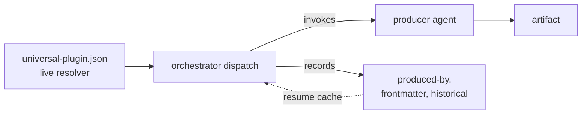

# Production Provenance

---

## What

A model that records **which producer made each spec artifact**, in frontmatter, **always** — not only when two plugins contend for a domain. The record is `produced-by`, a map keyed by production role; together with `approved-by` (from `sdd-gate-autonomy`) it gives full per-artifact provenance: who **produced** it and who **judged** it.

`produced-by` plays two roles that are deliberately kept separate:

- a **historical record** — immutable provenance ("`aces-scenario-writer` wrote this `.feature`"), the data ACES needs to measure result quality and trace a bad artifact to its producer;
- a **resume cache** — on a later run the orchestrator reuses the recorded producer if its plugin is still installed, so resume is decisive without re-asking.

It never **blocks**: resolution is always live from the registry, so a recorded producer whose plugin was deleted degrades gracefully instead of stalling.



---

## Why

Today the orchestrator records a plugin choice **only on conflict** — the `domain-plugin` disambiguation map, written when two plugins claim the same domain. Every other production leaves no trace of who produced what. So:

- **Quality can't be attributed.** When a `.feature` is weak or an implementation drifts, there is no record of which producer made it — ACES cannot correlate outcomes to producers, which is the whole point of measuring agent-configuration quality.
- **`producer ≠ judge` is in the model but not in the data.** `approved-by` will capture the judge; nothing captures the producer. Recording both closes the loop.
- **Resume re-asks more than it should.** Because the plugin choice is only persisted on conflict, a resume can re-disambiguate; an always-on producer record makes resume decisive in every case.

The cost is small and bounded: a few frontmatter lines per spec, written by the orchestrator as a side effect of the dispatch it already does.

---

## Design decisions

### `produced-by` is the production twin of `approved-by`

| Field | Records | Keyed by | Written by |
|---|---|---|---|
| `produced-by` | who **made** each artifact | production role (`spec-producer`, `plan-producer`, `impl-producer`) | orchestrator, at dispatch |
| `approved-by` | who **judged** each gate | gate (`spec`, `impl`) | orchestrator (self-assert) / skill (ratify) |

Each `produced-by` value is the **plugin-qualified agent name** (`aces:aces-scenario-writer`, `quill:quill-doc-writer`, `sdd:sdd-scenario-writer` for a default). It is recorded **always**, on every production, regardless of whether any disambiguation happened.

### Provenance is historical; resolution is live

The two roles of the record must not be conflated:

- **Historical record — immutable.** "`X` produced this" stays true forever, even after `X` is uninstalled. It is the measurement trail; never rewrite or erase it on the basis of current availability. When displaying it for a plugin no longer present, annotate `[unavailable]` — do not drop it.
- **Resolution — always live.** The registry (`.agents/universal-plugin.json`) is the source of truth for **who acts next**. `produced-by` is consulted as a **cache**, never as an authority.

This is the same split `sdd-gate-autonomy` draws for `approved-by.why`: the record is a fact about the past, the resolver is a decision about the present.

### The record never blocks — resolution degrades gracefully

On dispatch for a role, the orchestrator resolves the producer in this order:

1. **Cache hit** — `produced-by[role]` is set **and** its plugin is installed → reuse it (decisive; no re-ask).
2. **Live resolve** — otherwise match the spec's domain in the registry → plugin → role agent, and record the result into `produced-by[role]`.
3. **Degenerate** — no plugin covers the domain → the SDD default (`sdd:<default>`); record it.
4. **Ambiguous** — two plugins still contend and there is no cache → `needs-input` (ask once); the answer is recorded into `produced-by[role]`, so the question never recurs.

A recorded producer whose plugin is **gone** is therefore not an error: step 1 misses, step 2 re-resolves, and the historical value is preserved (annotated `[unavailable]`) rather than overwritten — the new producer is appended for the new production.

### Subsumes the conflict-only `domain-plugin` map

Because the producer is now recorded on **every** production, the resume is decisive in every case — which is exactly what the `domain-plugin` map existed to provide after a disambiguation. The map is **retired**: a genuine first-time conflict still returns `needs-input` once (step 4), but the choice is captured in `produced-by`, not a parallel map. One record, all cases.

### Gates never resolve setup ambiguity — they fail closed

Disambiguation is a **setup** act, owned by the producing path (`create-spec`); a **gate** (`validate-spec`) is **verdict-only**. Recording `produced-by` on every production normally makes a gate's resolution a cache hit, so the question never reaches a gate. But a spec authored **before** a second plugin existed can arrive at a gate with no cache for the contested role — at which point the orchestrator's resolve step returns `needs-input` from inside a gate segment.

The gate must **not** absorb this. `validate-spec` owns only verdict frontmatter (`status`, the human ratification of `approved-by`); it must never write setup frontmatter (`produced-by` / the retired `domain-plugin`). On a `needs-input` for a contested producer during a gate, the gate **fails closed** with a blocker — "resolve the domain producer via `create-spec` first" — rather than silently asking and writing. The invariant is symmetric across both gates (spec and impl): setup ambiguity is resolved on the producing path and persisted to frontmatter there, so by the time a gate reads it the answer is already a fact. This keeps the gate verdict-only and `create-spec` the sole writer of producer choice.

### Inline and default producers are recorded too

When a role degenerates to the SDD default, `produced-by` records `sdd:<default>`. When the orchestrator executes a role **inline** with no producer agent (the gap noted in `sdd-gate-autonomy`, where ACES delegation is documented but executed inline), it records `sdd:orchestrator-inline` — so "no real domain producer ran here" is **visible in the data**, not silent. Provenance should never hide that a producer was missing.

### Who writes it

The **orchestrator** writes `produced-by` as part of its dispatch/synthesis — the same boundary by which it writes `aligned` and an agent self-assertion of `approved-by`. Producers and judges never write it (they do not know their own registry identity authoritatively; the orchestrator resolved them).

---

## Command surface / API

**Frontmatter additions** (defined in `sdd-plugin`):

| Field | Values | Meaning |
|---|---|---|
| `produced-by` | map keyed by role (`spec-producer`, `plan-producer`, `impl-producer`) → plugin-qualified agent name | who produced each artifact; historical record + resume cache |

```yaml
produced-by:
  spec-producer: aces:aces-scenario-writer
  plan-producer: sdd:sdd-planner
  impl-producer: sdd:orchestrator-inline   # no domain producer ran
```

**Resolution order** (orchestrator, per role): cache hit (recorded + installed) → live resolve + record → SDD default + record → `needs-input` once.

**`validate-spec` checks:**
- `produced-by` entries are well-formed plugin-qualified names;
- an entry whose plugin is **not installed** is **flagged, not blocked** (it is valid history);
- the `domain-plugin` map, if present, is migrated into `produced-by` (rewrite-on-encounter), then dropped;
- a contested role with **no cache** **fails the gate closed**, deferring to `create-spec` — the gate never asks for or writes the producer choice. Symmetric across the spec and impl gates.

**Gherkin scenarios:** [sdd-provenance.feature](./sdd-provenance.feature)

---

## Related

- `artifacts/specs/sdd-orchestrator/spec.md` — the discovery/registry model and the `domain-plugin` map this generalizes and retires
- `artifacts/specs/sdd-gate-autonomy/spec.md` — `approved-by`, the judging twin; the historical-vs-live split; the inline-producer gap this makes visible
- `artifacts/specs/aces-plugin/spec.md` — the consumer that measures quality by producer, the motivating use case
- `artifacts/specs/motive-model/spec.md` — `producer ≠ judge`, here captured as data

---

## Artifacts

| Label | Path |
|---|---|
| Spec | `artifacts/specs/sdd-provenance/spec.md` |
| Scenarios | `artifacts/specs/sdd-provenance/sdd-provenance.feature` |
