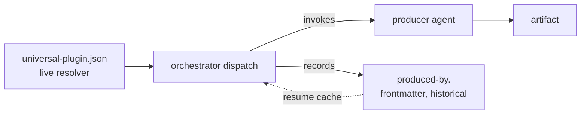
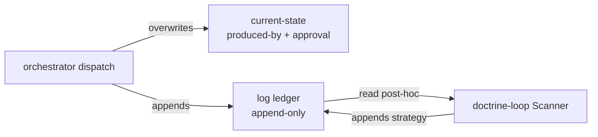

# Production Provenance

---

## What

A model that records **which producer made each spec artifact**, in frontmatter, **always** — not only when two plugins contend for a domain. The record is `produced-by`, a map keyed by production role; together with `approval` (from `sdd-gate-autonomy`) it gives full per-artifact provenance: who **produced** it and who **judged** it.

`produced-by` plays two roles that are deliberately kept separate:

- a **historical record** — immutable provenance ("`aces-scenario-writer` wrote this `.feature`"), the data ACES needs to measure result quality and trace a bad artifact to its producer;
- a **resume cache** — on a later run the orchestrator reuses the recorded producer if its plugin is still installed, so resume is decisive without re-asking.

It never **blocks**: resolution is always live from the registry, so a recorded producer whose plugin was deleted degrades gracefully instead of stalling.



---

## Why

Today the orchestrator records a plugin choice **only on conflict** — the `domain-plugin` disambiguation map, written when two plugins claim the same domain. Every other production leaves no trace of who produced what. So:

- **Quality can't be attributed.** When a `.feature` is weak or an implementation drifts, there is no record of which producer made it — ACES cannot correlate outcomes to producers, which is the whole point of measuring agent-configuration quality.
- **`producer ≠ judge` is in the model but not in the data.** `approval` will capture the judge; nothing captures the producer. Recording both closes the loop.
- **Resume re-asks more than it should.** Because the plugin choice is only persisted on conflict, a resume can re-disambiguate; an always-on producer record makes resume decisive in every case.

The cost is small and bounded: a few frontmatter lines per spec, written by the orchestrator as a side effect of the dispatch it already does.

---

## Design decisions

### `produced-by` is the production twin of `approval`

| Field | Records | Keyed by | Written by |
|---|---|---|---|
| `produced-by` | who **made** each artifact | production role (`spec-producer`, `plan-producer`, `impl-producer`) | orchestrator, at dispatch |
| `approval` | who **judged** each gate (`verdict` + `by` + `why`) | gate (`spec`, `impl`) | orchestrator (self-assert) / skill (ratify) |

Each `produced-by` value is the **plugin-qualified agent name** (`aces:aces-scenario-writer`, `quill:quill-doc-writer`, `sdd:sdd-scenario-writer` for a default). It is recorded **always**, on every production, regardless of whether any disambiguation happened.

### Provenance is historical; resolution is live

The two roles of the record must not be conflated:

- **Historical record — immutable.** "`X` produced this" stays true forever, even after `X` is uninstalled. It is the measurement trail; never rewrite or erase it on the basis of current availability. When displaying it for a plugin no longer present, annotate `[unavailable]` — do not drop it.
- **Resolution — always live.** The registry (`.agents/universal-plugin.json`) is the source of truth for **who acts next**. `produced-by` is consulted as a **cache**, never as an authority.

This is the same split `sdd-gate-autonomy` draws for `approval.<gate>.why`: the record is a fact about the past, the resolver is a decision about the present.

### The record never blocks — resolution degrades gracefully

On dispatch for a role, the orchestrator resolves the producer in this order:

1. **Cache hit** — `produced-by[role]` is set **and** its plugin is installed → reuse it (decisive; no re-ask).
2. **Live resolve** — otherwise match the spec's domain in the registry → plugin → role agent, and record the result into `produced-by[role]`.
3. **Default** — no plugin covers the domain → the SDD default for the role (`sdd:<default>`), which **is** the producer; record it like any other.
4. **Ambiguous** — two plugins still contend and there is no cache → `needs-input` (ask once); the answer is recorded into `produced-by[role]`, so the question never recurs.
5. **Unresolvable** — no producer can be resolved at all, not even an SDD default for the role → **hard-fail** with a blocker; record no `produced-by` entry and no sentinel.

A recorded producer whose plugin is **gone** is therefore not an error: step 1 misses, step 2 re-resolves, and the historical value is preserved (annotated `[unavailable]`) rather than overwritten — the new producer is appended for the new production.

The "never blocks" invariant is scoped to **availability**: a recorded producer that is uninstalled is still **valid history**, so it degrades gracefully. **Structural** failures are a different class and fail closed: a **malformed** entry (not a well-formed plugin-qualified name) is not valid provenance at all, and a role with **no resolvable producer** (not even an SDD default) cannot produce provenance at all — both block rather than proceed. The consistent rule: **availability degrades gracefully (flag-not-block); structural validity fails closed (block)** — the same fail-closed posture the gate already takes for a contested role with no cache.

### Subsumes the conflict-only `domain-plugin` map

Because the producer is now recorded on **every** production, the resume is decisive in every case — which is exactly what the `domain-plugin` map existed to provide after a disambiguation. The map is **retired**: a genuine first-time conflict still returns `needs-input` once (step 4), but the choice is captured in `produced-by`, not a parallel map. One record, all cases.

### Gates never resolve setup ambiguity — they fail closed

Disambiguation is a **setup** act, owned by the producing path (`create-spec`); a **gate** (`validate-spec`) is **verdict-only**. Recording `produced-by` on every production normally makes a gate's resolution a cache hit, so the question never reaches a gate. But a spec authored **before** a second plugin existed can arrive at a gate with no cache for the contested role — at which point the orchestrator's resolve step returns `needs-input` from inside a gate segment.

The gate must **not** absorb this. `validate-spec` owns only verdict frontmatter (`status`, the human ratification of `approval`); it must never write setup frontmatter (`produced-by` / the retired `domain-plugin`). On a `needs-input` for a contested producer during a gate, the gate **fails closed** with a blocker — "resolve the domain producer via `create-spec` first" — rather than silently asking and writing. The invariant is symmetric across both gates (spec and impl): setup ambiguity is resolved on the producing path and persisted to frontmatter there, so by the time a gate reads it the answer is already a fact. This keeps the gate verdict-only and `create-spec` the sole writer of producer choice.

### Defaults are real producers; no producer means hard-fail

A role **always resolves to a real producer**. When no plugin covers the domain, the role resolves to the **SDD default for that role** — and the default *is* the producer: it is recorded in `produced-by` as `sdd:<default>`, exactly like any plugin producer. There is no inline path and no sentinel value; every recorded `produced-by` entry names a real agent that ran.

If **no producer can be resolved at all** — not a plugin producer, and not even an SDD default for the role — the orchestrator **hard-fails**: it surfaces a blocker, records **no** `produced-by` entry and **no** sentinel, and does not proceed. "No resolvable producer" is a **structural** error and joins the existing fail-closed class alongside an off-enum `cause` and a malformed `produced-by` entry. This **strengthens** the fail-closed posture rather than contradicting it: provenance only ever names a producer that actually acted, and the absence of any producer halts the mission instead of being papered over with a placeholder.

### Who writes it

The **orchestrator** writes `produced-by` as part of its dispatch/synthesis — the same boundary by which it writes `aligned` and an agent self-assertion of `approval`. Producers and judges never write it (they do not know their own registry identity authoritatively; the orchestrator resolved them).

### The combat log has two faces

`produced-by` + `approval` answer *"who produced this, and what is the verdict now?"* — they are the **current-state** face: overwritten, last-write-wins, authoritative present. But current-state alone **loses every correction**. When a gate rejects a spec and the producer later fixes it, `approval.spec` ends at `approve` — the rejection that drove the fix has vanished from the record. The mission's history is gone.

So the contract gains a second face: an **append-only `log` ledger** that preserves *what happened to get here* — every dispatch, every correction, in order, never edited or removed. The two faces are complementary, not redundant:

| Face | Fields | Mutability | Answers |
|---|---|---|---|
| **Current-state** | `produced-by`, `approval` | overwritten | who produced this; the standing verdict now |
| **Ledger** | `log` | append-only | what happened across the mission, in sequence |



The ledger exists for one consumer above all: the **doctrine-loop Scanner**, which drafts strategy from the combat log **alone** — no raw session transcripts. If the correction history is not in the log, it is unrecoverable, and recurring-failure detection across missions becomes impossible.

### The schema lives in `combat-log-governance`, not here

This spec **owns the contract** — the decision that the log exists, why, and who may write it — but it does **not** restate the field-by-field schema. The entry shapes (`report`, `correction`, `strategy`), the `correction-kind` set, the matchable `cause` enum, the `seq` discipline, and the write-ownership matrix all live in **`combat-log-governance`**, the single schema owner. Loading that governance is how `sdd-orchestrator`, `validate-spec`, and the doctrine-loop Scanner agree on the shape. Duplicating the schema here would create two sources of truth that drift; instead, this spec references the governance and the governance defines the bytes.

### Corrections-with-cause are recorded in both faces, non-duplicating

A gate rejection touches **both** faces, and they do not overlap:

- The **standing verdict** stays in the current-state face — `approval.<gate>` eventually reads `approve` (the rejection is not parked there; it is overwritten when the fix lands).
- The **immutable correction-with-cause** record goes in the ledger — a `correction` entry whose **matchable `cause`** is the load-bearing field.

The `cause` is what makes the ledger more than a diary. Because it is a value from a **closed, extensible enum** (defined in `combat-log-governance`), corrections are *groupable*: cross-mission recurrence detection counts the same `cause` across N specs' logs to surface a systemic weakness. A `cause` that is absent or off-enum breaks that matchability — so it is a **structural error**, the same fail-closed posture this spec already takes for a malformed `produced-by` entry. The three correction occasions — gate rejection, producer⇄judge iteration, and Council kick-back — each append one `correction` entry with a cause.

### Strategy occupies a log slot this contract shapes but does not write

The Scanner records drafted strategy back to the log. The combat-log contract defines the **shape** of that `strategy` entry, so it is a first-class slot in the ledger rather than an outside annotation — but the **write is owned by the doctrine-loop Scanner**, not by any provenance writer. The orchestrator appends `report` and `correction` entries; it never appends `strategy`. This keeps the read-side consumer (the Scanner) the sole author of its own output while the log remains one coherent record. The doctrine-loop spec governs *when* the Scanner writes; this spec only reserves the slot.

---

## Use Cases

The combat log is consumed long after a mission ends. Each use case below is an entry-point into the recorded provenance — most are driven by the doctrine-loop Scanner reading the log without any session transcript.

| # | Trigger | Inputs | Outcome |
|---|---|---|---|
| **UC-1 Record on dispatch** | The orchestrator dispatches a production-chain role | The role, the resolved agent, the dispatch outcome | A `report` entry is appended and `produced-by[role]` is set — provenance captured live as a side effect of the dispatch |
| **UC-2 Record a correction** | A gate rejects, a producer⇄judge iteration fires, or the Council kicks a spec back | The correction occasion and its matchable `cause` | A `correction` entry is appended to the log with that `cause`; the standing verdict in `approval` is unaffected |
| **UC-3 Mission reconstruction** | A reviewer or the Scanner needs to know what happened on a spec, after the fact, with no transcript | The spec's `log` ledger | The full ordered sequence of dispatches and corrections is replayable from the log alone |
| **UC-4 Recurring-pattern detection** | The doctrine-loop Scanner runs across the corpus | Many specs' `log` ledgers | Corrections grouped by `cause` across N specs; a `cause` recurring above threshold is surfaced as a candidate systemic weakness |
| **UC-5 Kill / post-mortem** | A spec is killed or reverted and someone asks why | The spec's `log` ledger and final `approval` | The deal-breaker and the correction trail that led to the kill are recoverable from the log |
| **UC-6 Strategy recording** | The Scanner drafts strategy from detected patterns | The corrections that drove it (the `evidence`) | A `strategy` entry is appended by the Scanner, occupying the log slot this contract shapes; it sits unratified until the Council rules |

---

## Command surface / API

**Frontmatter additions** (defined in `sdd-plugin`):

| Field | Face | Values | Meaning |
|---|---|---|---|
| `produced-by` | current-state | map keyed by role (`spec-producer`, `plan-producer`, `impl-producer`) → plugin-qualified agent name | who produced each artifact; historical record + resume cache |
| `approval` | current-state | map keyed by gate → `verdict` + `why` | the standing verdict per gate |
| `log` | ledger | append-only list of entries (`report`, `correction`, `strategy`), each with a monotonic `seq` and a `kind` | the immutable mission history — **shape defined in `combat-log-governance`** |

```yaml
produced-by:
  spec-producer: aces:aces-scenario-writer
  plan-producer: sdd:sdd-planner
  impl-producer: sdd:sdd-implementer
log:
  # entry shapes (report / correction / strategy), the correction-kind set,
  # and the matchable cause enum are owned by combat-log-governance —
  # see that governance for the field-by-field schema.
  - { seq: 1, kind: report, role: spec-producer, agent: aces:aces-scenario-writer, outcome: pass }
  - { seq: 2, kind: correction, correction-kind: gate-reject, cause: coverage-gap }
```

**The `log` ledger** is append-only for every writer: entries are added with the next `seq`, never edited or removed. The orchestrator appends `report` entries (one per production-chain dispatch) and `correction` entries (one per correction, carrying a matchable `cause`); the doctrine-loop Scanner appends `strategy` entries. The full schema — entry fields, the `correction-kind` set, the `cause` enum, and the write-ownership matrix — is the schema owner's: **`combat-log-governance`**.

**Resolution order** (orchestrator, per role): cache hit (recorded + installed) → live resolve + record → SDD default + record → `needs-input` once → hard-fail with a blocker if no producer (not even an SDD default) can be resolved.

**`validate-spec` checks:**
- `produced-by` entries are well-formed plugin-qualified names; a malformed entry **fails the gate** (a structural error — not valid provenance at all, unlike an unavailable-but-valid entry, which is only flagged);
- an entry whose plugin is **not installed** is **flagged, not blocked** (it is valid history);
- the `domain-plugin` map, if present, is migrated into `produced-by` (rewrite-on-encounter), then dropped;
- a contested role with **no cache** **fails the gate closed**, deferring to `create-spec` — the gate never asks for or writes the producer choice. Symmetric across the spec and impl gates;
- a role with **no resolvable producer** — not a plugin producer and not even an SDD default — **fails closed with a blocker**; no `produced-by` entry and no sentinel is written (a structural error, the same class as a malformed entry);
- a `correction` entry in `log` whose `cause` is absent or **off-enum** **fails the gate** (a structural error — it breaks cross-mission matchability), per `combat-log-governance`; a well-formed `log` does not fail.

**Gherkin scenarios:** [sdd-provenance.feature](./sdd-provenance.feature)

---

## Related

- `combat-log-governance` (SDD plugin skill) — **the schema owner** for the two-face combat log: entry shapes, the `correction-kind` set, the matchable `cause` enum, the strategy slot, and log write-ownership. This spec references it; it does not duplicate it.
- `artifacts/specs/sdd-orchestrator/spec.md` — the discovery/registry model and the `domain-plugin` map this generalizes and retires
- `artifacts/specs/sdd-gate-autonomy/spec.md` — `approval`, the judging twin; the historical-vs-live split; the inline-producer gap this resolves by always resolving a real producer (plugin or SDD default) and hard-failing when none can be resolved
- `artifacts/specs/aces-plugin/spec.md` — the consumer that measures quality by producer, the motivating use case
- `artifacts/specs/motive-model/spec.md` — `producer ≠ judge`, here captured as data; the doctrine-loop Scanner that reads the log as its sole input

---

## Artifacts

| Label | Path |
|---|---|
| Spec | `artifacts/specs/sdd-provenance/spec.md` |
| Scenarios | `artifacts/specs/sdd-provenance/sdd-provenance.feature` |
