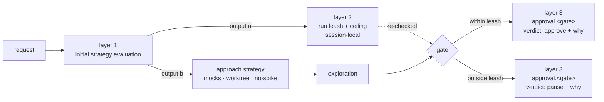

# Stop Provenance

---

## What

A **three-layer model** for autonomy and gate provenance that (a) contains blast radius from the **start** of a run, and (b) records **both** why an agent advanced and why it halted, durably, in one frontmatter map.

The three layers, deliberately not conflated:

1. **Initial strategy evaluation** *(new)* — a run-level evaluation done **before exploration**, against the request itself. It analyzes blast radius and the other dimensions up front and emits **two** outputs: the **leash** (autonomy reach) and the **approach strategy** (how to do the work safely — avoid exploratory implementation, scope behind mocks, do the work in a worktree). It may be **user-specified** rather than derived.
2. **The leash** — the **run-level** reach value (`auto-none` | `auto-spec` | `auto-all`) produced by layer 1, **re-checked at each gate** in case exploration changed the picture. It lives with the initial evaluation, **not** inside a per-gate entry. The run **ceiling** stays session-local and is never persisted.
3. **The per-gate verdict** *(durable)* — `approval`, a frontmatter map keyed by gate. Each entry: `verdict: approve | pause | reject`, `by`, `cause: dimension | ceiling`, `why: {reversibility, blast-radius, novelty, confidence}`. This **renames and supersedes** `approved-by` and folds in the original gap — "why I halted" is now `verdict: pause` + `why`, as durable as `verdict: approve`.



---

## Why

Two gaps, one model.

**Gap A — blast radius is only contained reactively.** The exploration phase **is real exploratory implementation**: it spikes code, writes throwaway plans, touches files. Today the only blast-radius control is the per-gate leash derivation, which runs **after** exploration has already happened. There is no upfront call that decides *how* to do the work safely before the spiking starts. The fix is the **initial strategy evaluation**: assess up front, and emit an **approach strategy** (work behind mocks, in a worktree, or skip exploratory implementation entirely) that keeps blast radius contained **from the outset**, not just judged after the fact.

**Gap B — the trail is asymmetric.** `sdd-gate-autonomy` persists the leash derivation **only** on a self-assertion (`approved-by.<gate>.why`, when the agent advances). When the agent instead **stops** and returns `needs-input` (a risky dimension or a ceiling forced a halt), the derivation that justified stopping is computed, shown in the gate report, and then **discarded** — the next stateless segment re-derives it, and the human reopening the spec cannot see why the prior run stopped. "Why I went" is durable; "why I halted" is ephemeral. The fix folds both into one **per-gate verdict**: an `approval` entry whose `verdict` records go (`approve`) or stop (`pause`) and whose `why` is durable either way.

Both gaps trace to the same principle in the motive model: the human (Conductor) holds **accountability**; a delegate is handed the **act**. The initial evaluation decides up front how much act to delegate and how to bound it; the per-gate verdict records, durably, every point where the agent either took the act provisionally (`approve`, owed ratification) or **refused** to take it (`pause`, owed input). The pause is the accountability-preserving branch — exactly the reasoning worth keeping.

---

## Design decisions

### Layer 1 — the initial strategy evaluation (run start)

Before exploration, the run performs a single upfront evaluation against the **request**. It analyzes blast radius plus the other dimensions and produces two coupled outputs:

- **(a) the leash** — the run's autonomy reach (consumed by layer 2);
- **(b) the approach strategy** — the *method* that keeps the work safe: e.g. **avoid exploratory implementation**, **scope behind mocks** to shrink blast radius, **do the work in a worktree** for isolation.

The rationale this encodes: because exploration is itself real exploratory implementation, the upfront call is the only thing that can contain blast radius **before** the spiking begins. Judging after exploration is too late to prevent the spread; choosing an approach first is what bounds it.

The evaluation **may be user-specified instead of derived** — when the Conductor states the approach in the request ("do this in a worktree, mock the registry"), the run adopts it rather than deriving its own. Absent a user directive, it derives the approach from the same dimension assessment that yields the leash.

**The initial evaluation gets its own durable run-level frontmatter block, `strategy`.** Layer 1 stays in this spec with a real artifact — the chosen leash and approach strategy are recorded, not transient. The block records *how this spec's run was bounded*, so a later segment or the human reads the original strategy without re-deriving it:

```yaml
strategy:
  leash: auto-none          # the leash this run derived/adopted (the layer-2 reach)
  by: derived               # derived | user — was the strategy reasoned or user-specified
  approach:                 # the methods chosen to keep blast radius contained
    - no-spike              # avoid exploratory implementation
    - mocks                 # scope behind mocks
    - worktree              # isolate the work
```

- `leash` is the run's reach as **first evaluated** (the layer-2 value); the per-gate re-check may tighten it, and the *effective* reach at each gate is read from the `approval` verdicts — `strategy.leash` is the run's starting derivation, not a live per-gate value.
- `by: derived | user` records whether the agent reasoned the strategy or the Conductor specified it in the request.
- `approach` is the list of containment methods chosen (`no-spike`, `mocks`, `worktree`, …); it is the durable record of *how the work was bounded from the outset*.

The run **ceiling** is **not** in this block — it stays session-local and unpersisted (per `sdd-gate-autonomy`). `strategy.leash` records what the run derived/adopted; the ceiling that may have capped it is a session input, not a spec fact.

### Layer 2 — the leash is run-level, re-checked per gate

The leash is the **output of layer 1**, not a per-gate property. It is a single run-level reach value (`auto-none` | `auto-spec` | `auto-all`) that describes how far this run may self-assert. It is **re-checked at each gate** — exploration may have changed the picture (a contract turned out riskier than the request looked), so the reach can tighten; it is the same per-gate four-dimension safety check, now reading against discovered state rather than the original request.

Critically, **the leash does not live inside a per-gate `approval` entry**. The per-gate entry records the gate's *verdict*; the leash is cross-gate and belongs with the initial evaluation. Putting a `leash` field on each gate entry would duplicate a run-level fact per gate and invite drift.

The **run ceiling** (the Conductor's cap) stays **session-local and unpersisted**, exactly as in `sdd-gate-autonomy` (the leash is per run/sitting, like the iteration cap). Effective leash = `min(ceiling, derived)`; only the effect (which gates self-assert) shows up in frontmatter, via the verdicts.

### Layer 3 — the per-gate verdict: `approval` (renames `approved-by`)

The durable record renames `approved-by` → **`approval`**, a map keyed by gate (`spec`, `impl`). Each entry:

```yaml
approval:
  spec:
    verdict: pause          # approve | pause | reject  (no `by` — a pause is always the agent)
    cause: dimension        # dimension | ceiling
    why:
      reversibility: "safe — docs only, revert is cheap"
      blast-radius:  "risky — renames a field across the whole SDD model"
      novelty:       "risky — three-layer model, human has not seen it"
      confidence:    "risky — open markers remain"
  impl:
    verdict: approve
    by: unional             # ratified by the human
```

Key properties:

- **`verdict` is the go/stop record.** `approve` = gate passed (provisional if `by: agent`, ratified if `by: <name>`); `pause` = gate halted, awaiting input; `reject` = gate failed (scope-kill or Director-revert). There is **no separate stop field and no `leash` field** inside the entry — `verdict` already says go or stop, and leash is layer 2.
- **`why` is durable for every verdict.** A `pause` carries the four-dimension halt reasoning just as an `approve` carries the advance reasoning. This is the original gap closed: "why I halted" is now as durable as "why I went," in the *same* map, distinguished only by `verdict`.
- **`cause: dimension | ceiling`** is kept. It distinguishes a `pause` forced by a risky dimension read from one forced by the run ceiling (every dimension safe, but capped below this gate). The two call for different human responses — resolve the risk vs raise the ceiling.
- **`by`** records who reached the verdict — but **only on `approve` and `reject`**. A `pause` is **always** the agent's act, so `by` is **omitted** on a pause entry (`verdict` + `cause` + `why` suffice). `by: agent` on an `approve` is provisional (review queue); a human name is ratified.

**The review and awaiting-input queues are both derived** from this one map: specs with an `approve`/`by: agent` verdict form the **review queue** (owed ratification); specs with a `pause` verdict form the **awaiting-input queue** (owed the human's decision). Neither is a stored backlog or stop-log file.

**Who writes it.** The **orchestrator** writes an `approve`/`by: agent` (self-assertion) or a `pause` verdict during **synthesis** — the same boundary by which it writes `aligned`, markers, and (today) the `approved-by` self-assertion. The **gate skill** writes a human ratification (`verdict: approve, by: <name>`) at the gate. No producer writes `approval`.

**Ratification authority is positional, not definitional.** The authority to write a **human-attributed** gate action — `status → approved | implemented`, a verdict carrying a human name (`approval.<gate>: { verdict: approve | reject, by: <name> }`), and the **freeze** transition — belongs to the **in-session position**: the agent that holds the real user channel. A **spawned delegate** (the Operator) has no user channel and may write **only** `by: agent` self-assertions and `pause` halts; on reaching a human gate it emits a **verdict packet** (`STATUS: needs-input`) and stops. It never writes a human ratification, **even when a coordinator relays "the user approved"** — a relayed claim of user approval is not user confirmation. This is **positional**: a **dual-mode** agent definition running in the spawned position is still in the relay position and is bound by this rule; the same definition run in-session may perform the write. In practice the human ratification is an in-session act that reconciles the review queue — the spawned delegate's job ends at the verdict packet.

**Pause-to-pass overwrites in place.** When a paused gate is later passed, the entry's `verdict` flips `pause` → `approve` **in place** — the `by`, `cause`, and `why` are rewritten to the passing verdict and the pause reasoning is **not** preserved in frontmatter. `approval` is a **current-state** map: it records the gate's *present* verdict, not a history of every verdict it held. The superseded pause reasoning lives in git history, like every other transient frontmatter fact. (No stopped-then-passed trail is kept inline.)

### State legality (enforced by validate-spec)

`approval` joins the legal-state contract in `gate-validation-governance`, replacing the `approved-by` rows. New/changed rules:

- an `approval.<gate>` entry **must** carry a four-dimension `why` block;
- `verdict` must be one of `approve | pause | reject`;
- `approval` may name **only** `spec` or `impl`;
- a gate holds **exactly one** verdict at a time (no pause-and-approve together);
- a `pause` entry **omits `by`**; an `approve`/`reject` entry **carries `by`**;
- a `pause` verdict is legal only on a gate the spec **has not passed** (`approval.spec: pause` requires `status: draft`);
- the existing `status`-requires-an-approver rules now read against `approval.<gate>.verdict: approve` instead of `approved-by.<gate>.by`.

These are changes to `check-spec-state.mts` (the mechanical authority); the prose list in `gate-validation-governance` mirrors them.

---

## Cross-spec impact (big blast radius — flagged, implementation serialized)

This spec **renames `approved-by` → `approval`** and changes its shape (adds `verdict`, drops the per-entry `leash`) **across the whole SDD model**. Implementing it is a wide migration and is **deferred and serialized** (a sibling spec, `sdd-state-legality`, is paused on the same shared files). The migration must touch, at minimum:

| Surface | Change |
|---|---|
| `sdd-gate-autonomy/spec.md` | retire `approved-by`; describe the `approval`/`verdict` map; move the leash to layer 1 |
| `sdd-provenance/spec.md` | update the `produced-by` ↔ `approved-by` twin framing to `approval` |
| `ownership-governance` | rename the `approved-by` write-ownership rows to `approval`; add the `pause`/orchestrator row; add the positional-authority rule (human-attributed gate writes reserved to the in-session position; spawned delegates emit a verdict packet and stop) |
| `lifecycle-governance` | update the frontmatter schema block (`approved-by` → `approval` with `verdict`) |
| `gate-validation-governance` | replace the `approved-by` legal-tuple rows with the `approval`/`verdict` rules |
| `check-spec-state.mts` | the mechanical rule changes above |
| existing spec frontmatter | migrate `approved-by` in `sdd-mission-loop`, `sdd-gate-autonomy`, `sdd-provenance`, and any other spec carrying it |

Because the blast radius reaches every provenance-bearing spec and the shared enforcement script, the spec gate's blast-radius dimension reads **risky** and the derived leash is `auto-none` — this draft stops at the spec gate for human ratification, and implementation waits until the shared files are free.

---

## Command surface / API

**Frontmatter changes** (defined in `sdd-plugin`):

| Field | Values | Meaning |
|---|---|---|
| `strategy` *(new, run-level)* | `{ leash, by: derived\|user, approach: [...] }` | the layer-1 initial strategy evaluation: the run's leash + the containment methods (`no-spike`, `mocks`, `worktree`) chosen up front |
| `approval` *(renames `approved-by`)* | map keyed by gate (`spec`, `impl`); each entry `{ verdict, by?, cause, why }` | the durable per-gate verdict: `approve`/`pause`/`reject`, who reached it (omitted on a pause), why (four-dimension), and the halt cause |

- `strategy.leash` ∈ `auto-none | auto-spec | auto-all` (the run's first-evaluated reach); `strategy.by` ∈ `derived | user`; `strategy.approach` is a list of containment methods.
- `approval.<gate>.verdict` ∈ `approve | pause | reject`; `why` is the four-dimension derivation (durable for **every** verdict); `cause` ∈ `dimension | ceiling`; `by` is present on `approve`/`reject`, omitted on `pause`. **No `leash` field** on the entry — leash is run-level (`strategy`).
- The **leash** and **ceiling** are session-local, not persisted (per `sdd-gate-autonomy`).
- The **review queue** = specs with `approval.*.verdict: approve, by: agent`; the **awaiting-input queue** = specs with `approval.*.verdict: pause`. Both derived; no stored file.

**`validate-spec` new/changed checks:**
- `approval.<gate>` is well-formed (four-dimension `why`, known gate, valid `verdict`, one verdict per gate);
- a `pause` entry omits `by`; an `approve`/`reject` entry carries `by`;
- a `pause` verdict is legal only on an un-passed gate;
- `status` advancement reads against `verdict: approve`.

**Gherkin scenarios:** [sdd-stop-provenance.feature](./sdd-stop-provenance.feature)

---

## Design choices (settled in the draft, awaiting gate ratification)

These are the spec's **chosen defaults**, settled from review direction. They are recorded here as the draft's design; **gate ratification is a separate human act** that has not yet occurred. No open markers remain.

- **`verdict` enum** on the renamed `approval` map: `approve | pause | reject`.
- **`cause`** kept: `dimension | ceiling`.
- **Leash leaves the per-gate entry** — it lives in the run-level `strategy` block (layers 1–2).
- **Field name `approval`** (renames `approved-by`, now carrying the verdict).
- **Initial-strategy-evaluation persistence** → its own durable run-level `strategy` block (`leash`, `by: derived|user`, `approach[]`). Layer 1 stays in this spec with a real artifact.
- **`by` on a `pause`** → omitted; a pause is always the agent's act.
- **Pause-to-pass** → overwrite the verdict in place; no preserved stopped-then-passed trail (superseded reasoning lives in git).

---

## Related

- `artifacts/specs/sdd-gate-autonomy/spec.md` — the leash, the four-dimension derivation, and the `approved-by` map this renames to `approval` and extends with `verdict`
- `artifacts/specs/sdd-provenance/spec.md` — `produced-by`, the production twin of the gate record
- `artifacts/specs/sdd-orchestrator/spec.md` — the synthesis boundary, the `needs-input` return, and the exploration phase the initial evaluation precedes
- `artifacts/specs/motive-model/spec.md` — the act is delegable, accountability is not: the initial evaluation bounds the delegated act, the `pause` verdict records the refusal to take it

---

## Artifacts

| Label | Path |
|---|---|
| Spec | `artifacts/specs/sdd-stop-provenance/spec.md` |
| Scenarios | `artifacts/specs/sdd-stop-provenance/sdd-stop-provenance.feature` |
| Enforcement | `plugins/sdd/skills/validate-spec/scripts/check-spec-state.mts` |
