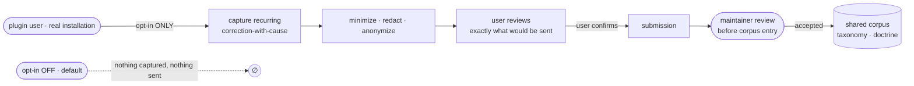

# SDD Usage Feedback — the Strategist field loop

---

## What

The **field loop** of the SDD model — the one that reaches *outside* this repo. It sits between the **plugin's users** (the field: real installations out in the world) and the **SDD system** (the maintainers and the shared corpus). It collects **real corrections** from **actual usage** across installations and feeds them upstream, so the shared taxonomy, doctrine, and corpus **grow from real corrections** rather than invented ones. It is the mechanism behind the descriptive promise — *"the cause enum grows from real corrections"* — that the combat-log contract already references.

It is the loop **above** the doctrine loop. The doctrine loop is in-repo (it reads *this* project's combat logs to improve the corpus for the plugin's own user); the field loop is **cross-installation** (it gathers what users actually hit, out in the world, and routes it back to the maintainers).

---

## Why

Today the shared SDD contract grows by hand. The `cause` enum, the doctrine, the corpus — a maintainer extends them from intuition and from whatever corrections happen to surface in this one repo. Nothing systematically carries **what real users actually hit, in their own installations,** back to the people who maintain the shared contract.

- **Invented taxonomies drift from reality.** A `cause` enum grown from a maintainer's imagination encodes guessed failure modes, not observed ones. The field loop is how the enum and the doctrine grow from corrections that really happened.
- **The field is where the signal is.** A correction that recurs across many installations is a far stronger doctrine signal than one seen once in the maintainer's own repo — but only the field loop can see across installations.
- **Trust is the gate, not an afterthought.** A loop that ships corrections — which can carry code, prompts, paths, secrets — off a user's machine is worthless if users cannot trust it. So **opt-in, redaction, visibility, and human review are the load-bearing design, not features bolted on.**

---

## Design decisions

### Opt-in always — default OFF (load-bearing)

**Nothing is captured, and nothing is transmitted, without explicit user opt-in.** The default state is **OFF**. This is the central constraint of the whole loop, not a footnote:

- With opt-in **OFF**, the loop captures nothing locally and sends nothing upstream — it is fully inert.
- Opt-in is **explicit** — a deliberate user action, never inferred, never defaulted-on by an update.
- Opt-in is **revocable** — turning it off returns the loop to the inert default.

The negative mirror is a first-class scenario: *opt-in OFF ⇒ nothing captured, nothing sent.*

### Privacy and security — designed against leakage

The **primary failure mode** is **leakage of sensitive data**. Corrections can contain source code, prompts, file paths, and secrets. Before *anything* leaves the user's environment, the contract requires, in order:

| Stage | Requirement |
|---|---|
| **Minimize** | Capture only the correction-with-cause record needed upstream — not surrounding context, not the whole transcript. |
| **Redact / anonymize** | Strip or mask sensitive content (secrets, paths, identifying data) from the record before it can be transmitted. |
| **Preview / visibility** | The user can review **exactly what would be sent** before it leaves — no opaque payload. |
| **Maintainer review** | A submission enters the shared corpus **only** after a human maintainer reviews it — never automatically. |

**Hard invariant:** *sensitive data is never transmitted unredacted.* A record that has not passed redaction is never eligible to leave the environment. This is a boolean scenario with an explicit negative mirror.

### The unit fed upstream is the correction-with-cause record

What the loop captures and routes is the combat-log **`correction`-with-`cause`** record — the same provenance unit the combat-log contract defines. The **shape** of that record (its fields, the `cause` enum) is owned by `sdd-provenance`; this spec does not restate or redesign it. That ownership is exactly why this spec is `blocked-by: sdd-provenance` — it consumes that record shape, it does not define it.

### The loop is optional — SDD works fully without it

The field loop is **entirely optional**. SDD's core workflow — spec, plan, implement, the mission and doctrine loops — runs **identically whether the field loop is present, absent, or opted out**. The loop is **never a dependency** of the core workflow; no core step waits on it, reads from it, or fails without it.

### Downstream, never blocking — loose coupling

This loop is **downstream** of the core loops. It depends on the provenance record *shape*, so `sdd-provenance` is its only `blocked-by` edge. It is **not** in the `blocked-by` of any core loop spec, and the core loops must never depend on it. Coupling is deliberately **loose**: the field loop reads the unit the core already produces; it adds no obligation back onto the core.

### Lower priority than the core loops

`priority: 3`. The field loop refines the corpus over time; it does not run a mission. It is built after the core loops are solid, and its absence costs nothing operationally.

---

## Use Cases

A **use case** is an entry-point — a trigger, its inputs, and its outcome. Each maps to one-or-more boolean scenarios in the `.feature` (happy path plus negative mirror where the constraint is load-bearing).

| Use case | Trigger | Inputs | Outcome |
|---|---|---|---|
| **Opt in** | the user explicitly enables the field loop | the user's explicit consent action | the loop is enabled; default before this is OFF |
| **Capture a correction** | a recurring correction-with-cause occurs **while opted in** | the combat-log correction-with-cause record | the correction is captured locally |
| **Redact before transmit** | a captured correction is staged to leave the environment | the captured record + redaction rules | a minimized, redacted record; unredacted data cannot leave |
| **Preview what would be sent** | the user inspects a staged submission | the staged, redacted record | the user sees exactly what would be sent before it leaves |
| **Maintainer review** | an opt-in submission reaches the SDD system | the submitted record | the record is surfaced for human review before any corpus entry |
| **Opt-in OFF (negative)** | the loop runs with consent OFF (the default) | — | nothing is captured and nothing is sent |
| **No unredacted transmit (negative)** | a record that failed/skipped redaction is staged | a record still carrying sensitive data | the record is never transmitted |
| **Core workflow unaffected** | a core mission runs | the spec under work | the mission completes identically whether the loop is present, absent, or off |

---

## Command surface / API

| Concern | Behavior |
|---|---|
| Consent | explicit opt-in; **default OFF**; revocable |
| Capture | only when opted in; captures the combat-log correction-with-cause record |
| Egress guard | minimize → redact/anonymize → preview → maintainer review, in order, before corpus entry |
| Hard invariant | sensitive data is never transmitted unredacted |
| Optionality | core SDD workflow runs unaffected with the loop present, absent, or off |
| Record shape | owned by `sdd-provenance`; consumed here, not defined here |

---

## Related

- `artifacts/specs/sdd-provenance/spec.md` — owns the `correction`-with-`cause` record shape and the `cause` enum this loop feeds; this spec's only `blocked-by`
- `artifacts/specs/sdd-doctrine-loop/spec.md` — the in-repo outer loop; the field loop sits above it, cross-installation
- `artifacts/specs/motive-model/spec.md` — "Strategist and the loop"; the loop hierarchy this spec's field loop tops

---

## Artifacts

| Label | Path |
|---|---|
| Spec | `artifacts/specs/sdd-usage-feedback/spec.md` |
| Scenarios | `artifacts/specs/sdd-usage-feedback/sdd-usage-feedback.feature` |
