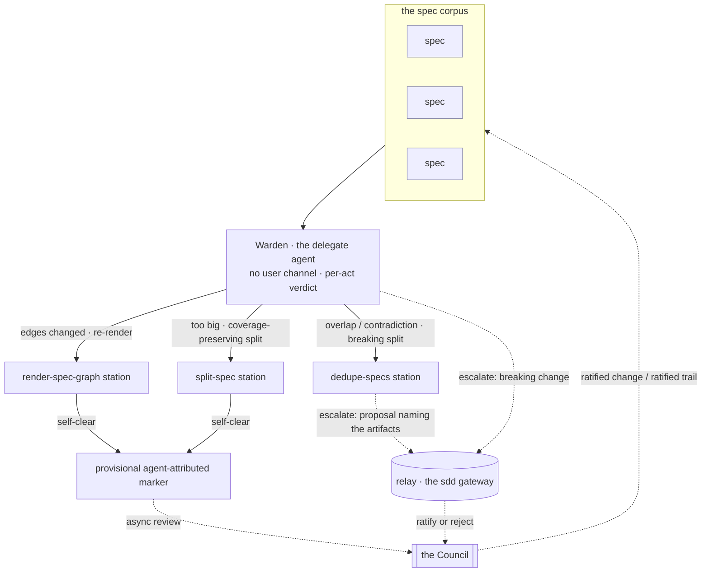

# SDD Warden — the Formation-loop delegate agent

The **Warden** is the agent that *runs* the Formation loop. Where `sdd-formation-loop` specs the **loop model** (dedupe / split / graph soundness / reconcile, corpus-wide and continuous), this spec governs the **delegate's contract** — the operating rules the agent definition asserts: no user channel, continuous and non-blocking, stations not status, a **per-act self-clear-vs-escalate verdict** (the Warden is rubric-subject, parallel to the Operator at a gate), a frozen-contract guard keyed on contract impact, and altitude discipline.

---

## What

The **Warden** is the SDD subagent that carries the Architect's **Formation loop**. It is fleet-level and corpus-wide, running **exactly parallel to the Operator** (`sdd-operator`): the Operator runs the middle Mission loop per segment; the Warden runs the **outer Structure loop continuously across the whole corpus**.

This spec is the **agent's contract**, not the loop's model. The loop's acts and altitude live in `sdd-formation-loop`; here we pin the things the *delegate* must do and must not do:

- **Per-act self-clear-vs-escalate verdict.** For each structural act the Warden assesses its risk and renders its own **self-clear vs escalate** verdict — exactly as the Operator does at a gate. It **self-clears** the reversible, derivable, low-blast acts (graph re-render, coverage-preserving split / refactor / consistency fix), acting in-session and leaving a **provisional, agent-attributed marker** that is never final until the Council ratifies the trail; it **escalates** the destructive, contested, or breaking acts.
- **No user channel.** It has no direct user channel. Self-cleared acts leave a provisional marker for the Council's async review; escalated acts return findings and proposals to the **relay** (the `sdd` gateway), where the **Council** holds ratify-or-reject.
- **Continuous and non-blocking.** It runs between missions, accumulates findings, and surfaces them episodically — never on a mission's critical path.
- **Stations, not status.** It runs the `split-spec` / `render-spec-graph` / `dedupe-specs` stations in-session; it **never** writes a spec's `status`.
- **Proposals naming the artifacts.** The escalated acts — dedupe and reconciliation — are emitted as proposals *naming the specs/artifacts* for the Council's confirmation; the Warden **never** silently merges, rewrites, or deletes a spec.
- **Frozen-contract guard, keyed on contract impact.** A split that **preserves every scenario verbatim is non-breaking** and self-clears even on a frozen `.feature` (leaving the provisional marker); a split that **alters or drops scenario truth is breaking** and requires a Council-ratified freeze re-open carried by the relay. **Dedupe is destructive, so it escalates regardless** of the contract-impact class.
- **Altitude discipline.** Out-of-loop requests are routed away; it emits no out-of-loop decision.

---

## Why

The Formation loop only matters if a *delegate* actually runs it, and a delegate without a tight contract drifts: it starts talking to the user, blocking missions, writing `status`, or silently merging specs. Those are exactly the failures the Operator's contract guards against on the Mission side — the Warden needs the same guards on the Structure side. Naming the delegate's rules separately from the loop model keeps the two re-judgeable independently: the loop's altitude can change without re-litigating the agent's seam to the relay, and vice versa.

---

## Design decisions

### Delegate contract vs loop model — the load-bearing split

`sdd-formation-loop` and this spec are **distinct on purpose**. Do not duplicate.

| | **`sdd-formation-loop`** (the model) | **`sdd-warden`** (this spec, the delegate) |
|---|---|---|
| Subject | the loop's acts and altitude | the agent that runs the loop |
| Asserts | corpus-wide, continuous; dedupe/split/graph/reconcile; distinct from the per-spec gate | no user channel; non-blocking; stations not status; proposals; frozen-contract guard; routing |
| Re-judged when | the loop's altitude or acts change | the agent's seam, guards, or entry-points change |

The Warden shares the Architect's concern (structural fit) but is the **operating agent**, not the abstract loop.

### Per-act self-clear-vs-escalate verdict — rubric-subject, not always-escalate

The load-bearing behavior of the delegate: the Warden is **rubric-subject**, exactly as the Operator is at a gate. For **each structural act** it assesses the act's risk — reversibility, user-facing blast radius, contract-impact semver class, decision novelty, confidence — and renders its own **self-clear vs escalate** verdict. The two outcomes carry different provenance:

- **Self-clear** the reversible, derivable, low-blast acts — re-rendering the graph, a coverage-preserving split, a refactor or consistency fix. The Warden acts **in-session** and leaves a **provisional, agent-attributed marker** in the async review queue. That marker is **never final**: it stands until the Council ratifies the trail, and a Council reject unwinds it.
- **Escalate** the destructive, contested, or breaking acts — deprecating a spec in a dedupe, choosing the winning claim in a reconciliation, or any change **breaking** under the contract-impact gradient. The Warden surfaces a proposal and holds; the act does not land until the Council ratifies.

This is what keeps the body and the `.feature` in agreement: it is **not** true that every act is proposed-and-ratified. That holds for the destructive / contested acts (dedupe, reconcile) and for breaking changes; the reversible / derivable acts the Warden **self-clears** under the provisional marker.

### The relay/Council seam — provisional marker vs escalated proposal

Like the Operator, the Warden **has no direct user channel**, and it writes nothing positional. The two verdict outcomes route differently. A **self-cleared** act leaves a **provisional agent-attributed marker** for the Council's async review of the trail. An **escalated** act returns to the **relay** (the `sdd` gateway), where the **Council** holds ratify-or-reject: a breaking split runs through `split-spec`'s human confirmation checkpoints, and dedupe and reconciliation are emitted as **proposals naming the artifacts**. The positional structural change — and the ratification of any self-cleared trail — is the Council's act; the Warden never performs it unilaterally.

### Stations, not status — and the frozen-contract guard

The Warden runs **stations** (skills) in-session: `split-spec`, `render-spec-graph`, `dedupe-specs`. It **never** writes a spec's `status` (the gate skill owns that). The frozen-contract guard is keyed on the **contract-impact semver class**, not on the bare fact that the `.feature` is frozen:

- A split that **preserves every scenario verbatim is non-breaking** — it self-clears **even on a frozen `.feature`**, leaving the provisional agent-attributed marker; it requires no freeze re-open.
- A split that **alters or drops scenario truth is breaking** — it shards the frozen contract only with a **Council-ratified freeze re-open carried by the relay**.
- **Dedupe is destructive** — it deprecates a spec — so it **escalates regardless** of the contract-impact class; it merges a frozen contract only with a Council-ratified freeze re-open carried by the relay, but for the reason that it is destructive, not merely that the `.feature` is frozen.

### Corpus-wide is definitional

Every run produces a **finding set covering every spec in the corpus** — each spec examined for split candidacy, overlap, contradiction, and graph placement. **A run scoped to one spec is not a Formation run.** This is the boundary that keeps the Warden from being pulled into a single gate review.

### Altitude discipline — route, do not decide

The Warden owns corpus structure only. It routes out-of-loop requests away and emits **no** out-of-loop decision:

- a **build-or-deprecate** request → **Campaign loop** (Director); no build-or-deprecate decision;
- a **process lesson** → **Doctrine loop** (Strategist); no governance or process edit;
- a **per-spec gate structural check** → **declined**; the Warden does not run as the gate check.

---

## Use Cases

The Warden runs one loop, corpus-wide. Each row is an entry-point over the whole corpus.

| Use case | Trigger | Inputs | Outcome |
|---|---|---|---|
| **Split a monolith** | a spec trips the spec-granularity heuristic (too many scenarios / >1 behavior / independent cadences) | the oversized spec + the granularity heuristic | run `split-spec` → **self-clear** a coverage-preserving split (provisional marker), **escalate** a breaking or contested one through the confirmation checkpoints |
| **Dedupe overlap** | two specs cover overlapping behavior | the overlapping specs | run `dedupe-specs` → **escalate** a dedupe proposal **naming the overlapping specs** (it deprecates a spec) so each behavior has one home |
| **Keep the graph sound** | the rendered graph is stale vs the `blocked-by` edges, or a cycle appears | the corpus's `blocked-by` edges | run `render-spec-graph` → **self-clear** the re-render (`graph.md` back in sync, provisional marker); a cycle is **surfaced / escalated**, never written away |
| **Reconcile a contradiction** | two governances or two specs contradict | the contradicting artifacts | run `dedupe-specs` → **escalate** a reconciliation proposal **naming the contradicting artifacts** (it picks the winning claim) so no contradiction stands |
| **Stay altitude-disciplined** | a build/deprecate request, a process lesson, or a per-spec gate structural check | the misrouted request, or the spec at its gate | emit **no** out-of-loop decision; route build/deprecate → Campaign, process lessons → Doctrine; **decline** the per-spec gate check |

---

## Command surface / API

The Warden is a subagent invoked by the `sdd:formation-loop` skill — **never triggered by users directly**, and with **no direct user channel**.

| Concern | Behavior |
|---|---|
| Invocation | spawned by `sdd:formation-loop`; runs as a subagent parallel to the Operator |
| Verdict | renders a **self-clear-vs-escalate verdict per act** (rubric-subject); self-clears reversible/derivable acts, escalates destructive/contested/breaking ones |
| Channel | no direct user channel; self-cleared acts leave a **provisional agent-attributed marker** (never final until the Council ratifies the trail); escalated acts return findings + proposals to the **relay** (the `sdd` gateway) for the Council's ratify-or-reject |
| Cadence | continuous, between missions; non-blocking on any mission in progress |
| Scope | corpus-wide — a finding set covering every spec; a one-spec run is not a Formation run |
| Stations | runs `split-spec`, `render-spec-graph`, `dedupe-specs` in-session; writes **no** `status` |
| Dedupe / reconcile | **escalated** proposals **naming the artifacts**; never a silent merge, rewrite, or delete |
| Graph | **self-clears** the re-render of `graph.md` from `blocked-by` edges (provisional marker); **surfaces / escalates** a cycle, never writes over it |
| Frozen guard | a coverage-preserving (non-breaking) split **self-clears** on a frozen `.feature`; a split altering scenario truth is **breaking** and needs a Council-ratified freeze re-open; **dedupe escalates regardless** (destructive) |
| Out of scope | what-to-build (Campaign), how-we-work (Doctrine), the per-spec gate structural check |

---

## Related

- `artifacts/specs/sdd-formation-loop/spec.md` — the **loop model** this delegate runs (dedupe/split/graph/reconcile, corpus-wide, continuous); the distinct sibling
- `artifacts/specs/sdd-doctrine-loop/spec.md` — the parallel outer loop (Strategist / Process), run by the **Scanner** delegate — the exact structural parallel to this Warden
- `artifacts/specs/motive-model/spec.md` — the Architect actor and the three outer loops; the Warden wears the **Structure** role
- `plugins/sdd/skills/split-spec` — the station that decomposes a monolith under two Council confirmations
- `plugins/sdd/skills/render-spec-graph` — the station that re-renders `graph.md` from `blocked-by` edges and surfaces cycles
- `plugins/sdd/skills/dedupe-specs` — the station that emits dedupe/reconciliation proposals naming the artifacts
- `plugins/sdd/agents/sdd-operator.md` — the Mission-loop delegate the Warden runs parallel to

---

## Artifacts

| Label | Path |
|---|---|
| Spec | `artifacts/specs/sdd-warden/spec.md` |
| Scenarios | `artifacts/specs/sdd-warden/sdd-warden.feature` |
| Agent definition | `plugins/sdd/agents/sdd-warden.md` |
