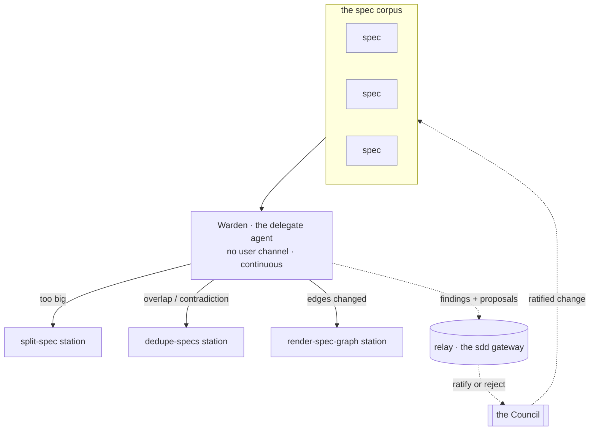

# SDD Warden — the Formation-loop delegate agent

The **Warden** is the agent that *runs* the Formation loop. Where `sdd-formation-loop` specs the **loop model** (dedupe / split / graph soundness / reconcile, corpus-wide and continuous), this spec governs the **delegate's contract** — the operating rules the agent definition asserts: no user channel, continuous and non-blocking, stations not status, proposals the Council ratifies, a frozen-contract guard, and altitude discipline.

---

## What

The **Warden** is the SDD subagent that carries the Architect's **Formation loop**. It is fleet-level and corpus-wide, running **exactly parallel to the Operator** (`sdd-operator`): the Operator runs the middle Mission loop per segment; the Warden runs the **outer Structure loop continuously across the whole corpus**.

This spec is the **agent's contract**, not the loop's model. The loop's acts and altitude live in `sdd-formation-loop`; here we pin the things the *delegate* must do and must not do:

- **No user channel.** It returns findings and proposals to the **relay** (the `sdd` gateway); the **Council** holds ratify-or-reject through the gateway.
- **Continuous and non-blocking.** It runs between missions, accumulates findings, and surfaces them episodically — never on a mission's critical path.
- **Stations, not status.** It runs the `split-spec` / `render-spec-graph` / `dedupe-specs` stations in-session; it **never** writes a spec's `status`.
- **Proposals naming the artifacts.** Dedupe and reconciliation are emitted as proposals *naming the specs/artifacts* for human confirmation; the Warden **never** silently merges, rewrites, or deletes a spec.
- **Frozen-contract guard.** Splitting or deduping a frozen `.feature` requires a Council-ratified freeze re-open carried by the relay.
- **Altitude discipline.** Out-of-loop requests are routed away; it emits no out-of-loop decision.

---

## Why

The Formation loop only matters if a *delegate* actually runs it, and a delegate without a tight contract drifts: it starts talking to the user, blocking missions, writing `status`, or silently merging specs. Those are exactly the failures the Operator's contract guards against on the Mission side — the Warden needs the same guards on the Structure side. Naming the delegate's rules separately from the loop model keeps the two re-judgeable independently: the loop's altitude can change without re-litigating the agent's seam to the relay, and vice versa.

---

## Design decisions

### Delegate contract vs loop model — the load-bearing split

`sdd-formation-loop` and this spec are **distinct on purpose**. Do not duplicate.

| | **`sdd-formation-loop`** (the model) | **`sdd-warden`** (this spec, the delegate) |
|---|---|---|
| Subject | the loop's acts and altitude | the agent that runs the loop |
| Asserts | corpus-wide, continuous; dedupe/split/graph/reconcile; distinct from the per-spec gate | no user channel; non-blocking; stations not status; proposals; frozen-contract guard; routing |
| Re-judged when | the loop's altitude or acts change | the agent's seam, guards, or entry-points change |

The Warden shares the Architect's concern (structural fit) but is the **operating agent**, not the abstract loop.

### The relay/Council ratification seam

Like the Operator, the Warden **has no direct user channel**. It writes nothing positional. Findings and proposals go to the **relay** (the `sdd` gateway); the **Council** holds ratify-or-reject through that gateway. A split runs through `split-spec`'s two human confirmation checkpoints; dedupe and reconciliation are emitted as **proposals naming the artifacts** for the Council's confirmation. Structural change to the corpus is the Council's positional act — the Warden never performs it unilaterally.

### Stations, not status — and the frozen-contract guard

The Warden runs **stations** (skills) in-session: `split-spec`, `render-spec-graph`, `dedupe-specs`. It **never** writes a spec's `status` (the gate skill owns that). And because the `.feature` is frozen once a spec is `approved`, **splitting or deduping a frozen contract requires a Council-ratified freeze re-open carried by the relay** — the Warden never shards or merges a frozen `.feature` without it.

### Corpus-wide is definitional

Every run produces a **finding set covering every spec in the corpus** — each spec examined for split candidacy, overlap, contradiction, and graph placement. **A run scoped to one spec is not a Formation run.** This is the boundary that keeps the Warden from being pulled into a single gate review.

### Altitude discipline — route, do not decide

The Warden owns corpus structure only. It routes out-of-loop requests away and emits **no** out-of-loop decision:

- a **build-or-deprecate** request → **Campaign loop** (Director); no build-or-deprecate decision;
- a **process lesson** → **Doctrine loop** (Strategist); no governance or process edit;
- a **per-spec gate structural check** → **declined**; the Warden does not run as the gate check.

---

## Use Cases

The Warden runs one loop, corpus-wide. Each row is an entry-point over the whole corpus.

| Use case | Trigger | Inputs | Outcome |
|---|---|---|---|
| **Split a monolith** | a spec trips the spec-granularity heuristic (too many scenarios / >1 behavior / independent cadences) | the oversized spec + the granularity heuristic | run `split-spec` in-session → a project spec + feature children (Council's two confirmations) |
| **Dedupe overlap** | two specs cover overlapping behavior | the overlapping specs | run `dedupe-specs` → a dedupe proposal **naming the overlapping specs** so each behavior has one home |
| **Keep the graph sound** | the rendered graph is stale vs the `blocked-by` edges, or a cycle appears | the corpus's `blocked-by` edges | run `render-spec-graph` → `graph.md` back in sync; a cycle is **surfaced**, not written away |
| **Reconcile a contradiction** | two governances or two specs contradict | the contradicting artifacts | run `dedupe-specs` → a reconciliation proposal **naming the contradicting artifacts** so no contradiction stands |
| **Stay altitude-disciplined** | a build/deprecate request, a process lesson, or a per-spec gate structural check | the misrouted request, or the spec at its gate | emit **no** out-of-loop decision; route build/deprecate → Campaign, process lessons → Doctrine; **decline** the per-spec gate check |

---

## Command surface / API

The Warden is a subagent invoked by the `sdd:formation-loop` skill — **never triggered by users directly**, and with **no direct user channel**.

| Concern | Behavior |
|---|---|
| Invocation | spawned by `sdd:formation-loop`; runs as a subagent parallel to the Operator |
| Channel | returns findings + proposals to the **relay** (the `sdd` gateway); the Council ratifies through the gateway |
| Cadence | continuous, between missions; non-blocking on any mission in progress |
| Scope | corpus-wide — a finding set covering every spec; a one-spec run is not a Formation run |
| Stations | runs `split-spec`, `render-spec-graph`, `dedupe-specs` in-session; writes **no** `status` |
| Dedupe / reconcile | proposals **naming the artifacts**; never a silent merge, rewrite, or delete |
| Graph | re-renders `graph.md` from `blocked-by` edges; **surfaces** cycles, never writes over them |
| Frozen guard | shards/merges a frozen `.feature` only with a Council-ratified freeze re-open carried by the relay |
| Out of scope | what-to-build (Campaign), how-we-work (Doctrine), the per-spec gate structural check |

---

## Related

- `artifacts/specs/sdd-formation-loop/spec.md` — the **loop model** this delegate runs (dedupe/split/graph/reconcile, corpus-wide, continuous); the distinct sibling
- `artifacts/specs/sdd-doctrine-loop/spec.md` — the parallel outer loop (Strategist / Process), run by the **Scanner** delegate — the exact structural parallel to this Warden
- `artifacts/specs/motive-model/spec.md` — the Architect actor and the three outer loops; the Warden wears the **Structure** role
- `plugins/sdd/skills/split-spec` — the station that decomposes a monolith under two Council confirmations
- `plugins/sdd/skills/render-spec-graph` — the station that re-renders `graph.md` from `blocked-by` edges and surfaces cycles
- `plugins/sdd/skills/dedupe-specs` — the station that emits dedupe/reconciliation proposals naming the artifacts
- `plugins/sdd/agents/sdd-operator.md` — the Mission-loop delegate the Warden runs parallel to

---

## Artifacts

| Label | Path |
|---|---|
| Spec | `artifacts/specs/sdd-warden/spec.md` |
| Scenarios | `artifacts/specs/sdd-warden/sdd-warden.feature` |
| Agent definition | `plugins/sdd/agents/sdd-warden.md` |
