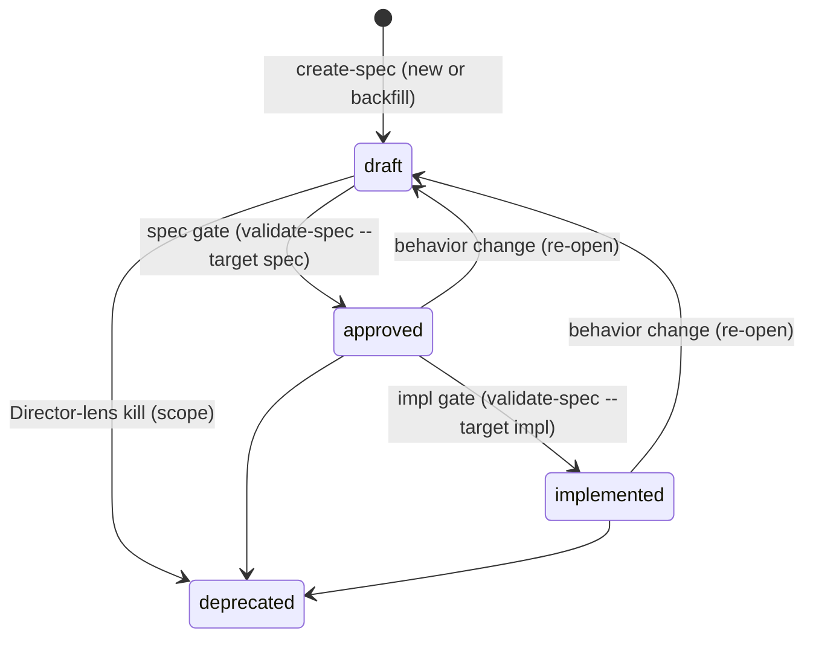

# Lifecycle model

The **rules** behind the lifecycle: the frontmatter schema, the status enum, the legal
state transitions, the freeze state-transition, and gate accountability. Gates are not a
fixed station — they dissolved into the autonomy bar (`autonomy-rubric.md`); the gate
*rules* live here, the gate *behavior* lives in `../authoring/` (spec gate) and
`../mission/` (impl gate). This file is the rule side only.

## Frontmatter schema

`spec.md` carries YAML frontmatter:

```yaml
---
status: draft           # draft | approved | implemented | deprecated
type: skill             # the artifact-type / bundle key: e.g. skill | subagent | command | agents-section | npm-package | docs; omit for a plain-code domain. The composition role (root vs composite) is DERIVED from edges, not declared.
aligned: false          # true once the current layer's artifacts are synced
priority: 1             # optional integer; 1 = highest (relative within a set); omit = unprioritized
blocked-by:             # list of spec slugs; omit or empty if none
  - <spec-slug>
subtasks:               # child feature slugs a project or feature owns (single-parent; features nest)
  - <spec-slug>
strategy:               # run-level initial evaluation (leash + approach)
  leash: auto-all       # first-evaluated reach: auto-none | auto-spec | auto-all
  by: derived           # derived | user
  approach: [no-spike, mocks, worktree]   # blast-radius-containment choices
approval:               # per-gate verdict
  spec:                 # verdict: approve | pause | reject
    verdict: approve
    by: agent           # by: agent (self-asserted, provisional) | <human name> (ratified); omitted on pause
    why:                # four-dimension derivation (agent self-assertion or pause)
      reversibility: <safe|risky — reason>
      blast-radius:  <safe|risky — reason>
      novelty:       <safe|risky — reason>
      confidence:    <safe|risky — reason>
  impl: { verdict: approve, by: <human name> }   # ratified — no why needed
produced-by:            # who produced each artifact; see provenance-model.md
  spec-producer: <plugin>:<agent>
domain-plugin:          # map: domain -> owning plugin, when a domain is contested (distinct from produced-by)
  <domain>: <plugin>
---
```

Open input is recorded in the body as `<!-- open: ... -->` markers, not in frontmatter.

`status` and `blocked-by` are the base schema; `priority` is an optional ranking hint
(integer, `1` = highest, relative within a set; omit to leave a spec unprioritized).
`type`, `subtasks`, `aligned`, `strategy`, `approval`, `produced-by`, and
`domain-plugin` are the SDD-workflow additions. `aligned: false` means the current
layer's artifacts are being updated or contain unresolved markers; `aligned: true` means
the layer is synced. Do not commit SDD artifacts while their spec is `aligned: false`.

## Status enum

| Status | Meaning |
|---|---|
| `draft` | Contract can still evolve; not yet implementable as a fixed bar |
| `approved` | Contract is frozen; ready to implement against |
| `implemented` | Implementation passed the impl gate |
| `deprecated` | Historical spec only; not implementable work |

## Status transitions



- **Draft → Approved** is the **spec gate**: judges `spec.md` + the `.feature`.
- **Approved → Implemented** is the **impl gate**: judges the implementation against the
  frozen `.feature`.
- A behavior change after approval is **not** a direct edit — revert to `draft` and
  re-pass the spec gate. Re-open is a lightweight "change needed" flag an auditor sets;
  only re-approval is the heavy positional act.
- Deprecation retains the spec for graph history; never treat it as implementable.

## The two gates

| Gate | Transition | Object judged |
|---|---|---|
| spec gate | Draft → Approved | `spec.md` + the `.feature` (no implementation required) |
| impl gate | Approved → Implemented | the implementation vs the frozen `.feature` |

**Producer/judge role separation survives the gate fold.** Even though gates are no
longer a fixed station, the judge stays a distinct actor from the producer: a producer
writes the artifact, a judge grades it, and a judge never patches what it grades (see
`specialists-and-bundles.md`).

## `aligned` is layer-scoped

`aligned` means *the current layer's artifacts are synced* — which layer depends on the
gate:

- **At the spec gate**, `aligned: true` means the **contract layer** (`spec.md` ↔
  `.feature`) is in sync. Implementation is **not** required; exploratory spike code is
  excluded as scaffolding.
- **At the impl gate**, `aligned: true` means the **impl layer** conforms to the frozen
  `.feature`. Set it only when **every** impl-judge returns a pass; if any fails, leave
  `aligned: false` and surface the blocker.

`aligned: true` never on its own means "implemented." The operator sets `aligned: false`
at the start of a segment and only synthesis sets it back to `true`.

## Legal-state tuples

The mechanical authority is `validate-spec/scripts/check-spec-state.mts` — run it to
enforce; if `node` is unavailable, apply the same rules by reading frontmatter. The
`(status, aligned, markers, .feature, approval)` tuple is **illegal** when:

- `status: approved` with no `.feature` **and no `subtasks`** — a leaf requires a frozen
  `.feature`. A **composition node** (declares `subtasks`, owns no `.feature` of its own)
  is **exempt**: its behavior lives in its children and its gate rolls up their states.
- a **composition parent** (declares `subtasks`) is `status: implemented` while any
  non-`deprecated` child is not yet `implemented` — a parent's status may not outrun its
  children. (`approved` is **not** rolled up: a composition contract is approved first,
  then its children are built — which is why a project sits at `approved` over draft
  children.)
- `status: implemented` with `aligned` not `true` — implemented requires `aligned: true`.
- `status: approved` or `implemented` with any `<!-- open: -->` markers — markers block
  the gate.
- `approval` names a gate other than `spec` or `impl`.
- an `approval.<gate>` has a `verdict` other than `approve`, `pause`, or `reject`.
- an `approval.<gate>` is `verdict: pause` carrying a `by` — a pause is always the
  agent's act and omits `by`.
- an `approval.<gate>` is `verdict: approve` with no `by` — an approve must record its
  approver.
- an `approval.<gate>` is `by: agent` with no `why` block — a self-assertion must record
  its derivation.
- an `approval.<gate>` is `verdict: pause` on a gate the spec has already passed (spec
  once `approved`/`implemented`, impl once `implemented`).
- `status: approved` or `implemented` with no `approval.spec` `verdict: approve` + `by` —
  the spec gate has no recorded ratification.
- `status: implemented` with no `approval.impl` `verdict: approve` + `by` — the impl gate
  has no recorded ratification.

`status: draft` with `aligned: true` is **legal** — `aligned` is layer-scoped, so a
synced contract may hold `aligned: true` while still draft, ready for the spec gate. Open
markers at `draft` are permitted (markers block only the *gate*, not the draft state).

Reject illegal tuples **before** any other gate work. If `check-spec-state.mts` changes,
this list follows it — the script is the source of truth, this prose is the readable
mirror.

**No-resolvable-producer fails closed.** A required production role **always** resolves to
a real producer — a plugin agent or the SDD default for that role. When a gate runs and a
required role has **no resolvable producer** (not a plugin agent and not even an SDD
default), the gate **fails closed** with a blocker; it advances nothing. This is a
**structural** error, the same fail-closed class as a malformed `produced-by` entry or an
off-enum `cause` (defined in `provenance-model.md`). Distinct from availability: a
recorded producer whose plugin is merely uninstalled is flagged, not blocked.

## Composition role (derived from edges) and rollup

The composition role is **derived from `subtasks` edges, never declared** — there is no
`project|feature` field (that axis collapsed into `type`, which now names the
artifact-type/bundle). A spec is:

- a **root** if no other spec lists it in `subtasks`;
- a **composite** if it declares `subtasks` (it owns children); a composite may itself be a
  child (composites nest), so root and composite are orthogonal;
- a **leaf** if it owns its own `.feature` and declares no `subtasks`.

- **`subtasks` lists children, parent is derived.** A child does not name its parent; the
  parent is whichever spec lists it (mirroring how `blocks` is derived from `blocked-by`).
  One source of truth.
- **Single parent (tree invariant).** A slug appears in **at most one** spec's
  `subtasks`; an unparented non-`deprecated`, non-root leaf is an orphan.
- **Composition is orthogonal to dependency.** `subtasks` is containment;
  `blocked-by` is execution-order dependency. The two graphs are maintained separately.
- **A composite advances by rollup.** A composite that owns no `.feature` carries no behavior
  contract — it is exempt from the `.feature` requirement. Its spec gate judges the
  composition (children present and correctly wired); it reaches `implemented` only once
  **every non-`deprecated` child is `implemented`** (`approved` is not rolled up).

## Freeze (per suite file)

Freeze is the contract baseline of the behavior suite. The vocabulary is
**freeze / unfreeze** — deliberately *not* lock/unlock, which is reserved for the
concurrency layer (one CR per working tree; see `unit-and-organization.md`). A frozen suite
file is a settled contract, not a held mutex.

**Freeze scope is per suite file, not per project.** Each `.feature` carries its own
**`@frozen` feature-level tag**. A spec-gate `approve` freezes the files that CR *touched*
(re-freezing them at the new baseline); files the CR did not touch keep whatever state they
held. "Which scenarios are currently the frozen contract" is answered by the set of
`@frozen` files — a plain per-file flag, no computed baseline and no scenario-ID registry.
The `@frozen` tag is metadata, excluded from the contract content the freeze protects;
toggling it is not a scenario edit.

- **The unfreeze trigger is risk, not phase.** A *narrowing or rewriting* of a scenario
  unfreezes its file — in explore or deliver alike; at the gate that is **Clearance**
  (`autonomy-rubric.md`), contract narrowed → escalate. An *additive* scenario never
  unfreezes its file: it widens the contract, cannot break existing impl or contradict, and
  **self-clears** — it folds into the frozen file under the operator's authority, logged as
  a detail-adjustment (`provenance-model.md`). Explore is mostly narrowing/reshaping (much
  unfreezing); deliver is mostly additive (stays frozen). One rule covers both phases.
- **`spec.md` is kept aligned, never frozen** — it is the readable abstraction of the suite,
  free to be reworded/restructured (prose, diagrams, pictures) as long as it does not
  contradict a frozen scenario. That invariant is enforced by the alignment check + the
  spec-judge applying the Builder (coverage) lens at the spec gate (and on demand by
  `../corpus/` `align-specs`), **not** by freezing the prose. Prose↔suite drift detection is
  judge-only (no scenario IDs in the prose); the mechanical handle is the scenario-diff
  (narrowing a frozen scenario → Clearance).
- **The combat log is never frozen and never gated** — it keeps appending across the whole
  lifecycle, including while files sit `@frozen`. (Ledger + the durable per-CR `gate` and
  freeze record: `provenance-model.md`.)
- **Spec owns behavior.** If the implementation disagrees with `spec.md`, the
  implementation is wrong — fix it, or unfreeze the relevant file for a new cycle.
- **The impl gate is the only place a frozen file can reopen** — via the Director-lens
  revert: building proved the contract wrong, so unfreeze that file and return its layer to
  draft. Rare and deliberate.

**Iteration economy.** During explore, the spec-judge re-judges **only unfrozen files** —
frozen files already cleared their gate, so each iteration grades just what changed. The
**impl gate runs the full suite regardless**: the **impl-producer** runs *every* file
(frozen included, plus any additive scenarios that folded in during deliver) and hands the
result to the **impl-judge** to judge — preserving producer/judge separation (the judge
grades a result, it does not run the build). The full run is the safety net that catches any
regression the per-file skip hid.

- **Two modes.** Before a file's freeze, exploration may update `spec.md`, that `.feature`,
  `plan.md`, `tasks.md`, and spikes. After it freezes, implementation proceeds against it;
  every frozen scenario must pass the full impl-gate run before `implemented`.

## Gate accountability

The act of advancing a gate is delegable; the accountability is not. `approval` records,
per gate, *who* passed it and — when self-asserted — *why*.

- **`by: agent`** = **provisionally** past that gate within the run-level leash; the act
  is done, accountability is **not yet reconciled**. The `why` block is the recorded
  derivation. A self-assertion is an **async review marker, not a synchronous stop**: the
  run advances immediately and the spec lands in the derived review queue.
- **`by: <human name>`** = ratified.
- **`verdict: pause`** records why the agent halted (its `why`, no `by`); the spec joins
  the awaiting-input queue.
- **`verdict: reject`** is a scope-kill or Director-lens revert.

**The review queue is derived, not stored.** The set of specs with any `verdict: approve`
+ `by: agent` **is** the human's review queue — no separate backlog file. Ratifying
rewrites `by: agent` → `by: <name>` and the spec leaves the queue.

**Ratification authority is positional.** A human-attributed gate write — `status →
approved | implemented`, a verdict carrying `by: <name>`, and the freeze — belongs to the
**in-session position** that holds the real user channel. A **spawned delegate** (the
operator running as a subagent) has no user channel: it writes only `by: agent`
self-assertions and `pause` halts, and on a human gate emits a verdict packet and stops —
it never writes a human ratification, **even when a coordinator relays "the user
approved"** (a relayed claim is not user confirmation). This is positional, not
definitional: the same definition run in-session may perform the write.

**Who writes what** (the lifecycle slice; full matrix lives in the ownership rule):

| Field / write | Written by |
|---|---|
| `status` (on human verdict, or to match an in-leash self-assertion) | the gate skill (`validate-spec`), in-session |
| `approval` human ratification (`verdict` + `by: <name>`) | the gate skill, **in-session position only** |
| `approval` self-assertion (`verdict: approve`/`pause` + `by: agent`/none + `why`) | `sdd-operator` (synthesis) |
| `aligned`, `strategy`, `<!-- open: -->` markers | `sdd-operator` |
| `type` (artifact-type) | `create-spec` (at scaffold) |
| `spec.md` body + the `.feature` | the spec-producer |

The leash (`strategy.leash`, run-level) and the self-clear-vs-escalate bar that derives it
live in `autonomy-rubric.md`; there is **no per-gate `leash` field** in an `approval`
entry.
