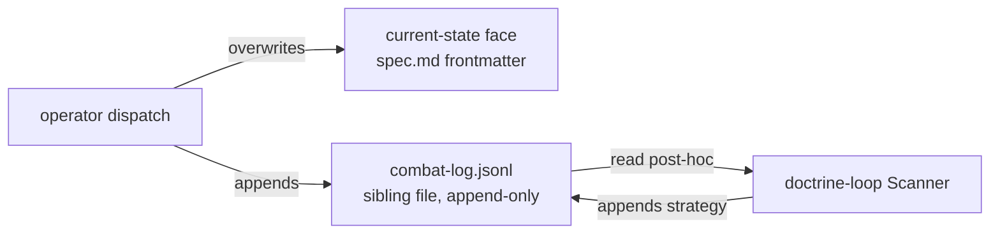

# Provenance model

The **shape** of production provenance: a two-face record — a current-state face in
`spec.md` frontmatter and an append-only ledger in a sibling `combat-log.jsonl`. This file
owns the record shape, the entry shapes, the matchable `cause` enum, and write-ownership.
Recording *behavior* (when the operator appends, how it resolves a producer) lives in
`../mission/`; this is the shape only.

## Two faces, two homes

| Face | Home | Shape | Mutability | Holds |
|---|---|---|---|---|
| **Current-state** | `spec.md` frontmatter | `produced-by` (map by role) + `approval` (map by gate: `verdict` + `why`) | **overwritten** — last write wins | the authoritative *present*: who produced each artifact, and the **standing** verdict per gate (the latest CR's outcome) |
| **Ledger** | sibling `combat-log.jsonl` | one JSON object per line, appended in order | **immutable** — lines appended, never edited or removed | the *history*: what happened across every mission/CR, in order |

The current-state face answers *"who produced this, and what is the verdict now?"* The
ledger answers *"what happened to get here?"* They do not duplicate: a gate rejection
overwrites nothing in `approval` (the eventual `approve` stands there), but the rejection
is preserved forever as a `correction` line in the ledger. This is the load-bearing reason
the ledger exists — current-state alone loses every correction.

**`approval` is standing, not historical.** The project has **one durable spec** that many
CRs flow through; `spec.md` `approval` holds only the **latest** CR's gate verdict
(overwritten each time), answering *"is the contract cleared right now, and who last
ratified?"* The **durable per-CR record** — *"CR #34's diff was approved by X, why Y"* —
lives in the ledger as a `gate` line (below), keyed by `cr`. The same two-face split that
separates `produced-by` (standing) from `report` (historical) separates `approval`
(standing) from `gate` (historical). There is **no per-CR `approval` block** in
frontmatter and no separate per-CR sidecar file.

**Every ledger line carries an optional `cr`.** Because one `combat-log.jsonl` now spans
many change requests against the one durable spec, each entry tags the CR it belongs to
(`"cr": 34`) so a reader groups a mission's lines without the transcript. Outer-loop
`strategy` lines (cross-CR by nature) may omit it.

**The ledger is operational provenance, not contract.** `combat-log.jsonl` is **never
frozen and never gated**: it keeps appending across the whole lifecycle, including while
`spec.md` and the `.feature` are frozen at `approved`. The freeze and the gates govern the
contract (`spec.md` + the `.feature`) only.

Write flow: the operator dispatch **overwrites** the current-state face in `spec.md` and
**appends** lines to `combat-log.jsonl`; the doctrine-loop Scanner reads the ledger
post-hoc and **appends** strategy lines.



## Current-state face — `produced-by` (+ `approval`)

`produced-by` records **which producer made each spec artifact**, in frontmatter,
**always** — not only when two plugins contend. Together with `approval` (the judging
twin) it gives full per-artifact provenance: who **produced** it and who **judged** it.

| Field | Records | Keyed by | Written by |
|---|---|---|---|
| `produced-by` | who **made** each artifact | production role (`spec-producer`, `plan-producer`, `impl-producer`) | operator, at dispatch |
| `approval` | who **judged** each gate (`verdict` + `by` + `why`) | gate (`spec`, `impl`) | operator (self-assert) / skill (ratify) |

Each `produced-by` value is the **plugin-qualified agent name** (`aces:aces-scenario-writer`,
`quill:quill-doc-writer`, `sdd:sdd-scenario-writer` for a default). Recorded **always**, on
every production. It plays two deliberately separated roles:

- a **historical record** — immutable provenance ("`X` produced this `.feature`"), the
  data ACES needs to measure result quality and trace a bad artifact to its producer;
- a **resume cache** — on a later run the operator reuses the recorded producer if its
  plugin is still installed, so resume is decisive without re-asking.

```yaml
status: approved
produced-by:
  spec-producer: aces:aces-scenario-writer
  plan-producer: sdd:sdd-planner
  impl-producer: sdd:sdd-operator
approval:
  spec:
    verdict: approve
    by: unional
```

**Provenance is historical; resolution is live.** "`X` produced this" stays true forever,
even after `X` is uninstalled — never rewrite or erase it on the basis of current
availability; annotate `[unavailable]` rather than drop it. The registry
(`.agents/universal-plugin.json`) is the source of truth for **who acts next**;
`produced-by` is a **cache**, never an authority.

**`domain-plugin` stays distinct from `produced-by`.** `domain-plugin` is the
forward-input disambiguation choice for an ambiguous artifact-type (which plugin to
resolve); `produced-by` is the after-the-fact record of who actually produced each
artifact. The conflation of the two was the original `sdd-plugin` impl-gate blocker; they
are not the same field.

### Availability degrades; structural validity fails closed

The "never blocks" invariant is scoped to **availability**:

- **Availability** — a recorded producer whose plugin is **gone** is still valid history:
  it is **flagged** (`[unavailable]`), not blocked; live resolution re-resolves a new
  producer for the new production.
- **Structural validity** — fails **closed**: a **malformed** `produced-by` entry (not a
  well-formed plugin-qualified name) is not valid provenance and **blocks**; a role with
  **no resolvable producer** (not even an SDD default) **blocks**; an off-enum or absent
  `cause` (below) **blocks**. The consistent rule: **availability degrades gracefully
  (flag-not-block); structural validity fails closed (block)**.

## Ledger face — the `combat-log.jsonl` entry shapes

One JSON object per line (JSON Lines). Every line carries a monotonically increasing `seq`
(append order within the spec) and a `kind`. Three kinds.

### `report` — per-subagent dispatch

One line appended per production-chain dispatch, so a later reader reconstructs what each
delegate did without the transcript.

```jsonl
{"seq": 3, "kind": "report", "role": "spec-producer", "agent": "sdd:sdd-operator", "outcome": "pass", "summary": "wrote 14 scenarios covering the ledger expansion"}
```

`role` is the production role dispatched; `agent` is the plugin-qualified agent name;
`outcome` is `pass | fail`.

### `correction` — correction-with-cause

The hard requirement. One line per correction: a gate rejection, a producer⇄judge
iteration, or a Council kick-back. The matchable `cause` is the **load-bearing field** —
cross-mission recurrence detection groups and counts corrections by `cause` across N
specs' ledgers.

```jsonl
{"seq": 7, "kind": "correction", "correction-kind": "gate-reject", "cause": "coverage-gap", "detail": "spec gate rejected — no negative scenario for the malformed-entry path"}
```

- **`correction-kind`** — the closed set `gate-reject | judge-iteration | council-kickback`.
  This names the *occasion* of a correction, not its cause; do not conflate the two.
- **`cause`** — a **minimal, discovered enum**. The matchable category of *why* a
  correction happened, not free text. Three are grounded so far:

  | Cause | Means | Grounded in |
  |---|---|---|
  | `coverage-gap` | a use case or operation lacked a covering scenario | a gate rejection for a missing scenario was observed |
  | `design-overreach` | the design added a mechanism the architecture did not need (e.g. an unnecessary sentinel / path) | a Council rejection of a design that introduced a superfluous sentinel |
  | `spec-feature-contradiction` | the `spec.md` body and the `.feature` asserted contradictory behavior | a judge-iteration where the spec narrative and a scenario disagreed (sdd-warden) |

  **Growth principle.** The enum is **closed at any point in time** but **discovered from
  usage, not designed up front**: a new value is **added** only when a real, recurring
  correction has no existing category. Fewer is better — speculative categories are not
  seeded. Two growers: the **doctrine-loop Scanner's** recurring-pattern detection, and the
  opt-in **Forge loop** (`sdd-forge-loop`) collecting real corrections from plugin usage.

  **Who edits the enum.** A grower *proposes* a value; **adding it is an edit to
  `combat-log-governance`, ratified by the Council** (a producer/judge/operator never edits
  the enum on its own). Until ratified, an off-enum `cause` still fails closed.

  A `cause` value that is **absent or off-enum** is a **structural error** (it breaks
  cross-mission matchability), not valid provenance, and **fails closed**.

### `gate` — the durable per-CR gate verdict

The durable record of *"this CR's diff was approved (or paused/rejected) at this gate."* One
line per gate verdict per CR — the immutable twin of the standing `approval` block in
`spec.md` frontmatter. Where `approval` is overwritten by the next CR, the `gate` line
preserves every CR's verdict forever, keyed by `cr`.

```jsonl
{"seq": 9, "kind": "gate", "cr": 34, "gate": "spec", "verdict": "approve", "by": "unional", "frozen": ["intake/intake.feature", "design/lifecycle.feature"]}
```

- **`gate`** — `spec | impl`, the gate this verdict closes.
- **`verdict`** — `approve | pause | reject`, mirroring the `approval` enum.
- **`by`** — the ratifier: a human name (ratified) or `agent` (self-asserted, provisional).
  A self-assertion additionally carries the four-dimension `why` derivation, same as
  the frontmatter block; a human ratification needs none.
- **`frozen`** — the suite files this verdict **froze** (spec-gate `approve` only): the
  per-file freeze record. Freeze is a per-file `@frozen` tag on each `.feature` (see
  `lifecycle-model.md`); this list records *which* files the CR froze, so the ledger answers
  *"what was frozen as of CR #34"* standalone — no git walk, which matters for the Forge loop
  reading logs across installations with no shared git.

The `gate` line is the **load-bearing answer to G**: with no per-folder `status`/`approval`,
the durable "CR approved + scenarios frozen" record is this ledger entry, not a sidecar and
not a growing frontmatter block.

### `strategy` — the slot this contract shapes but does not write

The Scanner records drafted strategy to the ledger. This contract defines the **shape** of
that line; the **write is owned by the doctrine-loop Scanner**, not by any provenance
writer.

```jsonl
{"seq": 12, "kind": "strategy", "recommendation": "codify the coverage-gap pattern as a spec-governance check", "evidence": ["coverage-gap x3 across sdd-foo, sdd-bar, sdd-baz"], "ratified": false}
```

`evidence` lists the corrections that drove the recommendation; `ratified: false` means
the Council holds keep-or-cut — unratified strategy never enters the corpus.

## The detail-adjustment report — a view of the ledger

During implement-and-verify, the operator serves expansion and minor fixes in-flight (not
the human), recorded in a **detail-adjustment report** — a *view of the combat log*, not a
separate journal. It is rendered from the `report` and `correction` lines of the run; the
human enters only on the hard floor (`autonomy-rubric.md`). Live current-state is
regenerated on demand; the durable record is the ledger.

## Write ownership

All writers append lines to the sibling `combat-log.jsonl` — no writer touches the ledger
through `spec.md` frontmatter. The ledger is append-only for every writer: lines are added
with the next `seq`, never edited or deleted.

| Writer | May append | Never writes |
|---|---|---|
| **operator** | `report`, `correction`, and **self-asserted `gate`** lines (`by: agent`, same boundary as `produced-by` / `aligned` / a self-asserted `approval`) | strategy lines; human-ratified `gate` lines |
| **gate skill (`validate-spec`), in-session** | **human-ratified `gate`** lines (`by: <name>`) | report / correction / strategy lines |
| **doctrine-loop Scanner** | `strategy` lines | report / correction / gate lines |
| **producers / judges** | nothing | the entire ledger — they do not know their own registry identity authoritatively |

A human-ratified `gate` line follows the **positional authority** rule
(`lifecycle-model.md`): only the in-session position holding the real user channel writes
`by: <name>`; a spawned operator writes only `by: agent` self-assertions and emits a verdict
packet on a human gate.

## Readers split by path

| Reader | Reads | Never reads |
|---|---|---|
| `sdd` gateway (status scan) | `spec.md` frontmatter — `status` field only | the sibling ledger |
| doctrine-loop Scanner | the sibling `combat-log.jsonl` file | `spec.md` frontmatter |

The gateway performs a **status-only scan**; the Scanner reads the ledger to draft
strategy and append its output there. Neither reader needs the other's file.

## Spec-folder shape

| File | Role | Frozen? | Gated? |
|---|---|---|---|
| `spec.md` | contract prose + standing current-state frontmatter | **never** (kept aligned) | yes |
| `<name>.feature` | contract scenarios | **per file**, via its own `@frozen` tag, set on a spec-gate `approve` that touched it (see `lifecycle-model.md`) | yes |
| `combat-log.jsonl` | operational ledger (append-only) | **never** | **never** |

Freeze is **per suite file**, not a single project-wide baseline: each `.feature` carries
its own `@frozen` tag. The standing `approval` in `spec.md` says the contract was last
cleared; the set of `@frozen` files says *which* scenarios are currently the frozen
contract; the `gate` ledger lines say *which CR* froze each.
