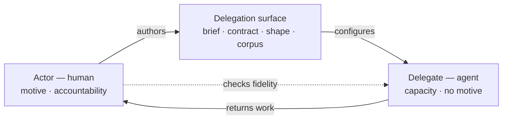
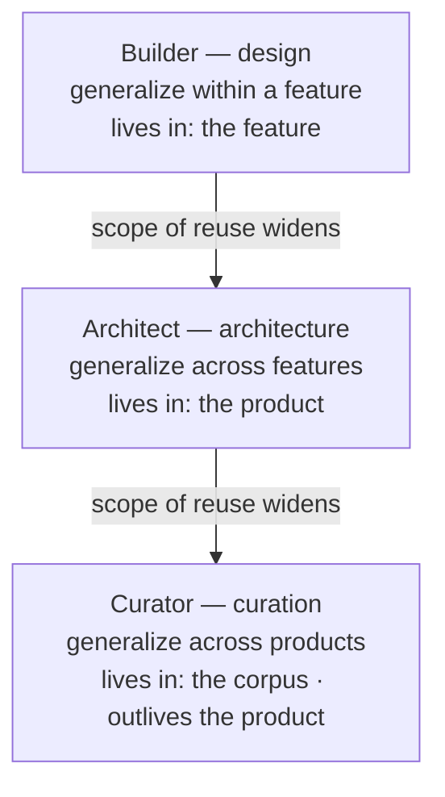
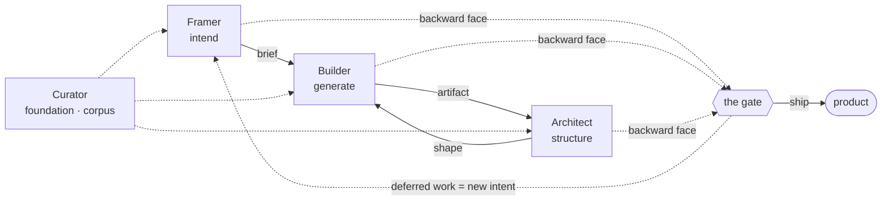
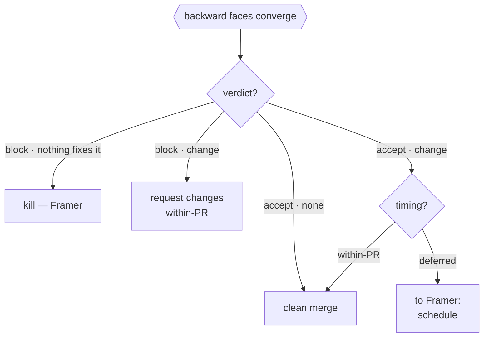
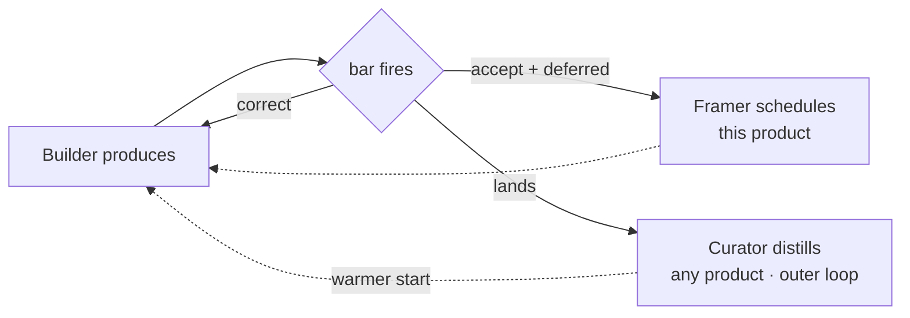
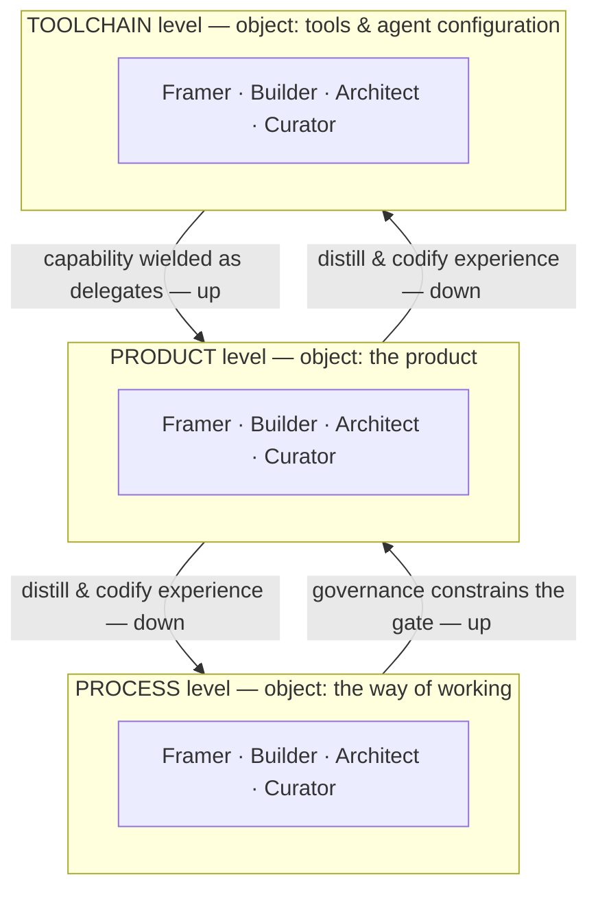

# The Actor–Delegate Model

A general framework for orchestrating human–agent teams that build a product — any product — seen fresh from the change AI introduces.

> **What this document is.** A research-centric **single source of truth**. It is neither of the two artifacts it exists to generate — it *feeds* both: a **machine artifact** (agent configuration: actors, motives, decision rules, interfaces) and a **human artifact** (an essay: variants, scenarios, narrative). Claims that lean on established theory carry inline citation keys like `[conway]`, resolved in **References**. Two claims are the framework's *own* and are marked **(original)** where they appear. The `## Downstream artifacts` map near the end says which parts feed which artifact.

## Premise

For as long as products have been built by teams, a *position* described a *contribution*: "Engineer" meant the person who produced the code, "Designer" the one who produced the design, "QA" the one who produced the checks. Position equaled contribution because **production was scarce**, and a human had the focus and capacity to be good at producing exactly one kind of thing.

AI breaks that equation. When generation becomes abundant, producing the artifact stops being the scarce, defining act — and the limit that confined a person to a single contribution dissolves. The shift is observable already: as AI automates portions of coding and testing, the work moves toward collaborating, translating intent, and shaping how systems are built, and analysts expect it to *spawn new roles* rather than simply delete old ones [ai-roles]. A human in any position can now span several kinds of contribution, because delegates extend their reach past their own focus and capability.

So the unit of a team is no longer the *title*. It is the **role** — the kind of contribution a person makes right now — and the **delegate** they direct to make it on their behalf.

## Two kinds of thing: Actors and Delegates

**Actors are humans, defined by motive.** An actor wants something — to solve the right problem, to make the thing work, to keep the whole coherent. The motive is intrinsic; it is *theirs*. Accountability lives with the actor and never leaves: an actor is answerable for the outcome of their role whether they did the work themselves or delegated it.

**Delegates are agents that act on an actor's behalf.** A delegate has no intrinsic motive. It is *given* one — through artifacts the actor authors — and it executes that intent, filling the gap when the human is unavailable. Given good artifacts, a delegate often works faster and more thoroughly than the actor would alone. But it is never accountable; it is *capacity*, not a *party*.

This is the load-bearing distinction, and it adapts a known idea. **Agency theory** describes exactly this shape — "one party (the principal) delegates work to another (the agent), who performs that work on behalf of the principal" [agency] — and it is the backbone of how we reason about delegation. But the classic theory assumes the agent is *self-interested*: it has its own goals, withholds information, and may shirk — the "agency problem." **Our delegate is the opposite, and deliberately so (original):** it has no goals of its own, so the agency problem dissolves by construction. An agent is not a teammate in the way a person is. It is a faithful extension of a person. The whole framework is about how humans-in-roles extend themselves through delegates, and how those extended roles compose into building a product.



## The four actors

Around abundant generation sit four roles, forming a control loop: someone decides what's worth making, someone makes candidates, someone keeps the whole coherent, someone makes the learning compound. The set is held to **MECE** — mutually exclusive (motives don't overlap), collectively exhaustive (nothing essential falls outside) [mece]. And each of them also *judges* — turns its expertise backward to evaluate — so there is no separate "judge" role; judging is a face every actor has, described below.

| Actor         | Motive                                                            | What they own                                                                                                            |
| ------------- | ----------------------------------------------------------------- | ------------------------------------------------------------------------------------------------------------------------ |
| **Framer**    | **Intend** — what's worth doing                                   | The problem worth solving and what success means; the authority to decide *not* to build                                 |
| **Builder**   | **Generate** — make the thing                                     | A working contribution from one angle of expertise                                                                       |
| **Architect** | **Structure** — shape the whole so it stays legible and evolvable | The organizing principles, boundaries, and conventions that keep the product comprehensible and maintainable as it grows |
| **Curator**   | **Accumulate** — make knowledge compound                          | The durable, reusable knowledge every other role draws on                                                                |

The motive is what makes each a real actor: each motive generates use cases the others don't. The Framer's signature output is a *kill decision*; the Builder's is a *working artifact*; the Architect's is a *boundary or convention*; the Curator's is *reuse*. Distinct motives, distinct use cases, distinct interfaces.

One scale runs through three of them and is worth stating up front, because it is where the roles are most often confused. **Generalization is just abstraction; what differs is the scope of reuse and where the result lives** — a ladder that also captures the classic *design vs architecture* distinction:

| Generalize across…              | Result lives in…                       | Actor         | Concern                                          |
| ------------------------------- | -------------------------------------- | ------------- | ------------------------------------------------ |
| parts **within one feature**    | the feature                            | **Builder**   | *design* — how it works                          |
| **features within one product** | the product (a shared abstraction)     | **Architect** | *architecture* — how it's organized              |
| **products, over time**         | the corpus (template, skill, plugin)   | **Curator**   | *curation* — knowledge that outlives the product |

The *mechanism* each uses to add value keeps the rungs apart: **design changes behavior directly** (write better logic); **architecture changes behavior through structure** (extract the shared path, and every feature inherits the consistency); **curation changes future capability through knowledge** (the next project starts warmer). An app crammed into a single file *works* — design is satisfied — yet is unmaintainable, because the behavior was bought directly, without the structural leverage that lets the rest of the system inherit the quality. That gap is the Architect's reason to exist.



### Framer — intend

- **Motive:** decide what is worth doing, and what success means.
- **Object:** the problem and its definition of done — including the authority to decide *not* to build.
- **Signature output:** a **kill decision** — the cheapest, highest-leverage thing a team can produce.
- **Forward / backward:** forward, frames the problem and sets the bar for success; backward, makes the kill-or-ship call at the gate.
- **Boundary (vs Builder):** the Framer owns *whether and why*; the Builder owns *how*. A Builder who redefines the goal has stepped into the Framer role.

### Builder — generate

- **Motive:** make the thing work, from one angle of expertise.
- **Object:** a **part** — a working contribution (a feature, a fix, a UI, a control). This is *design*: how it works.
- **Signature output:** a working artifact, co-delivered with the contract (test or spec) that defines its behavior.
- **Variant:** *Explorer* — generates to *discard* (breadth, speed, low attachment), versus the default Builder who generates to *keep* (depth, craft, correctness).
- **Boundary (vs Architect):** the Builder makes a part; the moment the work is about the *relations between* parts, it is an Architect act — even when the same person does it in the same minute.

### Architect — structure

- **Motive:** keep the whole legible and evolvable as it grows — *architecture*: how things are organized, for maintainability.
- **Object:** the **relations between parts** — boundaries, conventions, the composition law over everything the Builders make. Not a bigger part; a different *kind* of thing — which is why "Builder at system scope" is a category error (see *Resolved*): scope was never the separator. **Conway's Law** is the backdrop — a system's structure mirrors the communication structure that built it [conway].
- **Active, and it *is* governance.** The Architect does not tidy what landed; it **draws the lines ahead of time** — chooses that structure should *scream the domain* [screaming], leans on SOLID or clean-architecture boundaries, decides which principle outranks which for *this* system, and authors the rules the Builders then build under. Constraints are the defensive half; choosing and imposing the organizing principles is the constructive half.
- **Generalizes across features, inside the product.** Noticing three features each roll their own auth and extracting one shared path is Architect work — and it pays a *behavioral* dividend (every feature now authenticates consistently and correctly). That dividend is the **fruit of organizing**, not a separate design act; it is *why* architecture earns its keep.
- **Signature output:** a boundary or convention. **Variant:** *Conductor* (forming) — structures at runtime, orchestrating delegates and people in parallel; much of it is codifiable into a delegate (see *Two resolutions*).
- **Boundary (vs Curator):** the Architect's abstraction lives in *this* product and dies with it. The moment the output is lifted out as knowledge meant to outlive the product, it is Curator work.

### Curator — accumulate (the foundation tier)

The three roles above operate on the *product*. Curator does not — its object is **knowledge designed to outlive any single product**. That raises the objection that recurs every time: isn't keeping the corpus organized just *architecture at another tier*?

**Partly — and worth saying plainly.** Organizing the corpus (keeping it coherent, DRY, legible) *is* architecture-of-the-corpus, and a Curator performs it constantly — the way every actor borrows skills across roles. But the role is named for the part architecture does **not** contain. Three acts are Curator-only, and none is "organize":

- **Selection for durability** — deciding which lessons are *durable enough to encode* versus transient noise. Architecture organizes the parts that exist; it never judges which *experiences* earn a permanent place.
- **Generalization across products and time** — lifting a specific solution into a transferable form for problems that *don't exist yet* (a template, a convention, an agent skill or plugin). In-product DRY stops at the product boundary; this crosses it.
- **Pruning for truth** — removing what is *no longer true*, not merely what is structurally incoherent. Truth-decay over time, not present fit.

These are *accumulate* — grow a compounding, reusable asset — not *structure*. That is the motive architecture lacks, and it is why a corpus-maintainer flipping into Architect-of-the-corpus no more makes Curator a sub-case of Architect than a Builder reviewing code makes review a sub-case of Building.

Its output *feels* like a layer because every other actor's delegate reads from it — precisely the position of a **platform or infrastructure team**: a role whose *product* is a layer, "made available via self-service capabilities… easy for the [other] teams to consume" [team-topologies]. (Its capability-raising has an *enabling-team* flavor; but unlike an enabling team — time-boxed, product-less — Curator is permanent and owns a product, the corpus, which is the **platform** pattern [team-topologies].) So the model has two tiers:

- **Delivery actors** — Framer, Builder, Architect — operate on the *product*.
- **Foundation actor** — Curator — operates on the team's *capacity to deliver*: the corpus the other three's delegates draw from.

The Curator's own practices live in the corpus too, so it is self-describing — a fixed point, not an infinite regress. And a prediction falls out of the tiering: infrastructure is the first thing a team neglects, and its neglect degrades *everyone* — a decaying corpus forces every delegate, in every role, to start cold.

### Every actor has two faces: produce and evaluate

The same expertise points two ways. Applied **forward**, it produces — a Builder writes code, an Architect designs structure, a Framer frames a problem. Applied **backward**, the same expertise *judges* — the Builder reviews code, the Architect runs a design review, the Framer makes a kill-or-ship call. Nothing about the person or their knowledge changes between the two; only the *direction* does. This is "verbs, not titles" at its sharpest.

So there is **no standalone Gatekeeper actor.** "Gatekeeping" is what any actor's expertise does when turned backward; a thing with no domain of its own is a direction, not a role. The word survives as the name of an *activity*, not a party.

One constraint governs the faces: **`producer ≠ judge`** — an *echo* of the **separation-of-duties / four-eyes principle** [sod], not the strict thing. Strict four-eyes needs two different parties; here a single actor can serve both faces, flipping forward to backward on the same artifact in split seconds. The boundary is genuinely weaker — but it is real, and humans run it constantly. What the model *adds* is a **split of judgment across time** that beats the limit of real-time review. Criteria authored *ahead of time*, under no time pressure, can be thorough — but only *generally*, not specifically; these live in the **bar** and fire automatically through the delegate. *In the loop*, where attention is scarce and the clock runs, the human is freed from re-deriving the general checks and spends that scarce attention on the **specific and important** — which is where judgment quality is actually won. Switching forward-to-backward on the *same* artifact still *spends* your standing as an arm's-length reviewer, which is why, when a reviewer pushes a fix, someone else approves.

*The control loop — forward production, backward faces converging at the gate, and the feedback edge:*



## The gate: a two-axis decision

> **Feeds:** machine artifact (decision rules, interface contracts) primarily.

**The gate** is the boundary — a pull request, a release — where backward faces converge on one change: correctness (Builder, backward), fit-to-structure (Architect, backward), and worth-shipping (Framer, backward) are judged together. What comes out is **not a single bit.** It is two decisions on two axes:

- **Verdict** — does this change pass *now*? `accept` / `block`.
- **Change request** — does the gate emit new work? `none` / `yes`, and if yes, with a **timing**: `within-PR` or `deferred`.

|             | no change request           | change request                                        |
| ----------- | --------------------------- | ----------------------------------------------------- |
| **accept**  | clean merge                 | merge **+ work** (within-PR nit, or deferred follow-up) |
| **block**   | **kill** — nothing fixes it | **request changes** (work is within-PR by necessity)  |

Two corners earn names. `block + none` is the **Framer's kill surfacing at the gate** — *this should not exist* — the Framer's signature output, not a request to revise. `accept + deferred` is the **feedback edge**: merge now, spin off work that re-enters the loop later (see *How it composes*).



The first axis is governed by a **decision rule** — how the backward faces combine into one verdict, anywhere from an all-pass unanimous veto to a single senior decider (in practice, often a senior engineer weighting the Architect face, or a domain expert weighting the Framer face). The rule is *governance*, a policy choice, not an actor. The second axis is *generated output*, not a combination rule — so the two stay distinct.

One coupling, stated honestly: **`block` forces `within-PR`.** You cannot defer the thing that blocks — deferring it *means* it stopped blocking. So timing has freedom only under `accept`; a `block + deferred` cell would be dead. Timing is therefore a flavor of the change-request axis, not a third independent axis.

### The deferred branch is a scheduling decision over a dependency tree

`accept + deferred` is richer than "file a ticket." It hands the **Framer** a scheduling decision, because *what's worth doing now versus later* is an intend decision — the same motive as the kill, on the time axis. The **Architect** detects the concern and estimates it (scope, complexity → rework cost); the Framer decides the order. So the deferred branch is a **backward-face → Framer handoff**.

The decision runs over two trees that can diverge:

- **Dependency order** — A *needs* B. This is the Architect's object: relations between parts.
- **Work order** — the sequence we actually build in.

A **placeholder** — a stub (in the test-double sense [test-double], generalized to production), a workaround, or a rougher MVP — is what lets work-order diverge from dependency-order: you build A against a stand-in for B, and pay **rework** when the real B lands. (Contrast the *walking skeleton*, which dodges that tax by building a thin slice of **real** end-to-end functionality rather than a fake [walking-skeleton] — real-but-thin instead of full-but-faked.) That gives the two flavors of defer **(original — the trade-off is the framework's own inference, not a sourced result):**

- **Defer the new work** — workaround/stub now, build the dependency later, accept the rework.
- **Defer the current work** — stop, build the prerequisite first, no rework, at the cost of interrupting the current thread.

The determining factor is a cost comparison: **rework cost** (stub now, redo later) versus **switch/blocking cost** (stop current, build prerequisite first). Scope and complexity drive both sides — a large, high-blast-radius concern makes a rushed inline fix dangerous *and* makes rework expensive, which is why big architectural debt is deferred to a deliberate effort rather than either ignored or forced in-line.

**Capacity used to decide this — and abundance is exactly what changes it.** Pre-AI, "build the prerequisite first" meant *stop everything*, because no hands were spare; so teams defaulted to workaround-now and accumulated debt. With delegates, the human — conducting, in the Architect's runtime mode — **directs an orchestrator-delegate to fan the dependency out** while the current thread keeps moving (the orchestrator-worker pattern, where a lead "dynamically breaks down tasks, delegates them to worker [agents]… and synthesizes their results" [multi-agent]). "Build the dependency first" stops meaning "stop everything" and becomes "parallelize." This is the **conducting** move, and a direct instance of the abundance premise: abundance does not remove the dependency tree; it lets you walk it without serializing. The boundary condition is real, and it bites right here: fan-out works when the dependency is *separable behind a stable interface* (loose coupling at the seam), and works worst when the dependency is tightly interwoven with the current thread — exactly the *tightly interdependent* case orchestration handles least well [multi-agent]. So the move is available precisely when the seam is clean; when it is not, the scheduling choice tightens toward *defer current work*.

A naming distinction the metaphor invites: the **Conductor is the *actor*** — the human, holding motive and accountability — while the **orchestrator is the *delegate pattern*** it wields (a lead delegate that breaks down and directs workers [multi-agent]). They do not merge. Collapsing them would fold an actor back into a delegate — the one move the model forbids.

## Positions are not roles

> **Feeds:** human artifact (essay) primarily.

The thesis, made concrete. A job title used to name a single contribution because production was scarce and focus was finite. With delegates supplying production, each position can now act across many roles — the title becomes a *default*, not a boundary. ("Gatekeeper" below names the evaluative activity — a backward face — not a separate actor.)

| Position     | Default role (pre-AI)      | Roles AI now opens                                                                                                  |
| ------------ | -------------------------- | ------------------------------------------------------------------------------------------------------------------- |
| **PM**       | Framer                     | Explorer (prototype directly with a delegate), Gatekeeper (own acceptance), Curator (encode product knowledge)      |
| **Designer** | Builder + Explorer (of UX) | Framer (own the *why*), Gatekeeper (the taste and quality bar), Curator (the design system as a curated corpus)     |
| **Engineer** | Builder                    | Architect, Gatekeeper (review), Conductor (orchestrate delegate fleets), Curator (write the conventions)            |
| **QA**       | Gatekeeper                 | Architect (of acceptance criteria), Curator (golden sets and the regression corpus), Explorer (adversarial probing) |

QA is the sharpest case: when delegates write the tests, QA stops being the one who *writes* checks and becomes the one who *owns the acceptance contract and curates the corpus it draws on* — gatekeeping plus Curator.

The table reads two ways. Across a row: how far one position can now stretch. Down the **Gatekeeper** column: why review is everyone's part-time role, not a department — every position turns its expertise backward at the gate.

## Two resolutions: actors for machines, variants for humans

The four actors are the right unit **for the machine** — for generating use cases, scenarios, and human-agent interfaces. At that resolution, finer distinctions are noise.

But humans need a finer resolution, because **roles that share a motive can still demand opposite preparation.** Each actor has a default form plus named **variants** — specializations that fold away for the machine but matter enormously for human capacity, training, and growth.

Not every specialization earns a name. A candidate — actor, variant, or sub-role — must clear three **membership gates**, and they are what keep the taxonomy from sprawling:

- **Distinct motive** — for an *actor*; a *variant* instead shares its actor's motive.
- **Capacity differentiation** — inhabiting it must require a *substantial, distinct* body of knowledge. If the preparation delta is small, it is not a role; it is a function to **codify**.
- **Persistence** — the need must *recur and aggregate* into a standing demand a human specializes toward. (Not continuous occupancy — a Framer's kill is a split-second act; the *need* is what must aggregate.) A momentary, absorbable need is a sub-role: a *janitor*, not a *cleaner-of-the-flush-handle*.

| Actor         | Variant                               | Status    | How it differs — and why preparation differs                                                                                          |
| ------------- | ------------------------------------- | --------- | ------------------------------------------------------------------------------------------------------------------------------------- |
| **Builder**   | *Explorer* — generates to *discard*   | confirmed | Breadth, pattern recognition, low attachment, speed over polish — versus the default Builder who generates to *keep* (depth, craft, correctness). Clears both gates: a near-opposite cognitive profile, and a recurring, aggregated need. |
| **Architect** | *Conductor* — structures at *runtime* | forming   | Orchestrates many delegates and people into one whole at runtime — versus the default Architect who structures the *artifact* at design time. **Borderline today:** much of it is codifiable (the orchestrator-worker pattern is already a *delegate*, not a human role), and the non-codifiable residual decomposes into Framer (reprioritize) and Architect (re-seam) acts. It strengthens as fleets grow — at large scale, coordinating many agents in real time may cross an *air-traffic-control* threshold into a distinct capacity. |

Explorer and the default Builder are nearly opposite cognitive profiles — the same *motive* (generate), incompatible *training*. That is why a single framework needs both resolutions: collapse to actors to design the system, expand to variants to develop the people. Variants live on the forward face; the backward (evaluative) face is a separate axis again — an actor can be a deep Builder yet still turn that depth backward to review.

### Codification moves the actor/delegate line

The capacity gate has a consequence worth stating on its own: **a role is worth naming only where the human capacity is substantial *and* not-yet-codifiable.** The moment a function becomes codifiable, its codifiable slice crosses the **actor/delegate line** and becomes **agent configuration** — the delegation surface, materialized for an AI delegate. (Codify a Curator and you get skills and conventions; a Builder, specs; a Conductor, orchestration config.) So codifiability is *where* the actor/delegate boundary sits, and it moves over time — the same engine as the abundance premise, now applied to coordination rather than production.

This is why "isn't a Conductor just someone who *builds* the orchestration?" is half-right. Building that agent configuration is a real job — but it is a **Builder at the toolchain tier**, whose object is a *part* (the orchestration feature), because **agent configuration is itself a product**, built by its own Framer, Builder, Architect, and Curator. *(Concretely in this repository: the "agent orchestration" feature of the ACES plugin is the codified Conductor, built by a Builder of ACES — a product the framework describes building, not a part of the framework.)*

## Delegation surfaces

Every actor extends itself through a **delegation surface** — the artifact by which it transmits intent across an availability gap: to a delegate now, to a teammate, or to its own future self.

| Actor         | Delegation surface           | What it carries                                                                       |
| ------------- | ---------------------------- | ------------------------------------------------------------------------------------- |
| **Framer**    | **The brief**                | The problem, the *why*, the definition of success                                     |
| **Builder**   | **The contract + exemplars** | A behavioral spec for one angle, plus reference patterns to imitate                   |
| **Architect** | **The shape**                | Organizing principles, boundaries, conventions, and the constraints that protect them |
| **Curator**   | **The corpus**               | Distilled, reusable knowledge every other delegate reads from                         |

Each surface has a backward face too — its **bar**, the acceptance criteria the same expertise applies when judging. The bar is not a separate surface; it is the *criteria face* of every surface: the brief's definition of success, the shape's fitness rules, the contract's behavioral checks. Stated as instruction it guides production; stated as criteria it gates acceptance — two faces of one artifact.

*Brief, contract, shape, corpus* (each with its criteria face). These are categories, not products. A given team instantiates them in whatever form fits — a one-page brief or a chartered intent doc; convention files or decision records; checklists or executable acceptance tests. The framework names the surface; the team chooses the medium.

The Curator's surface is special: its output *is* the substrate every other delegate reads from. A team that invests in its corpus makes every other delegate faster and more faithful at once. A team that neglects it forces every delegate to start cold.

## Curator and the loop

Agentic "loop engineering" has an inner and an outer loop, and the actors split across them.

- **Inner loop** (within a task): generate → test → correct. Builder produces, the **bar** — an actor's backward face made executable — fires as the signal, Builder corrects, Architect reshapes under green. Fast, delivery tier. Mirrors the developer **inner loop**: rapid local iteration before integration [dev-loop]. Curator does not fire here.
- **Outer loop** (across tasks): harvest the durable lessons, distill, prune, and encode them into the corpus, so the next inner loop starts warmer. This is the Curator's loop — and *not* the DevEx "outer loop" of CI/CD integration and deploy, which is delivery plumbing, not knowledge distillation. Only the inner-loop analogy carries over [dev-loop].

This is single- versus double-loop learning [argyris]: the inner loop corrects *actions* under fixed assumptions (single-loop — "carry on its present policies… single-loop learning"); the outer loop can revise the *knowledge and assumptions* themselves (double-loop — "modification of an organization's underlying norms, policies and objectives") [argyris]. Curator owns the outer loop and spans both modes: routine **codification** — encoding what already works for reuse (a lint rule for a thrice-solved pattern) — is single-loop; **revision** — pruning a now-false convention, resolving a contradiction — is double-loop. Double-loop is the Curator's distinctive, highest-value mode, not its only one.

**Three loops now sit in the model, and they are distinct:**

- **Inner loop** — `within-PR` correction (Builder under the bar). Single-loop.
- **Product feedback edge** — `deferred` work on *this* product (the Architect→Framer handoff from the gate). New intent, same product.
- **Outer loop** — the Curator distilling reusable knowledge for *any* product. Double-loop at its distinctive best; single-loop when merely codifying.



The middle loop is *not* the Curator's: deferred product work changes *this* product, while the Curator changes the *capacity to build any product*. The discriminator stays sharp.

Firing Curator every iteration is **premature codification** — you encode transient noise and thrash the corpus before you know which lessons are durable. So the human Curator is episodic, triggered at boundaries: a pattern solved three times, the same correction repeated across loops, a contradiction or staleness that needs pruning, a milestone retro.

The interface this produces is the model's first concrete one: the **Curator's delegate watches continuously** — flagging candidates, drafting conventions, detecting corpus contradictions, all cheap — while the **human Curator holds the accept/prune decision**, because that call is accountable and high-blast-radius. *Detection and drafting by the delegate; keep-or-cut by the human.* It is a template for every other actor's interface.

## Delegate fidelity: the orthogonal axis

Delegating is only half the relationship. The other half is **verifying the delegate is faithful** — that it does what the actor would have done, and intended. This concern is orthogonal to the four actors: every actor delegates *and* must check its delegate.

Fidelity is distinct from evaluation. A backward face judges *the product*; fidelity judges *the delegate*. They are different objects at different levels — judging the work versus judging the worker. A great deal of human-agent *interface* design lives on this axis: how an actor inspects, calibrates, and trusts the capacity it is wielding.

> Building a robust fidelity system for one class of delegate — agent configurations — is itself a product, with its own Framer, Builder, Architect, and Curator. The framework describes how such a product gets built; it does not contain it.

## Scenarios: how the actors actually show up

> **Feeds:** human artifact (essay) primarily.

Actor involvement has a topology. Who plays which actor, and when, runs along an axis from **fully decoupled** — roles spread across people, gated by asynchronous boundaries — to **fully compressed** — one human spans every role while delegates supply the production. Real work sits between.

### Decoupled: a bug fix in an open-source project

- **Framer** — the contributor decides this bug is worth their time, usually self-framed from their own pain; the issue thread is the brief. A maintainer framed it earlier by accepting and labeling it.
- **Explorer** (Builder, divergent) — the contributor reproduces it, reads unfamiliar code, tries a couple of approaches, discards the dead ends.
- **Builder** (producer) — writes the fix and a regression test; the test is the contract, co-delivered.
- *— boundary: the pull request —*
- **The gate** — the maintainer enters *only now*, turning expertise backward against the change: correctness (Builder face) against the bar, fit-to-structure (Architect face), and worth-merging (Framer face). The two-axis verdict applies: accept-or-block, with or without change requests — and a recurring-class concern may be `accept + deferred`, filed as a follow-up. Note the asymmetry — the contributor produced for days with no evaluation present; the gate is async and late.
- **Curator** — if the bug is one of a recurring class, the maintainer encodes a lint rule, a test pattern, or a CONTRIBUTING note so the next contributor avoids it. Frequently deferred or skipped — infrastructure neglect in the wild.

Reading: one human (contributor) plays Framer + Explorer + Builder forward; another (maintainer) judges at the gate — the Builder, Architect, and Framer faces turned backward — and curates. Roles cluster by *position in the contribution flow*, not by job. And the same maintainer who judges here is a Builder on their own commits — the verb, not the person.

### Compressed: a solo developer and their delegates ship a feature

- **Framer** — the developer fixes the feature's *why* and what success looks like, sometimes as a written brief, sometimes only in their head.
- **Explorer** (Builder variant) — a delegate spikes three approaches in parallel; the developer, applying expertise *backward*, keeps one and kills two. (That pick is the Builder's own backward face — evaluation inside the Builder phase.)
- **Builder** (producer) — a delegate implements the chosen approach; the inner loop runs against tests.
- *— boundary: the developer reads the diff —*
- **The gate** — the same human, now turning their expertise backward on the delegate's output. `producer ≠ judge` still holds, because the *delegate* produced and the *human* judges.
- **Architect (conducting)** — the developer notices it should follow an existing convention and directs a refactor under green; if the convention requires a not-yet-built helper, they direct an orchestrator-delegate to build it in parallel rather than stalling the feature (the scheduling decision in miniature).
- **Curator** — at the end, the developer encodes the new convention so the next feature starts warmer — or, more often, a Curator-delegate flags "you've done this three times" and the human approves the entry.

Reading: one human spans all four actors, forward and backward, in an afternoon — impossible before AI, when production consumed all their focus. Delegates supply the production capacity, freeing the human to move through the roles while holding motive and accountability throughout. This is the thesis in miniature: abundance does not replace the human; it lets one human *be* the team.

## How it composes

The chain the framework is meant to drive — and the edge that closes it into the control loop named at the top:

```
Actors (humans + motives)
   └─ generate Use cases (what each motive needs to accomplish)
        └─ generate Scenarios (how it plays out, who delegates what)
             └─ shape Human–agent interfaces (the surfaces + fidelity checks)

   ▲ the loop closes: at the gate, backward faces emit new intent —
   └────── deferred work → Framer (scheduling) → new use cases ──────┘
```

Get the actors and motives right and the rest is downstream. Get them wrong — by treating agents as actors, or by organizing on a timeline instead of by motive — and the use cases overlap, the scenarios blur, and the interfaces inherit the confusion. The back-edge is what makes this a control loop and not a one-way pipeline: evaluation does not just gate, it *generates* the next round of intent. And this whole chain runs at every **level** — product, process, toolchain — not the product alone (see *The recursion axis*).

## The recursion axis: one framework, every level

Everything above describes building *a product*. But the four actors, the two faces, the delegation surfaces, and the gate are **invariant** — run the same machine on a different **object** and you get a different **level** of the same framework. Three are canonical:

| Level         | Object                          | Framer decides   | Builder makes              | Architect structures   | Curator distills            |
| ------------- | ------------------------------- | ---------------- | -------------------------- | ---------------------- | --------------------------- |
| **Product**   | the product (user value)        | which product    | a feature                  | the codebase           | product & domain knowledge  |
| **Process**   | the way of working              | which practices  | a workflow or runbook      | how the practices fit  | process lessons             |
| **Toolchain** | tools & agent configuration     | which tooling    | a skill, plugin, or harness | the toolchain          | tooling patterns            |

The loop in each row is identical; only its object differs. So a "senior" anyone is not a *bigger* role — it is the same role operated across more levels.



Three things fall out:

**Your past Architect definition resolves.** "Own codebase health, *and* the process governing AI contributions, *and* the AI workflow/harness" was never one outsized role — it is the **Architect motive at the product, process, and toolchain levels.** One motive, three objects.

**Codification is the elevator between levels.** Experience rides **down**: a product-level Curator distills a recurring lesson into a process convention or a toolchain artifact — *agent configuration*. Capability rides **up**: toolchain output is *wielded* as delegates; process output *constrains* the gate as governance. The codification law (above) is just this down-elevator, seen for one class of delegate.

**Curator is the bridge — and this unifies the model.** "Accumulate" *is* the act of moving product experience into a reusable process or toolchain asset. So four things we built separately — the **Curator foundation tier**, the **codification law**, **agent configuration**, and **recursion** — are one pattern at two scales: *the foundation supplies the surface.* It holds **within** a level (Curator → the other three actors) and **across** levels (toolchain & process → product). That is why Curator kept reading as "architecture at another tier": it lives on the seam between levels.

> **Two words, two axes — do not merge them.** A **level** is the recursion (product / process / toolchain); a **tier** is the delivery-vs-foundation split *within* a level (Framer/Builder/Architect over Curator). Curator is the foundation tier of every level *and* the actor that bridges levels — which is precisely why it sits at both seams.

## Resolved

- **Is Architect a distinct actor or Builder at system scope?** Distinct — and the original framing hid the real separator. *Scope* was a red herring: a Builder zoomed out still produces a **part**, just a bigger one. The Architect's **object** is different — *relations between parts* (boundaries, conventions, the composition law), not a slice of the product [conway]. That holds at every scope, so "Builder at system scope" is a category error. Operationally the Architect also differs on **deliverability** (realized only *through* others' work — a convention exists only when Builders follow it), **feedback latency** (slow and global — felt at the next change, not in a passing test), and **cadence** (per structural decision, not per contribution). Feature-scale fuzziness — "a Builder co-delivering a spec is already doing architecture" — is one *person* flipping roles, not the actors merging: switching motive is switching actor.

- **Is the Architect's breadth (codebase + process + harness) one big role?** No — it is the Architect motive at three **levels** (product, process, toolchain); see *The recursion axis*. *Level* (recursion) and *tier* (delivery vs foundation actor) are distinct axes that meet at the **Curator** — the foundation tier of every level and the actor that bridges levels.

- **Is Curator a peer actor or a layer?** Both — the question was a false choice. *Actor* asks whether a distinct motive generates distinct use cases (it does); *layer* asks where the output sits in the dependency graph (foundational). Curator is the team's **infrastructure actor**: a full actor whose product is a layer, like a platform team [team-topologies]. The model is two-tiered — three delivery actors over one foundation actor — not actors plus a non-actor substrate.

- **Is Gatekeeper a standalone actor?** No. Judging is expertise turned backward, so *every* actor has an evaluative face — there is no role with judging as its own domain. **The gate** is the boundary where those backward faces converge; the verdict is a two-axis decision (accept/block × change-request) governed by a **decision rule** (unanimous veto → single senior decider), i.e. governance, not a party. "Gatekeeper" survives as the name of the *activity*. `producer ≠ judge` holds per artifact across time [sod]. Net: **four actors** (Framer, Builder, Architect + Curator foundation), each with a forward and a backward face.

## Open questions

1. **How many variants, and for which actors?** The three **membership gates** (distinct motive, capacity differentiation, persistence) bound the list — that is what stops it sprawling. Under them, **Explorer** (of Builder) clears both variant gates; **Conductor** (of Architect) is *forming* — borderline until fleet scale raises the coordination capacity required. Whether **Framer** and **Curator** have variants that clear the gates is the open part. (Note: forward/backward *faces* are a separate axis from variants — both multiply the surface area.)

2. **Does the delegation surface serve human-to-human as well as human-to-agent?** A brief hands intent to a teammate as readily as to an agent. If the surface is medium-agnostic, the framework describes *all* delegation, not just delegation to AI — which is either a strength (generality) or a sign the AI-specific part is thinner than claimed.

3. **How broad is the abundance premise?** AI makes *common* generation cheap; *novel or hard* generation stays expensive, and there the old title-equals-contribution model partly survives. The framework's reach is exactly as wide as abundance actually is.

4. **What is the formal shape of delegate fidelity?** It is named here as an orthogonal axis but not modeled. Is it a fifth concern, a property of every delegation surface, or the true home of the human-agent interface?

## Downstream artifacts

This dossier is the single source of truth. Two artifacts are generated from it; this map says which parts feed which.

| Dossier part | → Machine artifact (agent config) | → Human artifact (essay) |
| --- | --- | --- |
| Two kinds of thing (Actors/Delegates) | core type definitions; the delegate-has-no-motive rule | the framing chapter |
| The four actors + motives | the actor enum that seeds use cases | the conceptual spine |
| Two faces; `producer ≠ judge` | review/governance constraints | the "verbs not titles" argument |
| The gate (two-axis decision, decision rule) | **primary** — gating logic, branch handling, interfaces | illustrated via scenarios |
| Deferred branch / scheduling over dependency tree | orchestration + scheduling policy; Conductor fan-out | the dependency-tree narrative |
| Delegation surfaces + bar | the surface/criteria contracts | what each role hands off |
| Curator and the loop (three loops) | when each loop fires; Curator-delegate interface | the learning-compounds story |
| Variants (Explorer; Conductor — forming) | folds away (machine uses actors) | **primary** — capacity, training, growth |
| Positions are not roles | — | **primary** — the reader's on-ramp |
| Scenarios | trace-checks for the use cases | **primary** — concrete walk-throughs |
| Delegate fidelity | the fidelity-check axis of every interface | the open frontier |

## Glossary

The framework's load-bearing terms, in dependency order — earlier terms ground later ones. Each word means exactly one thing; collisions are called out where they were tempting.

| Term | Definition |
| --- | --- |
| **Actor** | A human role defined by an intrinsic **motive**: Framer, Builder, Architect, Curator. Holds accountability, which never delegates. *Collision to note: unlike a UML use-case "actor" (which may be a non-human system) or the actor-model actor, our actor is **always human** — agents are delegates.* |
| **Delegate** | An agent acting on an actor's behalf. No motive of its own — *capacity*, not a *party*. Never accountable. Adapts agency theory's agent, minus the self-interest [agency]. |
| **Motive** | The intrinsic want that defines an actor: intend (Framer), generate (Builder), structure (Architect), accumulate (Curator). |
| **Object** | *What an actor's output is.* A Builder's object is a **part**; the Architect's, the **relations between parts**; the Curator's, **knowledge that outlives the product**. Object — not scope — separates them. |
| **Face** | The *direction* an actor's expertise points — **forward** (produce) or **backward** (evaluate). Every actor has both. *Reserved: never used for anything else — switching motive is switching actor, not face.* |
| **Variant** | A specialization of an actor's *forward face* that needs different preparation and clears the **membership gates**. **Explorer** (of Builder) is confirmed; **Conductor** (of Architect) is *forming* — much of it is codifiable into a delegate today. |
| **Membership gates** | What a candidate role must clear to be named: **distinct motive** (for actors), **capacity differentiation** (a substantial distinct body of knowledge, else codify), **persistence** (a recurring, aggregated need, else a sub-role). Bounds the taxonomy. |
| **Codifiability / actor–delegate line** | A role is worth naming only where human capacity is substantial *and* not-yet-codifiable. The codifiable slice crosses into a delegate as **agent configuration**; the boundary moves as codification advances. |
| **Agent configuration** | A delegation surface materialized for an AI delegate — skills, specs, conventions, orchestration config. The codified form of an actor's capacity; itself a toolchain-tier product built by a Builder. |
| **Angle** (domain) | The subject-matter expertise an actor works in — security, UX, performance, process, quality, AI/harness. An actor always acts *from an angle*; angle is orthogonal to actor. |
| **Gate** | A boundary (pull request, release) where several actors' **backward faces** converge on one change. An activity, not an actor — "Gatekeeper" names this activity, never a role. |
| **Verdict** | The gate's first axis: `accept` / `block`. Governed by the decision rule. |
| **Change request** | The gate's second axis: `none` / `yes`, with a **timing** (`within-PR` or `deferred`). Generated output, not a combination rule. `block` forces `within-PR`. |
| **Decision rule** | The governance policy that combines backward-face judgments into the verdict — from unanimous veto to a single decider. |
| **`producer ≠ judge`** | The constraint that the instance which produced an artifact is not its independent judge. An *echo* of separation of duties / four-eyes [sod] — not strict (one actor may serve both faces); the model's contribution is splitting judgment across time (thorough-but-general criteria ahead of time via the **bar**; focused human judgment in the loop). |
| **Dependency order vs work order** | *Dependency order*: A needs B (the Architect's object). *Work order*: the sequence we actually build in. A **placeholder** (stub, workaround, or rougher MVP) lets work-order diverge from dependency-order, at the cost of **rework**. |
| **Scheduling decision** | The Framer's call (informed by the Architect's estimate) on the deferred branch: *defer new work* (placeholder now, rework later) vs *defer current work* (build prerequisite first). Driven by rework-cost vs switch-cost. |
| **Delegation surface** | The artifact an actor transmits intent through: **brief** (Framer), **contract + exemplars** (Builder), **shape** (Architect), **corpus** (Curator). Categories, not products — a team picks the medium. |
| **Bar** | The *criteria face* of a delegation surface — the same artifact stated as acceptance criteria rather than instruction. Not a separate surface. |
| **Tier** | The *dependency* split *within a level*: **delivery** actors (Framer/Builder/Architect, act on the object) versus the **foundation** actor (Curator, acts on the capacity to deliver). Distinct from *level*. |
| **Level** (recursion) | The framework run on a different *object*: **product** / **process** / **toolchain**. The four actors are invariant across levels; only the object changes. Codification is the elevator between levels; Curator bridges them. Distinct from *tier*. |
| **Delegate fidelity** | Verifying a delegate did what its actor intended — judging the worker, not the work. Orthogonal to the actors. |

## References

| Key | Source |
| --- | --- |
| `[agency]` | Agency / principal–agent theory — Eisenhardt (1989); Jensen & Meckling (1976). [EBSCO Research Starters](https://www.ebsco.com/research-starters/economics/agency-theory-organizational-economics). *Adapted: the framework's delegate has no self-interest, removing the agency problem.* |
| `[argyris]` | Argyris & Schön, *Organizational Learning* (1978) — single-/double-loop learning. [infed.org](https://infed.org/dir/welcome/chris-argyris-theories-of-action-double-loop-learning-and-organizational-learning/). *Curator spans both; double-loop is its distinctive mode, not all curation.* |
| `[team-topologies]` | Skelton & Pais, *Team Topologies* — the platform team as self-service product. [IT Revolution](https://itrevolution.com/articles/four-team-types/). |
| `[conway]` | Conway, "How Do Committees Invent?" (1968); MIT/Harvard mirroring study. [Wikipedia: Conway's law](https://en.wikipedia.org/wiki/Conway%27s_law). |
| `[screaming]` | Robert C. Martin, "Screaming Architecture" (2011); *Clean Architecture* (2017) ch. 21. [cleancoder.com](https://blog.cleancoder.com/uncle-bob/2011/09/30/Screaming-Architecture.html). |
| `[mece]` | Barbara Minto, MECE / the Pyramid Principle (McKinsey, late 1960s). [Wikipedia: MECE principle](https://en.wikipedia.org/wiki/MECE_principle). |
| `[sod]` | Separation of duties / four-eyes principle; ISO 27001 Annex A 5.3. [Flagsmith](https://www.flagsmith.com/blog/what-is-the-four-eyes-principle). |
| `[walking-skeleton]` | Freeman & Pryce, *Growing Object-Oriented Software, Guided by Tests* (ch. 10). [O'Reilly](https://www.oreilly.com/library/view/growing-object-oriented-software/9780321574442/ch10.html). |
| `[test-double]` | Martin Fowler, *TestDouble* (stubs supply canned answers for absent dependencies). [martinfowler.com](https://martinfowler.com/bliki/TestDouble.html). *"Stub" is a test construct; we generalize it to a production placeholder (stub/workaround/MVP). The rework/ordering trade-off is the framework's own inference.* |
| `[dev-loop]` | Developer inner/outer loop. [Red Hat Developer](https://developers.redhat.com/articles/2024/09/05/platform-engineers-role-devsecops-inner-and-outer-loops); [Speedscale](https://docs.speedscale.com/concepts/inner-outer/). *Used only for the **inner-loop** analogy; the DevEx outer loop is CI/CD integration, not the Curator's distillation loop.* |
| `[ai-roles]` | Generative AI augmentation vs automation; new roles, ~80% upskilling through 2027. [Gartner (2024-10-03)](https://www.gartner.com/en/newsroom/press-releases/2024-10-03-gartner-says-generative-ai-will-require-80-percent-of-engineering-workforce-to-upskill-through-2027). *Gartner measures **outcome** (modest productivity); our premise is about **capability** (production capacity becomes abundant) — distinct claims.* |
| `[multi-agent]` | Orchestrator-worker pattern; parallel subagents. [Anthropic, *Building Effective Agents*](https://www.anthropic.com/research/building-effective-agents); [*Multi-agent research system*](https://www.anthropic.com/engineering/multi-agent-research-system). *Anthropic notes orchestration is weakest on tightly interdependent work — a real boundary on the Conductor's fan-out (needs a clean seam). The **orchestrator** is a delegate pattern, distinct from the **Conductor** actor.* |

*Research workspace (evidence log, confidence, caveats): `.research/actor-delegate-model/`.*
