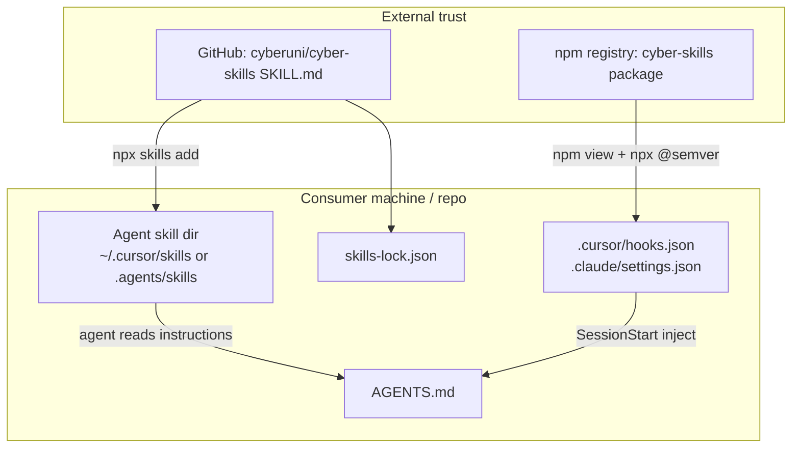

# cyber-skills supply chain threat model

Background research for install, pinning, and runtime trust boundaries when consumers use cyber-skills skills and CLI. Normative install guidance lives in the [README](../../readme.md) and init skills; this document records threats, mitigations, and gaps.

**Related:** [Skill ecosystem landscape](2026-05-skill-ecosystem-landscape.md), [ADR-0002](../adr/0002-external-governance-federation.md), `skill-repo-structure` governance.

## Scope

| In scope | Out of scope |
| --- | --- |
| Installing skills via [Skills CLI](https://github.com/vercel-labs/skills) | npm CVE audit of cyber-skills dependencies |
| Running `cyber-skills` via npx or local bin | Compromise of the user's machine or agent product |
| SessionStart hooks written by `init-commit-discipline` | Malicious code in the consumer application repo |
| `skills-lock.json` restore flows | Full Agent Skills specification threat model |

## Assets and trust boundaries



| Asset | Source | What breaks if untrusted |
| --- | --- | --- |
| **Skill text** (`SKILL.md`) | GitHub (default branch or lock restore) | Agent follows malicious workflow (shell, exfiltration, destructive git) |
| **CLI binary + governances** | npm at resolved semver | Wrong audit rules, hook behavior, or injected content |
| **Hook commands** | Written locally by `hook register` | Every session runs attacker-controlled shell |
| **skills-lock.json** | Committed in consumer repo | Team installs wrong skill content if lock is tampered |

Two **independent** supply chains: skill content (GitHub) and CLI (npm). Pinning one does not pin the other.

## Threats

### T1 — GitHub repo hijack on first install (High)

**Scenario:** User runs `npx skills add cyberuni/cyber-skills --skill init -g`. The Skills CLI fetches the repo default branch at install time. A compromised org, maintainer account, or malicious merge delivers trojaned `SKILL.md` before the user runs init.

**Impact:** Agent executes attacker instructions; may invoke shell, modify hooks, or steer toward `@latest` / unpinned tooling.

**Current mitigations:**

- Mechanical audit rules (E1–E2) in cyber-skills-authored skills — does not protect consumers after hijack.
- User can run `audit-skill` before trusting a skill — not wired into default install path.

**Gaps:** Global `-g` install (README quick start) has no lockfile. First fetch is always live GitHub unless the user installs from a pinned ref or local path.

### T2 — Unpinned skill updates (Medium)

**Scenario:** User runs `npx skills update` on globally installed init skills.

**Impact:** Same as T1 without any review step.

**Mitigations:** Project-scoped install + committed `skills-lock.json` + `npx skills experimental_install` / `npx skills ci` (restore from lock, analogous to `npm ci`).

**Gaps:** Lock uses content hashes; [verification alignment](https://github.com/vercel-labs/skills/issues/806) and [commit SHA pinning](https://github.com/vercel-labs/skills/issues/500) are still evolving in the Skills CLI ecosystem.

### T3 — npm registry compromise at init time (Medium)

**Scenario:** During `init` / `init-commit-discipline`, the agent runs `npm view cyber-skills version` and `npx cyber-skills@<exact> …`. A bad publish at that moment gets pinned into hooks.

**Impact:** SessionStart hooks and one-off CLI runs execute compromised package code on every session until hooks are re-registered.

**Mitigations:**

- Exact semver in hook commands (not `@latest`).
- [`publishConfig.provenance`](../../package.json) on npm publishes.
- Re-run `init-commit-discipline` or `hook register` after upgrading; as of 0.3.x, `hook register` **replaces** stale semver when `--name` and hook flags match.

**Gaps:** No digest/SRI beyond npm tooling. User must consciously upgrade after security releases.

### T4 — Skill / CLI version drift (Low–Medium)

**Scenario:** Old globally installed `init` skill text references workflows that assume a different CLI version than `npm view` resolves today.

**Impact:** Confusion, failed commands, or skipped steps — rarely direct RCE if skill text is still from a trusted source.

**Mitigations:** npm-aligned install (`pnpm add -D cyber-skills` + `npx skills add ./node_modules/cyber-skills …`) couples skill files and CLI to one release.

### T5 — Stale SessionStart hook (Low–Medium)

**Scenario:** Hook registered at semver 0.1.0; user never re-runs register after 0.3.0 security fix.

**Impact:** Old CLI behavior persists every session.

**Mitigations:** Re-run `init-commit-discipline`; `hook register` upgrades in-place when hook identity matches but semver differs (see T3).

**Gaps:** Legacy shell-script hooks are replaced only when register runs; no automatic semver bump.

### T6 — Lockfile tampering in repo (Medium, teams)

**Scenario:** Attacker commits a modified `skills-lock.json` with hashes pointing at benign-looking but substituted content on restore.

**Impact:** CI and teammates install trojaned skills via `experimental_install`.

**Mitigations:** Code review on lock changes; `skills verify` / frozen lockfile when available; prefer lock entries from a trusted initial install.

### T7 — Prompt injection via skill body (Medium)

**Scenario:** Benign repo later adds hidden prompt-injection lines in SKILL.md or SKILL.local.md.

**Impact:** Agent behavior override.

**Mitigations:** audit-skill E2 checks; treat skill body as untrusted data; review diffs on `skills update`.

## Recommended install profiles

| Profile | Skill install | CLI | Best for |
| --- | --- | --- | --- |
| **Quick solo** | `npx skills add … -g` | Pinned at init via `npm view` | Individual experimentation |
| **Team reproducible** | Project scope, commit `skills-lock.json`, `npx skills ci` | Pinned in hooks + optional `pnpm add -D cyber-skills` | Shared repos, CI |
| **npm-aligned** | `npx skills add ./node_modules/cyber-skills --skill init …` after devDependency | Same semver from `node_modules` | Strong coupling, offline CLI |

### Example project lock (init skills only)

After a trusted project-scoped install, commit entries similar to:

```json
{
  "version": 1,
  "skills": {
    "init": {
      "source": "cyberuni/cyber-skills",
      "sourceType": "github",
      "skillPath": "skills/init/SKILL.md",
      "computedHash": "<from skills add>"
    },
    "init-commit-discipline": {
      "source": "cyberuni/cyber-skills",
      "sourceType": "github",
      "skillPath": "skills/init-commit-discipline/SKILL.md",
      "computedHash": "<from skills add>"
    }
  }
}
```

Restore: `npx skills experimental_install` or `npx skills ci` (when available in your Skills CLI version).

## Controls summary

| Control | Addresses | Owner |
| --- | --- | --- |
| Pinned npx in init skills (never `@latest`) | T3 | cyber-skills SKILL.md |
| Semver baked into SessionStart hooks | T3, T5 | `hook register` |
| Hook semver upgrade on re-register | T5 | cyber-skills CLI |
| `skills-lock.json` + restore | T2, T6 | Consumer repo + Skills CLI |
| npm provenance on publish | T3 | cyber-skills release |
| audit-skill before install | T1, T7 | Consumer workflow |
| npm-aligned devDependency path | T4 | Consumer workflow |

## Open questions

1. Should cyber-skills ship a verified starter `skills-lock.json` fragment for init skills in consumer templates?
2. When Skills CLI stabilizes `skills ci --frozen-lockfile`, should init skills recommend it in AGENTS.md boilerplate?
3. Should `init` offer to add `cyber-skills` as devDependency by default for Node repos?
4. Federation / digest pinning per [agentskills#255](https://github.com/agentskills/agentskills/issues/255) may supersede ad hoc GitHub fetches — track and adopt.

## Revision history

| Date | Change |
| --- | --- |
| 2026-05 | Initial threat model (dual supply chain, lockfile, hook pinning) |
