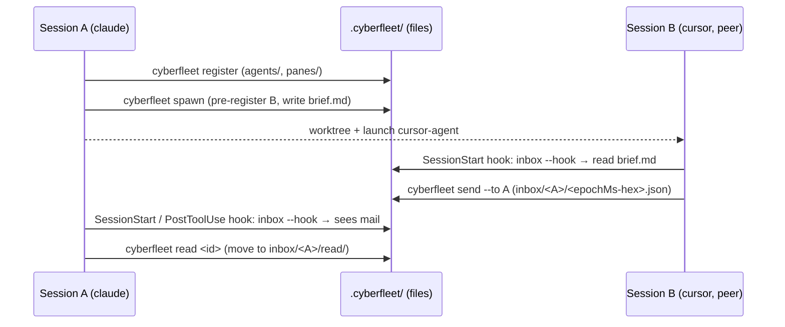

# cyberfleet CLI — harness-agnostic agent sessions + messaging (MCP-free)

The engine that creates new agent sessions and lets them talk to each other, across harnesses (a
Claude Code session ↔ a Cursor session ↔ a Codex session) and **without MCP** — no server, no port,
no daemon. The transport is the filesystem (a project-scoped `.cyberfleet/` directory), the
interface is one shell command (`cyberfleet`), and delivery is surfaced through the same per-harness
hooks cyberspace already wires. Nobody speaks a vendor-specific protocol — peers share files and one
CLI, so the mechanism ports to every harness by construction.

This project (`packages/cyberfleet`) is the **CLI half** — the deterministic engine. The persona
layer that decides *when* and *how* an agent reaches for the fleet (the `fleet` gateway personas and
the `crew` recruit/tune personas) is the sibling `cyberfleet-plugin` project
(`../../.agents/specs/cyberfleet-plugin`, source `plugins/cyberfleet`), which calls this CLI by
**intent**, never by its command slugs.

The end-to-end path — register, spawn a peer, message, surface — with the filesystem as the only
shared state and no process between the two sessions:

Units:

- [**`identity`**](./identity/README.md) *(behavioral)* — `cyberfleet register` / `who`: an agent
  self-identifies (pane-keyed self-recall via `$TMUX_PANE`, harness auto-detection) and discovers
  its peers.
- [**`messaging`**](./messaging/README.md) *(behavioral)* — `cyberfleet send` / `inbox` / `read`:
  the per-recipient file queue, chronological collision-free delivery, and ack-by-move.
- [**`spawn`**](./spawn/README.md) *(behavioral)* — `cyberfleet spawn`: launch a new peer session
  in a git worktree, pre-register it, and hand it its brief through its own SessionStart hook.
- [**`surfacing`**](./surfacing/README.md) *(behavioral)* — `cyberfleet inbox --hook`: emit the
  SessionStart `additionalContext` payload so a session sees its unread mail, and register that
  emitter across harnesses reusing the existing per-vendor event mapping.

Scope: MVP is pull-via-hooks, project-scoped `.cyberfleet/`, worktree spawn. A live `send` nudge, a
zero-token watcher, message threads, a cross-repo root, and Copilot CLI are deferred to their own
change requests. This project has its own cross-capability e2e (register → spawn → send → inbox →
read); a future `acceptance/` node may formalize it. The persona/e2e for the plugin lives with the
`cyberfleet-plugin` project.

Squad note: all four nodes are deterministic `cyberfleet` CLI behaviors (SDD-default + a script
harness — boolean scenarios, no rubric). The agent-behavior nodes (ACED — activation and judgment)
are in the `cyberfleet-plugin` project.
</content>
