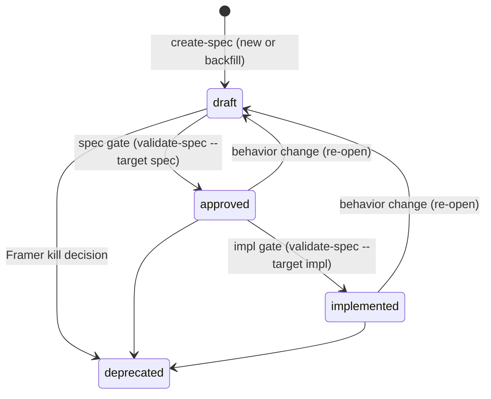

# SDD Lifecycle Governance

The state machine a `spec.md` moves through, and the frontmatter that records it. This skill is the canonical home for the lifecycle; consumers load it instead of restating it. Write-ownership of these fields lives in `ownership-governance`; legality of field combinations and gate verdicts live in `gate-validation-governance`.

## Frontmatter schema

`spec.md` carries YAML frontmatter:

```yaml
---
status: draft           # draft | approved | implemented | deprecated
type: feature           # project | feature; omit for an untyped legacy spec
aligned: false          # true once the current layer's artifacts are synced
priority: 1             # integer; 1 = highest (relative within a set)
blocked-by:             # list of spec slugs; omit or empty if none
  - <spec-slug>
subtasks:               # project specs only: child feature slugs (single-parent)
  - <spec-slug>
approved-by:            # written by the gate; see gate-validation-governance
  spec: { by: <approver>, why: <derivation if by:agent> }
  impl: { by: <approver>, why: <derivation if by:agent> }
domain-plugin:          # map: domain -> owning plugin, when a domain is contested
  <domain>: <plugin>
---
```

Open input is recorded in the body as `<!-- open: ... -->` markers, not in frontmatter.

`status`, `priority`, and `blocked-by` are the base schema; `type`, `subtasks`, `aligned`, `approved-by`, and `domain-plugin` are the SDD-workflow additions.

## Spec typing and composition

A spec carries a `type` and projects own their features:

| `type` | Meaning |
|---|---|
| `project` | A top-level spec: a plugin/project, or a standalone model. Has no parent. May own features via `subtasks`. |
| `feature` | A unit of work belonging to exactly one project. Owns its detailed behavior; the project spec stays high-level and cross-references it. |

- **`subtasks` lists children, parent is derived.** Only a `project` declares `subtasks` — the child feature slugs it owns. A feature does not name its parent; the parent is whichever project lists it, mirroring how `blocks` is derived from `blocked-by`. This keeps one source of truth.
- **Single parent (tree invariant).** A slug appears in **at most one** project's `subtasks`. Each `feature` is owned by exactly one project; an unparented `feature` is an orphan. This keeps composition a tree, not a tangle.
- **Composition is orthogonal to dependency.** `subtasks` is containment (project → feature); `blocked-by` is execution-order dependency. A feature may be `blocked-by` specs outside its parent. The two graphs are maintained and rendered separately.

## Spec discovery

A spec is defined by its **shape, not its location**: an SDD spec is any git-tracked `spec.md` whose frontmatter `status` is one of the lifecycle enum values below. This is the single source of truth — there is no spec registry or enumerated index to keep in sync.

To locate specs, glob `**/spec.md` repo-wide, filter to git-tracked files (e.g., cross-reference with `git ls-files`), and keep those whose `status` is in the enum. A `spec.md` without a lifecycle `status` is not an SDD spec and is excluded (for example, doc-only spec folders that live outside the workflow).

To resolve a **domain name** to its spec folder, match the name against each discovered spec's folder slug — the root-relative path of the folder containing `spec.md`. A spec may be flat (`sdd-orchestrator`) or nested (`sdd/spec-digest`); match the leaf segment or the full slug. If a name matches more than one folder, disambiguate with the user.

Derived views (such as `graph.md`) are rendered from the discovered set and never hand-maintained — see `render-spec-graph`.

**`aligned` and commit timing.** `aligned: false` means the current layer's artifacts are being updated or contain unresolved markers; `aligned: true` means the layer is synced (which layer depends on the gate — see `gate-validation-governance`). Do not commit SDD artifacts while their spec is `aligned: false`.

## Status enum

| Status | Meaning |
|---|---|
| `draft` | Contract can still evolve; not yet implementable as a fixed bar |
| `approved` | Contract is frozen; ready to implement against |
| `implemented` | Implementation passed the impl gate |
| `deprecated` | Historical spec only; not implementable work |

## Status transitions



- **Draft → Approved** is the **spec gate**: judges `spec.md` + the `.feature`.
- **Approved → Implemented** is the **impl gate**: judges the implementation against the frozen `.feature`.
- A behavior change after approval is **not** a direct edit — revert to `draft` and re-pass the spec gate.
- Deprecation retains the spec for graph history; never treat it as implementable.

## Freeze (state transition)

Reaching `approved` **freezes the `.feature`**. Adding, removing, or rewriting scenarios requires reverting the spec to `draft` and passing the spec gate again. The matching write constraint ("never write a frozen `.feature`") is in `ownership-governance`.

**Spec owns behavior.** If the implementation disagrees with `spec.md`, the implementation is wrong — fix it, or revert the spec to `draft` for a new review cycle.

**Two modes.** Before `approved`, exploration may update `spec.md`, the `.feature`, `plan.md`, `tasks.md`, and spikes. After `approved`, implementation proceeds against the frozen `.feature`; every frozen scenario must pass before `implemented`.

## Open-marker gating

Missing contributor input is recorded as `<!-- open: ... -->` in the owning artifact. Open markers must be resolved (count = 0) before a spec may advance to `approved`. `gate-validation-governance` defines how markers interact with legal state; producers emit gaps that become markers, per `ownership-governance`.
