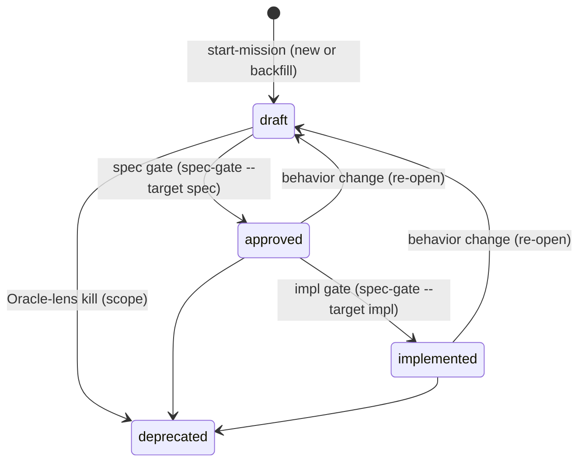

# SDD Lifecycle Governance

The state machine a `spec.md` moves through, and the frontmatter that records it. This skill is the
canonical home consumers load instead of restating it. Write-ownership of these fields lives in
`sdd:ownership-governance`; legality of field combinations and gate verdicts in
`sdd:gate-validation-governance`; the ledger shape in `sdd:combat-log-governance`.

## Frontmatter schema

The **root** `spec.md` carries YAML frontmatter:

```yaml
---
status: draft           # draft | approved | implemented | deprecated
project-path: plugins/sdd   # repo-relative source dir this spec governs; the location mode is derivable
name: SDD               # OPTIONAL declared project name; authoritative for name→spec resolution
approval:               # per-gate verdict
  spec:                 # verdict: approve | pause | reject
    verdict: approve
    by: agent           # agent (self-asserted, provisional) | <human name> (ratified); omitted on pause
    cause: dimension    # dimension | ceiling — what drove the verdict
    why:                # verdict derivation (agent self-assertion or pause)
      floor:       <none | clearance | conflict | compatibility | consent>
      blast:       <low|high — reason>
      novelty:     <low|high — reason>
      confidence:  <low|high — reason>
  impl: { verdict: approve, by: <human name> }   # ratified — no why needed
produced-by:            # who produced each artifact; see sdd:combat-log-governance
  spec-producer: <plugin>:<agent>
---
```

Open input is recorded in the body as `<!-- open: ... -->` markers, not in frontmatter.

The frontmatter is the **router's upfront index** (ADR-0017): the gateway scans every spec at the
three SDD spec locations, frontmatter only (no bodies), to route, so it carries only what routing
needs. `status` is the base schema;
`project-path`, `approval`, and `produced-by` are the SDD-workflow additions. `project-path` records
the repo-relative source dir the spec governs; the spec **location mode** (`colocated | hoisted |
monorepo-member`) is *derived* from it (hoisted iff `project-path` is not the spec's own dir), never
stored. There is **no `aligned`, `spec-layout`, or run-level `leash` field** — sync is derived
(below), the organization strategy is declared in the body placement map, and the leash is
session-local on the ledger/plan (the conductor's autonomy bar, `start-mission`).

**A file's artifact-type is resolved per file, never stored here.** Each file's artifact-type (the
squad key) resolves its own squad against the project's registered plugins
(`sdd:plugin-contract-governance`); the conductor classifies it by convention, falling back to the
optional `.agents/sdd/artifact-types.toml` tiebreaker on ambiguity. The contested-type →
chosen-plugin disambiguation lives in `.agents/sdd/` resolution state, **distinct from
`produced-by`**, never a frontmatter field. The project carries no root `artifact-types` summary.

**This whole frontmatter is root-`spec.md`-only.** A capability node README (a `reference` or
`behavioral` spec — `sdd:spec-format-governance`) carries **only** its `spec-type` marker, never a
lifecycle field. Folders are views, never lifecycle units: the project has **one** lifecycle, on the
root.

## Spec discovery

A spec is **location-bounded and shape-confirmed** (ADR-0017): an SDD spec is a git-tracked
`spec.md` that sits at one of the three fixed SDD spec locations — **or** at an extra anchor the
project declared (ADR-0019) — **and** whose frontmatter `status` is one of the enum values below:

1. `.agents/spec/spec.md` — repo-root single-project
2. `.agents/specs/<project>/spec.md` — repo-root multi-project
3. `<project-path>/.agents/spec/spec.md` — a nested project (the `**` is the project-path, any depth)
4. any extra anchor declared in `.agents/sdd/spec-anchors.toml` — **opt-in and additive**; absent
   config ⇒ only 1–3 (today's behavior). The three fixed conventions need no registry; the extra
   anchors are a declared, curated registry (`manage-spec-anchors`), not a derived hot path.

To locate specs, scan the fixed conventions (plus any declared extra anchors) and keep git-tracked
files whose `status` is in the enum. A `spec.md` at a recognized location with no lifecycle `status`
is **not** a spec (so a stray file is never grabbed by accident); a status-bearing `spec.md` at
neither a fixed convention nor a declared extra anchor is not a spec either. An unreadable/malformed
`spec-anchors.toml` is ignored (fall back to the fixed conventions). The concrete engine is the
`discover-specs` skill (frontmatter only, TOON output).

Each spec carries a **project name** so a consumer can resolve a name → spec. The name is `declared`
(the optional frontmatter `name`, authoritative), else `derived` (the repo-root single-project →
`repo`; a `.agents/specs/<project>` folder names itself), else `guessed` (a nested project's folder
basename — confirm with the user). The optional `name` field is **written at spec creation**
(`sdd:backfill-project-spec`) — it earns its router slot because the gateway presents project names
to the user; it is required in practice only for a nested project whose folder is not the user's name.

**Sync is derived, not stored (no `aligned` flag).** "Synced" is two properties, each derived or
judged (ADR-0017): contract-sync (`spec.md` ↔ `.feature`) is *judged* at the spec gate (Builder
coverage lens); impl-sync is the impl gate's *runtime suite run* (advance to `implemented` only when
every impl-judge passes); per-node settled state is the **`@frozen`** scan; what is in flux now is the
`.plan.md` todos. Do not commit SDD artifacts while a touched `.feature` is unfrozen or the plan's
todos are incomplete.

## Status enum

| Status | Meaning |
|---|---|
| `draft` | Contract can still evolve; not yet implementable as a fixed bar |
| `approved` | Contract is frozen; ready to implement against |
| `implemented` | Implementation passed the impl gate |
| `deprecated` | Historical spec only; not implementable work |

## Status transitions



- **Draft → Approved** is the **spec gate**: judges `spec.md` + the `.feature`.
- **Approved → Implemented** is the **impl gate**: judges the implementation against the frozen `.feature`.
- A behavior change after approval is **not** a direct edit — revert to `draft` and re-pass the spec
  gate. Re-open is a lightweight "change needed" flag an auditor sets; only re-approval is the heavy
  positional act.
- Deprecation retains the spec as a historical record; never treat it as implementable.

## Freeze (per suite file)

Reaching a spec-gate `approve` **freezes** the `.feature` files the CR *touched* — each via its own
feature-level **`@frozen` tag** (set/cleared per file; the vocabulary is **freeze / unfreeze**, never
lock/unlock — lock is the concurrency layer, `cr-concurrency`). Files the CR did not touch keep
whatever state they held. "Which scenarios are the frozen contract" is answered by the set of
`@frozen` files — a plain per-file flag, no computed baseline. The `@frozen` tag is metadata,
excluded from the content the freeze protects; toggling it is not a scenario edit. The matching
write constraint ("never write a frozen `.feature`") is in `sdd:ownership-governance`.

- **The unfreeze trigger is risk, not phase.** *Narrowing or rewriting* a scenario unfreezes its
  file (in explore or deliver alike) — at the gate that is **Clearance** (the conductor's autonomy
  bar, `start-mission`), contract narrowed → escalate. An *additive* scenario never unfreezes its file:
  it widens the contract, cannot break existing impl, and **self-clears** — folding into the frozen
  file under the conductor's authority, logged as a detail-adjustment.
- **A pure move/rename preserves the freeze.** What a freeze protects is the scenario **content**,
  not where the file sits. A *pure rename* — a `git mv` with **zero content delta** (a git `R100`) —
  does **not** unfreeze the file and is **not** a gate-able edit; it stays `@frozen` at the same
  baseline. This is what lets **placement be finalized at handoff** (`design/spec-layout.md`): a node
  may be relocated to its blessed home in the same change without re-opening its contract. Only a
  *content* change (the narrowing/rewriting trigger above) unfreezes.
- **`spec.md` is kept in sync, never frozen** — the readable abstraction of the suite, free to be
  reworded/restructured as long as it does not contradict a frozen scenario. Enforced by the
  spec-judge applying the Builder (coverage) lens, not by freezing the prose.
- **The ledger is never frozen and never gated** — it keeps appending across the whole lifecycle,
  including while files sit `@frozen` (`sdd:combat-log-governance`).
- **Spec owns behavior.** If the implementation disagrees with `spec.md`, the implementation is
  wrong — fix it, or unfreeze the relevant file for a new cycle. The **impl gate** is the only place
  a frozen file reopens — via the Oracle-lens revert (building proved the contract wrong). Rare
  and deliberate.

**Two modes.** Before a file's freeze, exploration may update `spec.md`, that `.feature`, the plan
(brief + ordered `todos`), and spikes. After it freezes, implementation proceeds against it; every
frozen scenario must pass the full impl-gate run before `implemented`.

## Open-marker gating

Missing contributor input is recorded as `<!-- open: ... -->` in the owning artifact. Open markers
must be resolved (count = 0) before a spec may advance to `approved`; they are permitted at `draft`
(markers block only the *gate*, not the draft state). `sdd:gate-validation-governance` defines how
markers interact with legal state; producers emit gaps that the conductor turns into markers
(`sdd:ownership-governance`).
